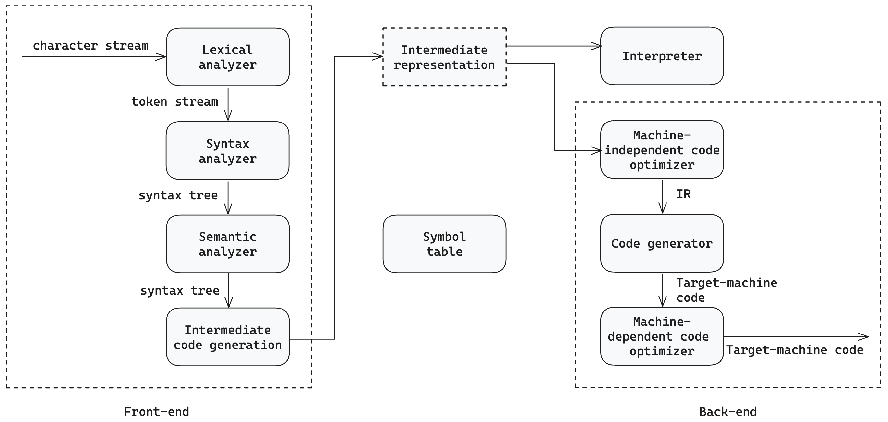

# A comparative analysis of programming languages for blockchain development with focus on gas efficiency

## Cover page

TODO: in English or Ukrainian?

## Abstract

TODO:
Document size A pages, B illustrations, C references.

TODO: add keywords and sort alphabetically
WEB-3, BLOCKCHAIN, GAS OPTIMISATION, GAS EFFICIENCY, PROGRAMMING LANGUAGE, OPCODE, BYTECODE, COMPILATION, SMART CONTRACT, SOLIDITY

The process of developing smart contracts with different programming languages, further source code compilation into bytecode, and its on-chain execution is an object of research in this paper. The subject of the research is the comparison of different programming languages for smart contract development with focus on gas efficiency of the resulting bytecode.

The main goal is to compare different programming languages for blockchain development, highlighting the gas efficiency of the resulting bytecode, alongside with other language features.

The research is based on the analysis of the Ethereum Virtual Machine (EVM), its code execution, programming languages for smart contract development, the features of corresponding compilers, and the gas efficiency of the resulting bytecode.

TODO: if have time, add more practical application:

> try to evaluate procedure of rewriting SC to a more gas-efficient language
> OR
> rewrite an existing smart contract with more gas-efficient programming language

The results of this research paper describe features of different programming languages for blockchain development, their advantages and disadvantages, and a comparision of gas efficiency of the resulting bytecode.

The research findings can be used by developers to choose the most gas-efficient programming language for blockchain development both prior to the development or for optimisation purposes.

## Table of contents

TODO: update TOC accordingly to what's written below

- Introduction
- Chapter 1. Smart contract development
  - 1.1. Blockchain technology
  - 1.2. Accounts and Smart contracts
  - 1.3. Ethereum Virtual Machine
  - 1.4. Gas
- Chapter 2. Compilation and EVM bytecode
  - 2.1. Compilation process
  - 2.2. EVM bytecode
- Chapter 3. Blockchain programming languages comparison
  - 3.1. List of programming languages for blockchain development
    - 3.1.1. Solidity
    - 3.1.2. Yul
    - 3.1.3. TODO: add more languages
  - 3.2. Criterias for comparison
  - 3.3. Gas comparison
    - 3.3.1. Defining the Smart Contract for comparison
    - 3.3.2. Developing the Smart Contract
    - 3.3.3. Compiling the Smart Contract
    - 3.3.4. Benchmarking the resulting bytecode
- Conclusion
- References

## Introduction

Current state of the research topic. The blockchain technology has gained significant popularity in recent years due to its decentralised nature, security, and transparency. One of the key components of blockchain technology is smart contracts, self-executing contracts with the terms of the agreement between buyer and seller being directly written into lines of code. Smart contracts are executed on the blockchain and can be used for various purposes, such as financial transactions, supply chain management, and digital identity verification.

Smart contracts are executed inside Ethereum Virtual Machine (EVM), a virtual machine that runs on every blockchain node when validating transactions. To prevent spam and unreasonably-heavy computational transactions, a concept of gas was introduced. Each operation in the EVM has a gas cost associated with it, which corresponds to the computational resources required to execute the operation. The gas cost is paid by the transaction sender in Ether, the native cryptocurrency of the Ethereum blockchain.

On the one hand, gas fees allow for a fair and efficient execution of smart contracts, preventing spam and denial-of-service attacks. On the other hand, gas fees can be a significant cost for both the smart contract developers and their users, especially when the contract contains complex and computationally-intensive logic. Consequently, it is crucial to optimise the gas efficiency of the smart contracts to reduce the gas fees and ease the burden of developing and using smart contracts.

Relevance of the research.
Each EVM operation is denoted by an opcode, which constitutes the bytecode of the smart contract. The bytecode is generated by compiling the source code of the smart contract written in a programming language supported by the EVM. The gas cost of the bytecode execution is the sum of the gas costs of the individual opcodes that are executed.

Alongside with the rise of the blockchain technology, different languages for smart contract development have emerged. However, if the same smart contract is developed in different languages, the resulting bytecode may have different gas costs due to the language features and compiler optimisations. Therefore, it is essential to compare different programming languages for blockchain development with focus on gas efficiency of the resulting bytecode.

Purpose and objectives of the research. The purpose of the research "A comparative analysis of programming languages for blockchain development with focus on gas efficiency" is to compare different programming languages for blockchain development, highlighting the gas efficiency of the resulting bytecode, alongside with other language features.

To achieve this goal, the following objectives were outlined:

1. Conduct a research on the blockchain technology
2. Describe how smart contracts and Ethereum Virtual Machine work
3. Define gas and its role in the EVM
4. Investigate the compilation process and resulting bytecode
5. Compile a list of programming languages for blockchain development
6. Define criterias for comparison of programming languages
7. Define and develop a smart contract for comparison
8. Compile and benchmark the resulting bytecode

Object, methods and means of research
An object of the research is the process of developing smart contracts with different programming languages, further source code compilation into bytecode, and its on-chain execution.

During the research, the most popular programming languages for blockchain development were analysed, and the criterias for comparison were defined. A smart contract was developed in different programming languages, compiled into bytecode, and benchmarked for gas consumption.
The result of the research is a comparison of the programming languages with focus on gas efficiency of the resulting bytecode.

Microsoft Visual Studio Code was used as an integrated development environment (IDE) for the development of the smart contract.

Possible areas of application
This paper describes the process of smart contract execution on the EVM-compatible blockchains, the concepts of gas, opcodes, bytecode, and the compilation process. The results of this research can be used by developers to better understand the relation between the bytecode and gas efficiency, and to choose the most gas-efficient programming language for blockchain development.

## Chapter 1. Blockchain and gas fees

The advent of blockchain technology has revolutionized the way transactions and digital interactions are conducted, introducing a decentralized and immutable ledger system that operates independently of traditional financial institutions.Central to this innovation is the concept of "gas fees," a critical component that governs the execution of operations on blockchain networks, particularly in platforms like Ethereum.Understanding gas fees is not only essential for developers working on blockchain-based applications but also for those involved in optimizing the efficiency of these platforms, particularly when it comes to the design and implementation of smart contracts.

At its core, gas fees serve as the economic incentive that drives the processing power required for transactions and smart contract execution on a blockchain.They function as a mechanism to compensate miners or validators for the computational resources they expend.In essence, gas fees ensure that the network remains secure, incentivizing participants to verify and add new transactions to the blockchain while preventing abuse of network resources by imposing a cost on each operation. This concept is crucial in blockchain environments, where decentralized consensus is achieved without a central authority.

The calculation of gas fees is intrinsically tied to the complexity of operations performed on the blockchain. For each operation within a transaction or a smart contract, a specific amount of gas is required. The total gas required is then multiplied by the gas price, which can fluctuate based on network demand.Therefore, the total transaction cost is a function of both the gas used and the prevailing gas price at the time of the transaction. This variability introduces an additional layer of complexity for developers and users alike, as they must anticipate potential costs associated with their operations.

Gas fees also play a pivotal role in the design and development of blockchain-based applications. For developers, the challenge lies in optimizing their smart contracts to be as gas-efficient as possible, minimizing the costs for end-users while ensuring the functionality and security of their applications.The programming language chosen for smart contract development has a significant impact on gas efficiency, as different languages offer varying levels of control over low-level operations and optimizations. This aspect becomes particularly critical in high-traffic environments where gas costs can escalate rapidly, affecting the viability of certain applications or even leading to network congestion.

Moreover, the concept of gas fees extends beyond merely covering computational costs; it also serves as a mechanism for network governance. By adjusting gas limits and fees, blockchain networks can regulate the throughput and scalability of the system. Higher gas fees during periods of congestion can deter excessive or unnecessary transactions, thereby maintaining the network's overall stability.Conversely, lowering gas fees can encourage more activity and experimentation on the network, fostering innovation and adoption.

### 1.1. Blockchain technology

Blockchain technology represents a transformative innovation in digital record-keeping, characterized by its decentralized, transparent, and immutable nature. Unlike traditional centralized systems where a single entity controls data, blockchain operates on a distributed ledger maintained across a network of nodes. This decentralization ensures that no single participant can alter the history of transactions, thereby providing a secure and tamper-resistant platform for various applications. The blockchain's structure, comprising blocks of data linked together in a chronological sequence, underpins its robustness against fraud and data manipulation. Each block contains a list of transactions and is cryptographically secured, making it virtually impossible to alter without the consensus of the network. This inherent security, combined with the transparency of public ledgers, has made blockchain a foundational technology in industries ranging from finance to supply chain management, and most notably, in the development of smart contracts and decentralized applications (DApps).

#### 1.1.1. General overview

Blockchain technology, at its core, is a decentralized ledger system that records transactions across a distributed network of computers, known as nodes. This ledger is composed of a series of blocks, each containing a list of transactions, a timestamp, and a cryptographic link to the previous block. The decentralized nature of blockchain ensures that no single entity has control over the entire network, which enhances security, transparency, and resistance to tampering.

Ethereum, one of the most prominent blockchain platforms, extends the basic principles of blockchain beyond simple transaction processing, enabling the execution of smart contracts—self-executing code with the terms of the agreement directly written into lines of code. These contracts run on the Ethereum Virtual Machine (EVM), a decentralized computation engine that interprets and executes the code across the network's nodes. The Ethereum Yellow Paper, authored by Dr. Gavin Wood, provides the formal specification of the Ethereum protocol, detailing the structure, operation, and implementation of the EVM.

A significant feature of Ethereum is its Turing-complete programming language, which allows developers to create complex logic and execute sophisticated decentralized applications (DApps). This capability distinguishes Ethereum from earlier blockchain implementations, which were typically limited to simple transaction processing and scripting.

In Ethereum, each transaction and smart contract execution requires computational resources, which are quantified in terms of "gas." Gas serves as the unit of measure for the computational work required to execute operations on the EVM. The gas fee is calculated based on the amount of gas consumed by the operation and the gas price set by the user, which can vary depending on network congestion. This mechanism not only compensates miners or validators for their work but also serves as a deterrent against inefficient or malicious use of the network.

Ethereum's blockchain is maintained through a consensus mechanism, historically based on Proof of Work (PoW) and recently transitioned to Proof of Stake (PoS) with Ethereum 2.0. This upgrade significantly improves the network's scalability and energy efficiency, further solidifying Ethereum's position as a leading platform for decentralized applications and blockchain-based innovation. The technical rigor of Ethereum, as detailed in the Yellow Paper, underscores its foundational role in advancing blockchain technology and its practical applications across various industries.

#### 1.1.2. Global state

The concept of the "Global State" in Ethereum is one of the most fundamental and defining features of the platform, meticulously detailed in the Ethereum Yellow Paper. The Global State refers to the entirety of the Ethereum blockchain's current status at any given point in time. It encapsulates all account balances, contract code, and storage, essentially representing the collective "memory" of the network.

In Ethereum, the Global State is maintained across all nodes in the network, and it evolves over time as transactions are executed. Each transaction results in a state transition, whereby the Global State is modified according to the rules defined by the Ethereum protocol. The state transition function, formally denoted as 𝛾 in the Yellow Paper, is the mechanism that dictates how the state changes in response to a given transaction. This function is deterministic, meaning that given the same initial state and transaction, the resulting state will always be identical, ensuring consistency across the distributed network.

Ethereum's state is composed of multiple components, with each account on the network having its own associated state. There are two types of accounts: externally owned accounts (EOAs) and contract accounts. EOAs are controlled by private keys and are primarily used for sending and receiving Ether. Contract accounts, on the other hand, are controlled by code and can execute predefined actions based on the logic written in their smart contracts. Each account in the Ethereum Global State is identified by a unique address and maintains four critical pieces of information: the nonce, the account’s Ether balance, the contract code (if it’s a contract account), and the storage (a mapping of key-value pairs).

The Global State is stored in a data structure called a Merkle Patricia Trie, which is a type of modified Merkle tree designed to optimize the retrieval and verification of information. The use of this data structure ensures that any part of the state can be quickly and efficiently retrieved and verified, which is critical for maintaining the integrity and performance of the network. The root of this trie, known as the state root, is stored in the block header, and it provides a cryptographic summary of the entire state at the time the block was mined. This root allows any node in the network to verify the state independently without needing to store the entire blockchain, thus contributing to the decentralized nature of Ethereum.

In addition to storing balances and contract data, the Global State also encompasses the entire storage of all smart contracts on the Ethereum blockchain. Each contract has its own storage, which is organized as another Merkle Patricia Trie, allowing for efficient and secure storage of arbitrary data. This hierarchical structure of tries within tries is one of the reasons Ethereum is capable of scaling its state management to accommodate a vast and growing number of smart contracts and decentralized applications (DApps).

When a transaction is executed, it can potentially alter the Global State by modifying account balances, invoking smart contracts, or altering the storage associated with a contract account. The execution of a transaction involves the Ethereum Virtual Machine (EVM), which processes the transaction and computes the resulting state transition. The EVM operates on a stack-based architecture and uses gas to measure the computational effort required to execute operations, ensuring that resources are used efficiently and preventing the network from being overwhelmed by costly computations.

The integrity and security of the Global State are upheld through Ethereum’s consensus mechanism. Historically based on Proof of Work (PoW) and now transitioning to Proof of Stake (PoS) with Ethereum 2.0, the consensus mechanism ensures that all nodes agree on the current state of the blockchain. Each new block appended to the blockchain includes a new state root, representing the Global State after all transactions in the block have been processed. Validators or miners, depending on the consensus mechanism, are responsible for validating and proposing these new blocks, thereby ensuring the continuity and immutability of the Ethereum Global State.

#### 1.2.3. Transaction and execution

In Ethereum, transactions are the primary means by which state transitions occur within the blockchain. A transaction, as defined in Section 4.2 of the Ethereum Yellow Paper, is a signed data package that stores a message to be sent from an externally owned account (EOA) to another account on the network. Transactions are the mechanism through which value is transferred and smart contracts are executed, driving the functionality of decentralized applications (DApps) and the broader Ethereum ecosystem.

##### 1.2.3.1 Transaction Structure

A transaction in Ethereum contains the following fields, each of which plays a crucial role in the transaction's execution:

- Nonce: This is a counter that indicates the number of transactions sent from a particular account. It serves as a unique identifier for each transaction from the same account, preventing double-spending and ensuring that transactions are executed in the correct order.
- Gas Price: The gas price specifies the amount of Ether that the sender is willing to pay per unit of gas for the transaction to be processed. This value is set by the sender and can fluctuate depending on network demand. Higher gas prices incentivize miners or validators to prioritize the transaction.
- Gas Limit: The gas limit defines the maximum amount of gas the sender is willing to expend on the transaction. This value caps the total computational resources that can be used, protecting the sender from incurring excessively high costs if the transaction fails or requires more resources than expected.
- To: This field contains the address of the recipient account. If the transaction is intended to deploy a new contract, the "To" field is left empty.
- Value: The value field specifies the amount of Ether to be transferred from the sender’s account to the recipient’s account. If the transaction is calling a smart contract, this value might be used within the contract's logic.
- Data: The data field is optional and can contain arbitrary data, typically used for invoking specific functions within a smart contract. This field may also include the contract's initialization code when deploying a new contract.
- v, r, s: These fields represent the components of the transaction’s digital signature, ensuring that the transaction is authenticated and has not been tampered with. The v, r, and s values are derived from the sender's private key using the Elliptic Curve Digital Signature Algorithm (ECDSA).

Together, these fields define the parameters and constraints of a transaction, ensuring that it can be validated and executed in a manner consistent with the Ethereum protocol.

##### 1.2.3.2 Transaction Receipt

After a transaction is executed, a transaction receipt is generated, which provides a summary of the transaction’s execution. As detailed in Section 4.4.1 of the Ethereum Yellow Paper, a transaction receipt includes the following fields:

- Post-Transaction State Root: This is the root of the global state trie after the transaction has been executed. It serves as a cryptographic proof of the new state, allowing anyone to verify the state of the blockchain post-transaction.
- Cumulative Gas Used: This field records the total amount of gas used in the block up to and including the transaction in question. It provides an insight into the gas consumption of the entire block.
- Bloom Filter: The bloom filter is a compact data structure that encodes information about the logs generated during the transaction execution. It is used for efficient searching and filtering of logs by decentralized applications and users.
- Logs: Logs are data records generated during the execution of a transaction, often as a result of events emitted by smart contracts. These logs are not stored on the blockchain but are included in the transaction receipt, allowing for easy retrieval and verification by external applications.

The transaction receipt thus encapsulates key information about the execution of the transaction, providing both a historical record and a tool for developers and users to analyze and interact with past transactions.

##### 1.2.3.3 Transaction Execution Process

The execution of a transaction in Ethereum is a multi-step process that ensures the integrity and consistency of the network, as outlined in Chapter 6 of the Ethereum Yellow Paper. The process can be broken down into three main stages: transaction validation, logic execution, and receipt creation.

1. Transaction Validation: Before a transaction can be executed, it must first be validated by the network. This involves several checks, including:

- Nonce Check: The nonce must match the expected value for the sender's account. If it does not, the transaction is considered invalid.
- Signature Verification: The v, r, and s values are used to verify the sender’s signature, ensuring that the transaction has been authorized by the account holder.
- Gas Check: The transaction must have a gas limit that is sufficient to cover the intrinsic cost of the transaction. This intrinsic cost includes a base fee plus additional costs for the size of the transaction data and any specific operations it may invoke.

2. Logic Execution: Once validated, the transaction is executed by the Ethereum Virtual Machine (EVM). This execution involves the following steps:

- Gas Consumption: As the transaction is processed, gas is consumed based on the computational complexity of the operations. If the transaction runs out of gas before completion, it is reverted, but the gas spent is not refunded.
- State Modification: The EVM processes the transaction, potentially modifying the global state. This could involve updating account balances, invoking smart contracts, or altering contract storage.
- Log Emission: If the transaction includes events or triggers within a smart contract, logs are emitted and recorded in the transaction receipt.

3. Receipt Creation: After the transaction is executed, a transaction receipt is generated. This receipt includes the post-transaction state root, cumulative gas used, bloom filter, and logs, as described earlier. The receipt is then stored on the blockchain, providing a permanent record of the transaction's outcome.

The entire transaction execution process is governed by the Ethereum consensus mechanism, ensuring that all nodes in the network reach agreement on the validity and results of each transaction. This robust and meticulous process, as detailed in the Yellow Paper, is foundational to Ethereum’s security, consistency, and trustworthiness as a decentralized platform.

#### 1.2.4. Gas fees

Gas fees are a fundamental component of the Ethereum network, serving as the mechanism by which computational resources are measured and compensated. In Ethereum, every operation performed by the Ethereum Virtual Machine (EVM), whether it's executing a smart contract, sending a transaction, or performing data storage, requires a certain amount of computational work. Gas is the unit of measurement used to quantify this work, and gas fees are the cost that users must pay to execute these operations on the network.

##### 1.2.4.1. Components of Gas Fees

The gas fee for a transaction is determined by several factors, as detailed in Section 5 of the Ethereum Yellow Paper:

1. Gas Cost: Each operation in the EVM, from simple arithmetic to complex contract executions, has an associated gas cost. The gas cost is a fixed value assigned to each operation, reflecting the computational effort required. For example, simple operations like adding two numbers might cost only a few units of gas, while more complex operations like storing data in contract storage might cost significantly more.

2. Gas Limit: The gas limit is set by the sender of the transaction and represents the maximum amount of gas they are willing to spend. The gas limit must be high enough to cover the intrinsic gas cost of the transaction, which includes a base fee for the transaction itself, as well as additional fees for the data payload and specific operations. If the gas limit is set too low, the transaction will fail, but the gas used up to that point will still be consumed.

3. Gas Price: The gas price is the amount of Ether the sender is willing to pay per unit of gas. This value is set by the sender and is typically measured in gwei (1 gwei = 10^-9 Ether). The gas price can fluctuate based on network demand, with higher prices offering an incentive for miners or validators to prioritize the transaction. The total gas fee paid by the sender is the product of the gas used and the gas price.

##### 1.2.4.2. Gas Fees Calculation

The total gas fee for a transaction is calculated as follows:

```txt
Total Gas Fee = Gas Used × Gas Price
```

Where:

- Gas Used: This is the actual amount of gas consumed by the transaction during execution. If the transaction completes successfully, the gas used will be equal to or less than the gas limit set by the sender. If the transaction runs out of gas before completion, it is reverted, but the gas up to that point is still deducted from the sender’s account.

- Gas Price: This is the price per unit of gas, as determined by the sender.

For instance, if a transaction consumes 21,000 units of gas (a typical value for a simple Ether transfer) and the sender sets a gas price of 20 gwei, the total gas fee would be:

```txt
21,000 × 20 gwei = 420,000 gwei = 0.00042 Ether
```

##### 1.2.4.3. Intrinsic Gas Cost

The intrinsic gas cost is the base cost for executing a transaction, and it is composed of several elements:

1. Base Transaction Cost: This is a fixed cost for any transaction, which covers the basic overhead of processing the transaction on the blockchain. As per the Yellow Paper, the base cost for a standard transaction is 21,000 gas.

2. Data and Storage Costs: Transactions that include data (such as contract execution or deploying a contract) incur additional gas costs. The cost is proportional to the amount of data sent or stored, with operations that write to storage being particularly expensive, as they contribute to the growth of the blockchain state.

3. Operation-Specific Costs: Certain operations within a transaction, such as creating a new contract or invoking specific EVM opcodes, have additional gas costs associated with them. These costs are predefined in the Ethereum protocol to reflect the relative computational intensity of each operation.

##### 1.2.4.4. Gas Refunds and Efficiency

Ethereum also provides mechanisms for optimizing gas usage and potentially receiving gas refunds. For example, if a transaction deletes a contract or clears storage, gas can be refunded to the sender, reducing the overall cost of the transaction. This incentivizes developers to write more efficient smart contracts, as unnecessary data and operations can significantly increase gas costs.

##### 1.2.4.5. Economic and Network Implications

Gas fees play a critical role in the economics of the Ethereum network. They incentivize miners or validators to include transactions in the blockchain and help prevent network abuse by imposing a cost on every operation. High gas fees during periods of network congestion can serve as a natural deterrent to excessive or unnecessary transactions, while also reflecting the scarcity of computational resources on the network.

In conclusion, gas fees are a sophisticated mechanism that balances the computational needs of the Ethereum network with the economic realities of decentralized transaction processing. They ensure that all participants in the network contribute to the cost of maintaining and securing the blockchain, while also encouraging the efficient use of resources through careful management of gas limits, prices, and intrinsic costs. The Ethereum Yellow Paper’s detailed specification of gas costs and fees underscores the importance of these mechanisms in maintaining the network’s integrity, scalability, and long-term sustainability.

#### 1.1.5. Blocks

In Ethereum, the blockchain is composed of a series of blocks, each containing a collection of transactions and serving as a snapshot of the network’s state at a specific point in time. The structure of an Ethereum block, as detailed in Section 4.3 of the Ethereum Yellow Paper, is fundamental to the operation of the network, ensuring that transactions are recorded in a secure, immutable, and orderly manner.

An Ethereum block is composed of two primary parts: the block header and the block body.

1. Block Header: The block header contains critical metadata about the block, which includes:

   - Parent Hash: This field contains the hash of the previous block's header, linking the current block to its predecessor and forming the continuous chain of blocks that constitutes the blockchain. This linkage ensures that any alteration to a previous block would invalidate the subsequent blocks, thereby securing the integrity of the blockchain.
   - Uncle Hash: Ethereum allows for the inclusion of "uncle" blocks—blocks that were mined concurrently but did not become part of the main chain. The uncle hash is a hash of the list of uncle blocks included in the current block, which helps improve chain security and rewards miners for their work.
   - State Root: The state root is the root hash of the Merkle Patricia Trie that represents the global state of Ethereum after all transactions in the block have been executed. This root serves as a cryptographic proof of the network’s state at the time the block was mined.
   - Transactions Root: This is the root hash of the Merkle Trie containing all transactions included in the block. The transactions root allows for efficient verification and retrieval of transactions.
   - Receipts Root: Similar to the transactions root, the receipts root is the root hash of the Merkle Trie containing all transaction receipts. It enables efficient access to the results and logs generated by the transactions.
   - Logs Bloom: This is a bloom filter that summarizes all the logs generated by transactions in the block, allowing for efficient searching and filtering of specific events.
   - Difficulty: The difficulty value adjusts the complexity of the Proof of Work (PoW) algorithm, ensuring that blocks are mined at a consistent rate, despite variations in the network's computational power.
   - Number: This is the block number, which indicates the position of the block within the blockchain. The genesis block, being the first block, has a block number of zero.
   - Gas Limit and Gas Used: The gas limit sets the maximum amount of gas that can be consumed by transactions in the block, while gas used reflects the total gas consumed by all transactions within the block.
   - Timestamp: This field records the time at which the block was mined, providing a chronological order to the blockchain.
   - Extra Data: An optional field that can contain up to 32 bytes of arbitrary data, often used for custom purposes by miners.
   - Mix Hash and Nonce: These fields are used in the Proof of Work (PoW) algorithm, with the mix hash representing the proof-of-work solution, and the nonce being the value that miners adjust to find a valid hash.

2. Block Body: The block body contains two main elements:
   - Transaction List: This is the list of all transactions included in the block. Each transaction in this list contributes to the state transition from the state of the previous block to the new state.
   - Uncles: The block body also includes a list of uncle blocks, which are valid blocks that were mined almost simultaneously with the parent block but did not become part of the main chain. Including uncles helps to improve network security by rewarding miners who contribute to the network, even if their blocks do not become part of the main chain.

Blocks in Ethereum are cryptographically linked together to form the blockchain. This linkage is achieved through the parent hash field in each block header, which points to the hash of the previous block. This creates a continuous chain from the current block back to the genesis block. The use of cryptographic hashes ensures that any modification to the data in a previous block would result in a different hash, breaking the chain and alerting the network to the tampering.

The process of adding new blocks to the blockchain is governed by Ethereum's consensus mechanism, historically Proof of Work (PoW) and now transitioning to Proof of Stake (PoS) with Ethereum 2.0. In PoW, miners compete to solve complex mathematical puzzles, and the first to find a solution can propose a new block. In PoS, validators are chosen to propose new blocks based on the amount of Ether they have staked. Regardless of the consensus mechanism, once a block is added to the blockchain, it becomes a permanent part of the ledger, contributing to the immutability and security of the Ethereum network.

This structured and linked block design ensures that Ethereum maintains a consistent and secure record of all transactions and state changes, enabling the decentralized operation of smart contracts and applications across the network.

#### 1.1.6. Consensus algorithms and block finalization

Consensus algorithms are the mechanisms that allow distributed networks like Ethereum to agree on the state of the blockchain, ensuring that all participants maintain a consistent and secure ledger without a central authority. In Ethereum, two primary consensus algorithms have been employed: Proof of Work (PoW) and Proof of Stake (PoS), each with its own method of securing the network and achieving consensus.

##### 1.1.6.1 Proof of Work (PoW)

Historically, Ethereum utilized Proof of Work (PoW), the same consensus mechanism used by Bitcoin. In PoW, miners compete to solve complex cryptographic puzzles, where the first to find a valid solution is granted the right to propose a new block. The difficulty of these puzzles adjusts dynamically to maintain a consistent block time, typically around 15 seconds in Ethereum. PoW's security comes from the immense computational effort required to solve these puzzles, making it prohibitively expensive for any single entity to take control of the network. However, PoW is also energy-intensive and has scalability limitations, which prompted the transition to Proof of Stake.

##### 1.1.6.2. Proof of Stake (PoS)

Proof of Stake (PoS) is the consensus algorithm introduced with Ethereum 2.0, designed to address the limitations of PoW. In PoS, validators are chosen to propose and attest to new blocks based on the amount of Ether they have staked as collateral. This staking process replaces the need for energy-intensive computations, significantly reducing the environmental impact of securing the network. Validators are incentivized to act honestly by the potential loss of their staked Ether if they attempt to undermine the network. PoS also enables more efficient scalability and faster finalization times, making it a more sustainable solution for Ethereum’s long-term growth.

##### 1.1.6.3. Block Finalization

Block finalization refers to the point at which a block is considered permanently included in the blockchain, meaning that it cannot be altered or removed without the consensus of the entire network. In PoW, finalization is probabilistic; the more blocks that are added on top of a given block, the more secure it becomes, reducing the likelihood of a reorganization (or "reorg") that would remove it. Traditionally, a block is considered final after six subsequent blocks, often referred to as the "6 confirmations" rule.

In PoS, finalization is more deterministic and is achieved through a process known as checkpointing. Validators periodically vote on the state of the blockchain at certain intervals (epochs). When two-thirds of the validators agree on a checkpoint, all preceding blocks up to that checkpoint are considered finalized. This mechanism not only enhances security by preventing reorgs but also speeds up the finalization process, providing faster guarantees that transactions included in these blocks are immutable.

The transition from PoW to PoS in Ethereum represents a significant evolution in blockchain consensus, offering improvements in energy efficiency, scalability, and finality. This duality of consensus mechanisms highlights Ethereum’s commitment to innovation and its adaptability to the growing demands of decentralized applications and global adoption.

#### 1.1.7. EIPs and ERCs

Ethereum Improvement Proposals (EIPs) and Ethereum Request for Comments (ERCs) are essential mechanisms for proposing, discussing, and implementing changes to the Ethereum protocol and its ecosystem. EIPs serve as formal documents that outline new features, enhancements, or processes for the Ethereum network, covering a broad range of topics from core protocol changes to application standards and network upgrades.

EIPs are categorized based on their scope and impact. Core EIPs, for example, propose changes that directly affect the consensus layer of Ethereum, such as modifications to the Ethereum Virtual Machine (EVM) or changes to the consensus algorithm. Network upgrades like "The Merge" or "EIP-1559," which introduced a new fee-burning mechanism, are driven by Core EIPs. The process for an EIP involves rigorous discussion, testing, and community feedback before it can be accepted and implemented into the Ethereum mainnet.

ERCs, on the other hand, are a subset of EIPs focused on application-level standards, particularly those related to smart contracts and tokens. The most famous ERC is ERC-20, which defines a standard for fungible tokens and has become the foundation for countless tokens on Ethereum. Similarly, ERC-721 defines the standard for non-fungible tokens (NFTs), enabling the creation of unique digital assets.

Both EIPs and ERCs are community-driven, emphasizing Ethereum's decentralized ethos. They allow developers, users, and stakeholders to collaborate on the network’s evolution, ensuring that Ethereum remains adaptable and innovative. By enabling structured and transparent changes, EIPs and ERCs play a crucial role in shaping the future of Ethereum, fostering a vibrant ecosystem of decentralized applications and services.

#### 1.1.8. Clients

In the Ethereum network, clients, also known as nodes, are software implementations that enable participants to interact with the blockchain. Execution clients are responsible for executing smart contracts, validating transactions, maintaining the network’s state, and ensuring consensus across the distributed network. These clients provide the necessary infrastructure for developers, miners, validators, and users to access and engage with Ethereum.

Several execution clients exist, each with its own unique features and optimizations. The most prominent and widely used Ethereum clients include:

1. **Geth (Go-Ethereum)**: Developed by the Ethereum Foundation, Geth is the most popular and widely used client. Written in Go, it is known for its robust performance and extensive feature set, making it a preferred choice for both developers and operators of Ethereum nodes.

2. **Nethermind**: Written in C#, Nethermind is known for its high performance and compatibility with various platforms, including Windows. It is often chosen by developers looking for a client with strong support for debugging and analysis tools.

3. **Besu**: Developed by the Hyperledger Foundation, Besu is an Ethereum client written in Java. It is particularly popular among enterprises due to its support for both public and private Ethereum networks, as well as its strong focus on permissioned blockchain use cases.

4. **Erigon**: Formerly known as Turbo-Geth, Erigon is a performance-optimized client written in Go. It focuses on reducing resource usage and improving synchronization speed, making it ideal for operators looking for efficiency.

Each of these clients plays a crucial role in maintaining the decentralized and resilient nature of Ethereum. By offering diverse options tailored to different needs, they contribute to the robustness and scalability of the Ethereum network.

### 1.2. Accounts and Smart contracts

In Ethereum, accounts and smart contracts form the backbone of all interactions on the blockchain. Accounts, which can be either externally owned or contract-based, are the primary entities that hold Ether and initiate transactions. Externally owned accounts (EOAs) are controlled by private keys and are typically used by individuals or organizations to send and receive funds. In contrast, contract accounts are governed by code and operate autonomously based on predefined rules.

#### 1.2.1. Accounts

In Ethereum, every interaction on the blockchain is associated with an address, a 160-bit identifier that represents either an Externally Owned Account (EOA) or a Smart Contract (SC). The difference between these two types of accounts is fundamental to how Ethereum operates. An Externally Owned Account (EOA) is controlled by a private key and is typically associated with a user or entity. EOAs are the source of transactions on the Ethereum network, including sending Ether and interacting with smart contracts. A Smart Contract (SC), on the other hand, is a contract account that is controlled by code rather than a private key. Once deployed on the Ethereum blockchain, a smart contract operates autonomously according to its programmed logic, responding to incoming transactions based on its predefined rules.

Each Ethereum address, whether associated with an EOA or an SC, contains several key fields, as described in the Ethereum Yellow Paper:

1. Nonce: This field represents a counter that tracks the number of transactions sent from an EOA or the number of contract creations initiated by an SC. It ensures that transactions are processed in order and prevents replay attacks.

2. Balance: The balance field indicates the amount of Ether held by the account. For EOAs, this balance can be freely transferred, while for SCs, it can be used according to the contract’s logic.

3. Storage Root: This field is unique to smart contracts and represents the root of a Merkle Patricia Trie that encodes the contract’s storage. It is used to efficiently manage and access the data stored within the smart contract.

4. CodeHash: Also specific to smart contracts, the CodeHash field contains the hash of the contract’s code. This hash enables the network to efficiently verify the contract’s code during execution without storing the actual code in the address field.

These fields collectively define the state and capabilities of each Ethereum address, ensuring that all transactions and contract executions are handled securely and efficiently within the network.

#### 1.2.2. Contract creation

Contract creation in Ethereum is a specialized transaction type that results in the deployment of a new smart contract on the blockchain. This process follows a defined sequence, as outlined in Section 7 of the Ethereum Yellow Paper, ensuring that the contract is properly initialized and integrated into the Ethereum network.

While Externally Owned Accounts (EOAs) are the most common initiators of contract creation transactions, it is important to note that smart contracts themselves can also create new contracts. This capability allows for complex, multi-contract systems where contracts deploy or interact with other contracts autonomously, enhancing the flexibility and programmability of the Ethereum platform.

When an EOA or another smart contract initiates a contract creation transaction, the transaction's "To" field is left empty, indicating the intention to create a new contract. The transaction must include a data field containing the contract's initialization code, which is responsible for setting up the contract's initial state.

The sequence of events for contract creation is as follows:

1. Transaction Initiation: The initiating account (EOA or smart contract) sends a transaction with the "To" field empty, the data field containing the contract’s initialization code, and a specified amount of gas. The transaction undergoes validation, ensuring the sender has sufficient funds, the nonce is correct, and in the case of smart contracts, that the execution context is valid.

2. Address Generation: The address for the new contract is generated deterministically based on the sender’s address and the sender's nonce. This ensures that each contract created by the same sender (whether an EOA or a smart contract) has a unique address.

3. Execution of Initialization Code: The Ethereum Virtual Machine (EVM) executes the contract's initialization code. During this process, the EVM may consume gas as it processes the instructions in the code. The output of this code execution, which is typically the runtime bytecode, is stored in the contract’s CodeHash field.

4. Storage Setup: The initialization code may also set up the contract’s initial storage, which is represented by the Storage Root in the contract account. This storage is managed via a Merkle Patricia Trie, allowing for efficient retrieval and updates.

5. Contract Finalization: Once the initialization code has been executed and the contract’s code and storage have been set, the contract is officially created. The contract's address, CodeHash, and initial storage are recorded on the blockchain, and any remaining gas is refunded to the sender.

6. Deployment: The contract is now live on the Ethereum network, and its address can be used to interact with it through subsequent transactions. The contract operates autonomously, executing its code whenever it receives transactions that trigger its functions.

This sequence ensures that smart contracts, whether created by EOAs or other smart contracts, are deployed consistently and securely, maintaining the integrity and reliability of the Ethereum blockchain.

#### 1.2.3. Message call

A message call in Ethereum refers to the process by which an account, whether an Externally Owned Account (EOA) or a smart contract, interacts with another smart contract or sends Ether to another account. Unlike a transaction, which originates from an EOA and creates a new state on the blockchain, a message call is an internal process that may not necessarily create new blocks but can lead to state changes within the Ethereum Virtual Machine (EVM).

The sequence of steps for a message call, as described in Section 8 of the Ethereum Yellow Paper, is as follows:

1. Initiation: A message call is initiated by an account, either an EOA via a transaction or a smart contract as part of its execution. The message includes key parameters such as the recipient address, the amount of Ether to be transferred (if any), the input data, and the gas limit allocated for the call.

2. Recipient Address: The recipient of the message call is specified by an address, which can correspond to either an EOA or another smart contract. If the recipient is a smart contract, the message call may trigger the execution of the contract’s code.

3. Gas Allocation: A portion of the gas provided for the transaction or the parent execution context is allocated to the message call. This gas allocation determines how much computation the recipient contract can perform. If the gas runs out during execution, the message call fails, and all state changes are reverted, except for the gas consumed up to that point.

4. Code Execution: If the recipient is a smart contract, the EVM loads the contract’s code from the blockchain and begins execution. The input data provided in the message call is used as the input for the contract’s functions. The contract can perform various operations, including reading and writing to storage, sending Ether, or making further message calls to other contracts.

5. Return Data: Upon completion of the code execution, the contract returns data, which is then passed back to the calling account or contract. This data could be a simple confirmation of success, a computation result, or an error message if the call failed.

6. Finalization: The message call finalizes by either succeeding or failing. If it succeeds, the state changes made during execution are committed to the blockchain, and any unused gas is refunded. If it fails, all state changes are reverted, except for the gas used.

Message calls are fundamental to the interaction between contracts within the Ethereum network, enabling the execution of complex, decentralized applications that can dynamically interact with each other.

### 1.3. Bytecode

In Ethereum, bytecode refers to the low-level machine code that is executed by the Ethereum Virtual Machine (EVM). This code is the result of compiling high-level programming languages like Solidity or Vyper into a format that the EVM can understand and execute. Bytecode plays a critical role in how smart contracts are deployed, executed, and interacted with on the blockchain. Understanding its structure, functionality, and the distinction between different types of bytecode is essential for developers and researchers working with Ethereum.

#### 1.3.1. Structure of Bytecode

Ethereum bytecode consists of a series of hexadecimal values, each representing a specific instruction for the EVM to execute. These instructions, known as opcodes, dictate the operations the EVM must perform, such as arithmetic operations, storage access, flow control, and interaction with external contracts. Each opcode is 1 byte (2 hexadecimal characters), followed by any necessary parameters or arguments.

For example, a simple operation like `ADD` (which adds two numbers) is represented by the opcode `0x01`. More complex operations such as `SSTORE` (store a value in contract storage) are represented by opcodes like `0x55`.

A sample segment of Ethereum bytecode might look like this:

```hex
6080604052348015600f57600080fd5b50604051602080610100833981018060405281019080805182019291906020018051820192919050505061004c8061004a6000396000f3fe6080604052600080fdfea26469706673582212206d0d22d2b5bc5b08cfb4101917a9e0f08045c7f6b6c33e47d33f7419eebfd7a864736f6c63430008000033
```

The bytecode is composed of individual opcodes that the EVM interprets and executes sequentially. To extract opcodes from bytecode, a common method is to split the bytecode into segments of 2 hex characters (1 byte) and map them to known EVM opcodes using a reference table.

For example, consider the following simple bytecode:

```hex
6001600101
```

Breaking this down:

- `60` (PUSH1) pushes the value 01 onto the stack.
- `60` (PUSH1) pushes the value 01 again onto the stack.
- `01` (ADD) adds the two values on the stack.

This bytecode adds two numbers, both 1, resulting in a value of 2 on the stack.

#### 1.3.2. Deployment and execution bytecode

There are two types of bytecode associated with smart contracts in Ethereum: deployment (initialization) bytecode and execution (deployed) bytecode. These bytecode types serve different purposes in the lifecycle of a smart contract.

**Deployment Bytecode** is the code responsible for initializing a smart contract. It is included in the transaction that deploys the contract to the blockchain. The deployment bytecode contains both the constructor logic of the contract and the code responsible for returning the contract’s execution bytecode. Once this bytecode is executed, the contract is stored on the blockchain, and only the execution bytecode remains active.

For example, when a smart contract is deployed, the deployment bytecode handles tasks like setting initial values in storage, executing constructor functions, and allocating contract-specific resources. After the deployment process is complete, the EVM discards the initialization code, leaving only the execution bytecode on the blockchain.

**Execution Bytecode** is what remains on the blockchain once a smart contract is deployed, and is invoked when users or other contracts interact with the contract. This bytecode defines the contract's logic and handles function calls, event emissions, and interactions with external accounts or contracts. Unlike the deployment bytecode, which is executed once during contract creation, the execution bytecode persists on the blockchain and is executed each time the contract is called.

### 1.4. Ethereum Virtual Machine

Ethereum Virtual Machine (EVM) is a crutial component of the Ethereum blockchain, acting as a quasi-Turing-complete virtual machine that executes transactions within the Ethereum ecosystem.
As clarified in Ethereum Yellow Paper, "quasi" stems from the fact that the total amount of computations performed is explicitly bounded by a separate parameter called gas.
The aforementioned Ethereum Yellow Paper also rigoriously defines the behavior of the EVM, which includes the compliance with the rules of the global (persistant) and local (not persistant) state changes alongside with calculation and deduction of the gas costs of the performed operations.

#### 1.4.1. EVM overview

The EVM operates as a simple stack-based architecture with a word size of 256 bits, chosen specifically to support the Keccak256 hash function and elliptic-curve calculations.
The memory model is a straightforward word-addressed byte array, while the stack has a maximum depth of 1024 items.
The machine also includes a separate storage model, which is conceptually similar to memory but differs in that it is a word-addressable word array. Unlike volatile memory, storage is non-volatile and persists as part of the system global state.
Initially, all locations in both storage and memory are well-initialized as zero.

The EVM does not adhere to the traditional von Neumann architecture: instead of storing program code in generally accessible memory or storage, the code is kept in a separate virtual ROM, accessible only through specialized instructions.

The machine can have exceptional execution halting for several reasons, including stack underflow, invalid instructions, and out-of-gas exceptions. The latter is a critical feature of the EVM, as it prevents infinite loops and other computationally intensive operations from consuming all available resources.
During exceptional halting, all performed state changes are reverted and this fact is reported to the execution agent, which deals with it separetely.

#### 1.4.2. Machine state

For the EVM to operate, it must maintain a machine state, which consists of the following components:

- Gas available (g) - the amount of gas remaining for the current transaction. Decreases as operations are executed and is used to pay for computation.
- Program counter (pc) - the number of the current instruction being executed. Increments by one after each instruction. Can be modified by JUMP and JUMPI instructions.
- Memory contents (m) - word-addressable byte array, with each byte array being 32 bytes long. Used for temporary storage during execution.
- Active number of words in memory (i) - the number of words currently used in memory, counting from 0. Increases as memory is accessed and decreases as memory is freed.
- Stack contents (s) - a stack of 256-bit words used for storing intermediate values during execution. Grows and shrinks as values are pushed and popped.
- Returndata buffer (o) - a buffer used to store data returned from a message call. Cleared after each call.

Apart from the machine state, the EVM also inherits execution environment (I), which includes:

- I_a, the address of the account which owns the code that is executing.
- I_o, the sender address of the transaction that originated this execution.
- I_p, the price of gas paid by the signer of the transaction that originated this execution (effective gas price).
- I_d, the byte array that is the input data to this execution (transaction data).
- I_s, the address of the account which caused the code to be executing (transaction sender).
- I_v, the value, in Wei, passed to this account as part of the same procedure as execution (transaction value).
- I_b, the byte array that is the machine code to be executed.
- I_H, the block header of the present block.
- I_e, the depth of the present message-call or contract-creation (i.e. the number of CALLs or CREATE(2)s being executed at present).
- I_w, the permission to make modifications to the state.

#### 1.4.3. Opcodes

In EVM, each operation has its own number, therefore the short name - "opcode" (operation code). The EVM has a total of 143 opcodes, each descibed by:

- Value - the number of the opcode;
- Mnemonic - the short descriptive name of the opcode;
- Items popped - the number of items popped from the stack;
- Items pushed - the number of items pushed to the stack;
- Intrinsic gas cost - the base gas cost of the opcode. The actual gas cost can be higher due to additional factors;
- Operation logic - a description of the operation performed by the opcode.

Detailed information about each opcode can be found in Appendix TODO:.

It is worth noting that some of the opcodes read data from the bytecode itself, rather than the stack. These include the PUSH1...PUSH32 opcodes, which push a constant value to the stack.

All the opcodes are divided into groups based on their functionality. These groups include:

- 0s - Stop and Arithmetic Operations
- 10s - Comparison & Bitwise Logic Operations
- 20s - KECCAK256
- 30s - Environmental Information
- 40s - Block Information
- 50s - Stack, Memory, Storage and Flow Operations
- 5f, 60s and 70s - Push Operations
- 80s - Duplication Operations
- 90s - Exchange Operations
- a0s - Logging Operations
- f0s - System operations

The numeration of the opcodes is not continuous, as some numbers are reserved for future use.

#### 1.4.4. Fees overview

In EVM, gas fees are charged in three specific scenarios, each being a prerequisite for executing an operation. The first and most common scenario involves the intrinsic gas cost associated with the computation required for the operation (opcode) itself.
The second scenario arises when gas is deducted as part of a payment for initiating a subordinate message call or creating a new contract, which applies to operations such as CREATE, CREATE2, CALL, and CALLCODE. Lastly, gas is also consumed when there is an increase in memory usage during execution.

During the execution of a contract, the total fee related to memory usage is based on the smallest multiple of 32 bytes that covers all memory indices accessed (whether for reading or writing).
These memory fees are assessed on a just-in-time basis. For example, accessing a memory area that extends at least 32 bytes beyond any previously accessed region will trigger an additional fee.

Storage fees operate under a slightly different model. To encourage efficient storage usage — since excessive storage increases the state database size for all nodes — the gas cost for an operation that clears a storage entry does not only waived, but also gets a refund.
In fact, this refund is effectively provided up front because the initial cost of using a storage location is significantly higher than that of ongoing usage. This design incentivizes developers to clear unused storage, helping manage the overall blockchain state size.

The gas cost of an operation is calculated as the sum of the intrinsic gas cost, possible gas cost of passing arguments to instruction, as well as memory access, either cold or warm.
Ethereum Yellow Paper divides opcodes into such groups based on their gas cost:

- W_zero = {STOP, RETURN, REVERT}
- W_base = {ADDRESS, ORIGIN, CALLER, CALLVALUE, CALLDATASIZE, CODESIZE, GASPRICE, COINBASE, TIMESTAMP, NUMBER, PREVRANDAO, GASLIMIT, CHAINID, RETURNDATASIZE, POP, PC, MSIZE, GAS, BASEFEE, PUSH0}
- W_verylow = {ADD, SUB, NOT, LT, GT, SLT, SGT, EQ, ISZERO, AND, OR, XOR, BYTE, SHL, SHR, SAR, CALLDATALOAD, MLOAD, MSTORE, MSTORE8, PUSH1, ..., PUSH32, DUP*, SWAP*}
- W_low = {MUL, DIV, SDIV, MOD, SMOD, SIGNEXTEND, SELFBALANCE}
- W_mid = {ADDMOD, MULMOD, JUMP}
- W_high = {JUMPI}
- W_copy = {CALLDATACOPY, CODECOPY, RETURNDATACOPY}
- W_extaccount = {BALANCE, EXTCODESIZE, EXTCODEHASH}
- W_call = {CALL, CALLCODE, DELEGATECALL, STATICCALL}

with the following gas costs:

- G_zero = 0
- G_base = 2
- G_verylow = 3
- G_low = 5
- G_mid = 8
- G_high = 10
- G_copy = G_verylow + 3 \* rounddown(stack[2] / 32)
- G_extaccount = 100, if an account being accessed is "warm", 2600 if "cold"

More detailed information about gas costs for each opcode is presented in Appendix TODO:.

#### 1.4.5. Halting

As previously stated, the EVM can halt execution for various reasons, however two groups can be distinguished: exceptional halting and normal halting.

Ethereum Yellow Paper specifies that the execution is in an exceptional halting state if there is insufficient gas, if the instruction (opcode) is invalid, if there are insufficient stack items for the operation,
if the new stack size after performing an operation is larger than 1024, if a JUMP/JUMPI destination is invalid, or state modification is attempted during a static call.

JUMP/JUMPI destination is valid if it is occupied by the JUMPDEST opcode. Such positions must be on valid instruction boundaries, rather then in the middle of the PUSH operations, and must appear within the explicitly defined portion of the code.

The normal halting state is reached when the VM executes either opcode from the two groups: RETURN, REVERT or STOP, SELFDESTRUCT, or reaches the end of the code. In the latter case, the STOP opcode is executed.

#### 1.4.6. Execution

Execution model is defined recursively as a function X over the full system state, the machine state, accrued system substate and the execution environment.
The results of X are a changed full system state, changed machine state, and the output data, and are determined conditionally:

- if the system is in an exceptional halting state, a full system state is not changed, and output data is empty.
- if a system is in a normal halting state (e.g. the current instruction is REVERT), then a full system state is not changed, an amount of gas consumed by the instruction is deducted from the current machine state, and output data is the result of the current instruction.
- if an output of the current instruction is not empty, then the result is an application of the iterator function O (which defines the result of a single cycle of the state machine).
- otherwise, the result is an application of the execution model function X to the result of the iterator function O.

Iterator function O is defined as a function of the current full system state, machine state, accrued system substate, and execution environment, and outputs of the same meaning. The function is defined as following:

- The execution environment is not changed.
- The full system state and accrued substate are changed according to the effects of the current instruction.
- The changes to the machine state are the following:
  - a specific for a current instruction amount of items are popped from and pushed to the stack
  - gas left is decreased by the gas cost of the current instruction
  - program counter is modified according to the current instruction: either set to the JUMP/JUMPI destination, or incremented so that the next instruction is executed (PUSH1...PUSH32 require bigger increment to account for the data being pushed).

Informally, the execution model function X is cycled (Yellow Paper specifies recursion, but the implementation can use a simple loop), executes instructions one by one, which results in changes to the machine and global state,
until either the system is in an exceptional halting state, which discards all changes made, or the machine has reached a controlled halt, which preserves the changes made and returns the output data.

### 1.5. Fee sources conslusion

In Ethereum, gas fees are the fundamental mechanism that ensure fair compensation for computational resources consumed by smart contracts and transactions. As explained in the previous subchapter, users pay gas fees to cover the costs of various operations performed by the Ethereum Virtual Machine (EVM). These fees are required for executing opcodes, storing data, and interacting with the blockchain. To optimize the efficiency of smart contracts and minimize costs, it is essential to understand the key sources of gas consumption.

#### 1.5.1. Main Sources of Gas Fees

1. Computation: The EVM performs numerous operations during contract execution, each represented by an opcode. Some opcodes are computationally expensive, consuming significant gas, while others are relatively lightweight. Appendix G of the Ethereum Yellow Paper defines the gas cost for each opcode, with the following consuming the most gas:

- `EXP` (`0x0A`): Exponentiation is one of the most gas-intensive operations, with a base cost of 10 gas and an additional cost of 50 gas for every byte in the exponent.
- `SLOAD` (`0x54`): Loading data from contract storage is expensive, costing 100 gas per access.
- `SSTORE` (`0x55`): Storing data in contract storage is one of the most expensive operations, costing 20,000 gas to add new storage and 5,000 gas to modify existing storage.
- `CALL` (`0xF1`): External contract calls are costly due to the complexity involved. They have a base cost of 700 gas, with additional gas based on the contract's execution complexity.
- `CREATE` (`0xF0`): Deploying a new contract is expensive, requiring 32,000 gas plus the cost of executing the initialization bytecode.
- `LOGn` (`0xA0`–`0xA4`): Logging operations (event emissions) can consume between 375 gas and 8 gas per byte of data logged.
- `Storage`: Contract storage is a major source of gas fees. Operations that interact with storage, such as `SSTORE` and `SLOAD`, are expensive because they require changes to the blockchain’s persistent state. Storing large amounts of data or frequently accessing storage can significantly drive up the cost of executing smart contracts.

2. Memory and Stack Usage: While operations involving memory and the stack are less expensive than storage operations, they still contribute to gas consumption. Operations like MLOAD (3 gas) and MSTORE (3 gas) cost relatively little, but inefficient memory management can accumulate costs over many operations.

3. External Interactions: Interacting with external contracts or sending Ether through CALL or CREATE incurs substantial gas fees. Each call requires gas for both the base operation and the execution of the called contract, making contract-to-contract interactions one of the primary fee sources.

#### 1.5.2. Fee Optimization Considerations

Smart contract developers must carefully manage gas costs to optimize their contract’s performance and affordability. Reducing interactions with storage, minimizing computationally expensive operations, and efficiently managing memory are all key strategies for lowering gas consumption. Furthermore, gas refunds can be earned by deleting storage variables using the SSTORE opcode, which refunds part of the gas used, incentivizing more efficient use of the blockchain's resources.

## Chapter 2. Programming languages and compilation

### 2.1. Programming languages

#### 2.1.1. Overview

Programming languages are formal systems designed for writing instructions that computers can interpret and execute. They act as a bridge between human logic and machine operations, enabling developers to communicate tasks to a computer in a structured and efficient manner. Each language has its own set of rules, syntax, and semantics that dictate how instructions are written and executed, allowing for the creation of software ranging from simple scripts to complex applications.

At their core, programming languages abstract the complexities of hardware, making it easier for developers to focus on solving problems rather than dealing with low-level machine operations. They provide tools for controlling the flow of execution, manipulating data, and interacting with external systems. Over time, various languages have emerged, each with distinct characteristics and specialized use cases, catering to different programming paradigms and problem domains.

While all programming languages share a common goal—enabling human interaction with computers—they differ significantly in terms of structure, performance, and usability. These differences can be analyzed through several key features, such as paradigms, typing systems, memory management models, and more. Understanding these features provides insight into how different programming languages function and what makes them suitable for particular types of tasks.

#### 2.1.2. Key Features of Programming Languages

##### 2.1.2.1. Paradigms

Programming paradigms define the style or methodology used to structure and develop programs. They represent different ways to approach problem-solving in programming, and languages often support one or more paradigms.

**Procedural Paradigm**. In procedural languages, code is organized into procedures or functions. These functions consist of a sequence of statements that are executed step-by-step. For example, C and Fortran are classical procedural languages.

Procedural languages emphasize control flow, where the program's logic follows a defined sequence of operations.

**Object-Oriented Paradigm**. Object-Oriented Programming (OOP) organizes programs into classes and objects. Objects represent real-world entities, and classes define their properties and behavior. OOP languages, such as Java, C++, and Python, use concepts like inheritance, polymorphism, and encapsulation.

**Functional Paradigm**. Functional programming treats computation as the evaluation of mathematical functions. It emphasizes immutability and avoids changing state or mutable data. Haskell and Lisp are pure functional languages, while Python, JavaScript, and C# have functional programming features.

Functional languages favor higher-order functions and recursion over loops.

**Logic Paradigm**. Logic programming focuses on defining facts and rules to solve problems through logical inference. Prolog is a common language in this paradigm.
This example defines simple facts about who likes certain foods, and Prolog can infer relationships based on these facts.

**Declarative Paradigm**. In declarative programming, the programmer specifies what the program should achieve, rather than how it should do so. SQL is a classic example of a declarative language:

```sql
SELECT name, age FROM users WHERE age > 30;
```

Here, the query declares what data the user wants without specifying the procedure for retrieving it.

Many modern languages support multiple paradigms. For example, Python supports procedural, object-oriented, and functional paradigms, while JavaScript supports both functional and object-oriented styles. Each paradigm offers unique advantages, making certain types of problems easier to solve using a specific approach.

##### 2.1.2.2. Typing Discipline

Typing discipline refers to how a programming language handles data types, and it influences error prevention, performance, and code maintainability. There are two primary distinctions: static vs. dynamic typing and strong vs. weak typing.

**Static Typing**. In statically typed languages, variable types are known and checked at compile-time. This ensures that errors related to type mismatches are caught early, before the program runs. Examples of statically typed languages include Java, C, and Rust. A simple type declaration in Java looks like this:

```java
int age = 30;
```

If you try to assign a string to age, the program will not compile, catching the error early:

```java
int age = "thirty"; // Error: incompatible types
```

**Dynamic Typing**. Dynamically typed languages perform type checking at runtime. This means variable types are inferred when the code is executed, allowing for greater flexibility. However, errors related to types may only surface when the program is run, which can sometimes lead to runtime errors. Examples of dynamically typed languages are Python, JavaScript, and Ruby:

```python
age = 30
age = "thirty" # No immediate error, only at runtime if misused
```

**Strong Typing**. Strongly typed languages strictly enforce type rules, prohibiting implicit conversions between incompatible types. In Python, for example, you cannot automatically concatenate a string and an integer:

```python
age = 30
print("Age: " + age) # TypeError: can only concatenate str (not "int") to str
```

The same in JavaScript, a weakly typed language, would be allowed.

**Weak Typing**. Weakly typed languages allow implicit conversions between types, sometimes leading to unexpected behavior. JavaScript, for instance, is weakly typed and will coerce types automatically:

```javascript
let result = 5 + "5"; // Output: "55"
```

This flexibility can be convenient but also prone to subtle bugs if not handled carefully.

Languages like TypeScript (a superset of JavaScript) add static typing to a dynamically typed, weak language, providing type safety while retaining JavaScript’s flexibility. Another example is C++, which is statically and weakly typed, allowing implicit type conversions between some types but enforcing strict type compatibility for others.

##### 2.1.2.3. Syntax and Semantics

The syntax of a programming language refers to its set of rules that define how programs should be written, while semantics deals with the meaning or behavior of the code when executed. These two aspects help define the readability, learnability, and usability of a language.

**Human Readability**. Languages vary greatly in terms of human readability. Python, for example, is designed to be easily readable, using indentation to define blocks of code instead of curly braces or keywords:

```python
if age >= 18:
print("Adult")
```

In the C language, for example, the braces would be required.

Python's syntax emphasizes readability and simplicity, making it an excellent choice for beginners and rapid development. Other languages, such as Perl, may prioritize expressiveness and flexibility over readability:

```perl
print "Adult\n" if $age >= 18;
```

**Grammar Formalism**. The formal rules that define the structure of a language are defined by its grammar. Grammars are often based on Backus-Naur Form (BNF) or other formal grammar notations. While these are more relevant for compiler developers and language designers, they influence how expressive and flexible a language is.

**Semantics**. While syntax governs how programs are written, semantics deal with what those programs do. Consider the following two examples of assignment:

In Python:

```python
x = 5 # Assigns the value 5 to the variable x
```

In Haskell (a functional language):

```haskell
x = 5 -- Declares that x is always equal to 5 (an equation)
```

While the syntax looks similar, the semantics are quite different. In Python, x = 5 is an instruction to assign a value to a variable, but in Haskell, x = 5 is a declaration that defines a constant relationship.

Some languages have strict rules for code structure and semantics (like Java), while others are more permissive (like JavaScript). Understanding the semantics of a language is crucial for writing correct programs, as it dictates the behavior of operations, function calls, and program flow.

##### 2.1.2.4. Memory management

Memory management refers to how a programming language handles the allocation, use, and release of memory during the execution of a program. Efficient memory management is crucial for both performance and reliability, as poor management can lead to issues such as memory leaks, excessive resource consumption, and program crashes.

**Manual Memory Management**. In languages with manual memory management, developers are responsible for explicitly allocating and deallocating memory. C and C++ are common examples where the programmer uses functions like malloc() and free() in C or the new and delete operators in C++:

```c
int* ptr = (int*) malloc(sizeof(int));  // Allocating memory manually
*ptr = 10;
free(ptr); // Freeing memory manually
```

If a developer forgets to release the allocated memory, it can cause a memory leak, where the memory remains occupied without being used.

**Automatic Memory Management (Garbage Collection)**. Many modern languages handle memory automatically through garbage collection. The system periodically checks for memory that is no longer in use and reclaims it without developer intervention. Java and Python both use garbage collection:

```java
String name = new String("John");
// No need to manually free memory; the garbage collector will reclaim it when no longer needed
```

In Python, for instance, garbage collection is automatic, and developers rarely need to worry about memory leaks. However, this abstraction can sometimes lead to performance overhead, particularly if the garbage collector runs frequently.

**Reference Counting**. Some languages, like Objective-C and Swift, use reference counting, a form of automatic memory management. Every object keeps track of how many references point to it, and when the reference count reaches zero, the object is deallocated:

```swift
var person: Person? = Person(name: "John")
person = nil  // Reference count drops to zero, so memory is freed
```

This method is simple but can introduce problems with circular references, where two or more objects reference each other, preventing their memory from being freed.

**Memory Pools**. Some languages allow developers to create memory pools or use arenas, where large blocks of memory are preallocated, and allocations come from this pool. Rust uses a system where ownership and borrowing rules manage memory, and explicit allocation and deallocation are not always necessary.

```rust
let x = Box::new(5);  // Memory is allocated automatically in Rust
```

##### 2.1.2.5. Compilation model

Programming languages can differ significantly in how they are transformed into executable code, which directly affects their performance, flexibility, and usage scenarios. The compilation model refers to the process a language follows to transform source code into an executable form.

**Compiled Languages**. In compiled languages, the source code is translated into machine code, which the computer can directly execute. This process happens once, typically before the program is run. Compiled languages, such as C, C++, and Rust, generally offer high performance because the code is optimized for the specific machine it will run on. Here's a basic compilation flow:

```c
gcc program.c -o program  // Compiles C source code into machine code
```

Once compiled, the program runs natively on the hardware without needing an interpreter or runtime.

**Interpreted Languages**. In interpreted languages, the source code is executed line-by-line by an interpreter at runtime, rather than being compiled beforehand. Python, Ruby, and JavaScript are common examples of interpreted languages. Interpreted languages tend to be slower than compiled ones due to the overhead of interpretation, but they offer advantages like ease of debugging and platform independence:

```python
python script.py  # Runs the Python script through the interpreter
```

No machine code is generated, and the interpreter executes the instructions directly.

**Just-in-Time (JIT) Compilation**. JIT compilation is a hybrid approach used by languages like Java and JavaScript (in modern engines). The source code is initially interpreted, but during execution, parts of the code that are frequently run are compiled into machine code on the fly. This provides a balance between performance and flexibility. In Java, the source code is compiled into bytecode, which the Java Virtual Machine (JVM) interprets and JIT compiles as needed:

```java
javac Program.java  // Compiles into bytecode
java Program // JVM interprets and JIT compiles the bytecode
```

**Ahead-of-Time (AOT) Compilation**. Some languages, such as Swift, use AOT compilation, which compiles code directly into machine code, similar to traditional compilation models but with greater flexibility for optimizing specific platforms.

##### 2.1.2.6. Concurrent Support

Concurrency enables a program to perform multiple tasks simultaneously, which is important for improving performance in multi-core or distributed systems. Different languages implement concurrency in various ways:

**Multithreading**. Languages like Java support multithreading, where separate threads are created to run tasks in parallel. Threads can improve performance for CPU-bound tasks, but managing synchronization between them can be complex, leading to race conditions or deadlocks.

```java
Thread t = new Thread(() -> {
// Code runs in a separate thread
});
t.start();
```

**Asynchronous Programming**. Asynchronous programming is common in languages like JavaScript and Python. It allows tasks like I/O operations to run concurrently without creating new threads. This approach is efficient for handling tasks that involve waiting, such as network requests.

```javascript
async function fetchData() {
  const data = await fetch("https://api.example.com");
  console.log(data);
}
```

**Coroutines**. Used in Python and Kotlin, coroutines are a lightweight alternative to threads. They allow for cooperative multitasking, yielding control when waiting on other tasks to complete.

```python
async def task():
await another_task()
```

Concurrency models vary, and the choice depends on the nature of the task. CPU-intensive tasks may benefit from multithreading, while I/O-bound operations are more efficiently handled through asynchronous programming or coroutines.

##### 2.1.2.7. Level of abstraction

The level of abstraction refers to how close a programming language is to machine code versus human thinking. High-level languages abstract away most hardware details, while low-level languages offer fine control over system resources.

**High-Level Languages**. Languages like Python and Java prioritize ease of use by abstracting memory management, file handling, and system calls. This makes development faster and easier but at the cost of performance. For example, Python's file handling:

```python
with open('file.txt', 'r') as file:
    data = file.read()
```

**Low-Level Languages**. C and Assembly are low-level languages that provide direct control over memory and hardware. This allows developers to write highly optimized code but requires more effort:

```c
int* ptr = malloc(sizeof(int));
*ptr = 10;
```

**Mid-Level Languages**. C++ offers a mix of both high- and low-level features, providing object-oriented programming while allowing manual memory management with pointers.

##### 2.1.2.8. Error handling

Error handling ensures that programs can respond to unexpected situations without crashing. Different languages approach error handling in various ways:

**Exceptions**. Many languages, such as Python and Java, use exceptions to handle errors. When an error occurs, an exception is "thrown" and can be "caught" by the program to manage the issue without crashing.

```python
try:
result = 10 / 0
except ZeroDivisionError:
print("Cannot divide by zero")
```

**Error Codes**. In languages like C, errors are handled by returning special values or codes from functions, and the developer must check for errors manually:

```c
FILE \*file = fopen("file.txt", "r");
if (file == NULL) {
printf("Error: Could not open file\n");
}
```

**Assertions**. Assertions are used to check conditions during execution. If the condition fails, the program raises an error. This is often used for debugging:

```python
assert x > 0, "x must be positive"
```

Effective error handling is crucial for building reliable software. Exceptions offer structured error management, while error codes give more manual control but require careful checking.

### 2.2. Compilation process

#### 2.2.1. Compiler overview

A compiler is a program that reads a program written in one language (the source language) and converts it into an equivalent program in another language (the target language).
A critical function of the compiler is to identify and report any errors found in the source program during the translation process, so that the developer can resolve the issues and retry again.
When the target program is a machine-language executable, the user can call it to process inputs and generate outputs.

Another type of language processor is an interpreter. Rather than producing a target program through translation, an interpreter executes the operations specified in the source program directly on the user-provided inputs.
Generally, a compiler-generated machine-language target program is significantly faster at mapping inputs to outputs compared to an interpreter. However, an interpreter often provides better error diagnostics than a compiler because it executes the source program statement by statement.

Creating an executable target program might require more than just a compiler. The source program could be split into modules stored in separate files, and gathering these into a single program might be the job of a separate program called a preprocessor.
The preprocessor can also expand macros, which are shorthand notations, into source language statements.

This modified source program is then sent to a compiler. The compiler's output might be an assembly-language program, as assembly language is easier to generate and debug. The assembly-language program is then processed by an assembler, producing relocatable machine code.

Large programs are often compiled in segments, necessitating the linking of relocatable machine code with other relocatable object files and library files to form the executable code that runs on the machine.
The linker resolves external memory addresses where code in one file refers to a location in another file. Finally, the loader assembles all executable object files into memory for execution.

#### 2.2.2. Structure of a compiler

Basically, compilation process can be divided into two main parts: analysis and synthesis.

During the analysis phase, the source program is broken down into its fundamental components, and a grammatical structure is applied to these components. This structure is then used to create an intermediate representation of the source program.
If the analysis phase finds that the source program is either syntactically incorrect or semantically flawed, it must provide informative messages to help the user make corrections.
Additionally, the analysis phase gathers information about the source program and stores it in a data structure known as a symbol table. This symbol table, along with the intermediate representation, is then passed to the synthesis phase.

In the synthesis phase, the target program is constructed using the intermediate representation and the information from the symbol table. The analysis phase is often referred to as the front end of the compiler, while the synthesis phase is known as the back end.
Upon closer inspection of the compilation process, we see that it functions as a series of phases, each transforming the representation of the source program. A typical breakdown of these phases is shown in Fig. 2.1. In practice, several phases might be combined, and the intermediate representations between these grouped phases might not be explicitly constructed.
The symbol table, which contains information about the entire source program, is utilized by all phases of the compiler.

The analysis part is often called the front end, and the synthesis part is called the back end. An interpreter, however, does not fit into this model, as it does not produce a target program. Instead, it directly executes the operations specified in the source program on the user-provided inputs.



Figure 2.1. Compilation process phases

##### 2.2.2.1. Symbol table

A key function of a compiler is to record the variable names used in the source program and gather information about various attributes of each name.
These attributes may include details about the allocated storage for a name, its type, its scope (where in the program its value can be used), and, in the case of procedure names, details such as the number and types of its arguments, the method of passing each argument (e.g., by value or by reference), and the return type.

The symbol table is a data structure that contains a record for each variable name, with fields for the name's attributes. This data structure should be designed to enable the compiler to quickly find the record for each name and efficiently store or retrieve data from that record.

##### 2.2.2.2. Lexical analysis

The first phase of a compiler is known as lexical analysis or scanning. During this phase, the lexical analyzer reads the stream of characters that make up the source program and groups these characters into meaningful sequences called lexemes. For each lexeme, the lexical analyzer generates a token in the form of

```txt
<token-name; attribute-value>
```

which it then passes to the next phase, syntax analysis. In this token, the first component, token-name, is an abstract symbol used in syntax analysis, while the second component, attribute-value, refers to an entry in the symbol table for this token. The information from the symbol table entry is essential for semantic analysis and code generation.

For example, a sequence of tokens after lexical analysis might look like this:

```txt
<id,1> <+=> <42> <*> <id,2>
```

In this representation, the tokens are `id` (identifier), `+=` (addition assignment operator), `42` (integer constant), `*` (multiplication operator), and `id` (identifier). The attribute values `1` and `2` refer to the symbol table entries for the identifiers.

##### 2.2.2.3. Syntax analysis

The second phase of a compiler is syntax analysis or parsing. During this phase, the parser takes the first components of the tokens generated by the lexical analyzer and uses them to create a tree-like intermediate representation that illustrates the grammatical structure of the token stream.
A common form of this representation is a syntax tree, where each interior node represents an operation, and the children of the node represent the arguments of that operation.

The following phases of the compiler utilize this grammatical structure to further analyze the source program and generate the target program.

##### 2.2.2.4. Semantic analysis

The semantic analyzer utilizes the syntax tree and the information in the symbol table to verify the source program's semantic consistency with the language definition. It also collects type information and stores it either in the syntax tree or the symbol table for later use during intermediate code generation.
A crucial aspect of semantic analysis is type checking, where the compiler ensures that each operator has compatible operands. For instance, many programming languages require an array index to be an integer; the compiler must report an error if a floating-point number is used as an array index.
The language specification may allow certain type conversions, known as coercions. For example, a binary arithmetic operator might be used with either a pair of integers or a pair of floating-point numbers. If the operator is applied to a floating-point number and an integer, the compiler can convert or coerce the integer to a floating-point number.

##### 2.2.2.5. Intermediate code generation

When translating a source program into target code, a compiler may create one or more intermediate representations, which can take various forms. Syntax trees are a common type of intermediate representation used during syntax and semantic analysis.

After completing the syntax and semantic analysis of the source program, many compilers generate a specific low-level or machine-like intermediate representation, which can be considered a program for an abstract machine. This intermediate representation should be easy to produce and straightforward to translate into the target machine.

One form of intermediate representation is known as three-address code, which comprises a sequence of assembly-like instructions with three operands per instruction. Each operand can function similarly to a register.

There are several noteworthy points about three-address instructions. First, each three-address assignment instruction has at most one operator on the right side, thereby determining the order of operations. Second, the compiler must generate a temporary name to store the value computed by a three-address instruction. Third, some three-address instructions have fewer than three operands.

Another form of intermediate representation is bytecode, which is then usually executed by an interpreter.
For example, Java language processor generates bytecode that is executed by the Java Virtual Machine (JVM). A benefit of using bytecode is that it allows the same compiled program to run on any machine that has an interpreter for the bytecode.

##### 2.2.2.6. Code optimization

The machine-independent code optimization phase aims to enhance the intermediate code to produce better target code. Typically, "better" means faster, but other goals, such as shorter code or code that uses less power, may also be important. For instance, a basic algorithm might generate intermediate code by using an instruction for each operator in the tree representation produced by the semantic analyzer.

Using a straightforward intermediate code generation algorithm followed by code optimization is an effective method for producing high-quality target code.

The extent of code optimization varies significantly among different compilers. In those that perform the most optimization, known as "optimizing compilers," a substantial amount of time is devoted to this phase. There are simple optimizations that can greatly improve the running time of the target program without significantly slowing down the compilation process.

##### 2.2.2.7. Code generation

The code generator receives an intermediate representation of the source program and translates it into the target language. If the target language is machine code, it involves selecting registers or memory locations for each variable used by the program.
The intermediate instructions are then converted into sequences of machine instructions that accomplish the same tasks. An essential part of code generation is the careful assignment of registers to store variables.

---

NOTES:

EVM is alike Java VM, and their compilation processes are similar too. [2.1, p.2-3, Example 1.1].

Chapter 6 describes principal intermediate representations used in compilers.

There is a great variation in the amount of code optimization different compilers perform. In those that do the most, the so-called optimizing compilers, "a significant amount of time is spent on this phase. There are simple optimizations that signifficantly improve the running time of the target programwithout slowing down compilation too much. The chapters from 8 on discuss
machine-independent and machine-dependent optimizations in detail. [2.1, p.10]

Data-flow analysis engines that facilitate the gathering of information about how values are transmitted from one part of a program to eachother part.
Data-flow analysis is a key part of code optimization. [2.1, p.12]

The science of code optimization [2.1, p.15, 1.4.2]

A high-level programming language defines a programming abstraction: the
programmer expresses an algorithm using the language, and the compiler must
translate that program to the target language. Generally, higher-level programming languages are easier to program in, but are less efficient, that is, the target
programs run more slowly. Programmers using a low-level language have more
control over a computation and can, in principle, produce more efficient code. [2.1, p.17]

A body of compiler optimizations, known as data-ow optimizations, has been developed to analyze
the ow of data through the program and removes redundancies across these
constructs. They are effective in generating code that resembles code written by a skilled programmer at a lower level. [2.1, p.18]
Read about data flow optimization?

TODO:
Should we describe the connection with the EVM here or move the entire "EVM" section to the "Compilation and bytecode" chapter?

## Chapter 3. Blockchain programming languages comparison

Blockchain development involves selecting the right programming language to build efficient, secure, and scalable decentralized applications (DApps) and smart contracts. Given the unique demands of blockchain environments, different languages offer varying levels of performance, security, and resource efficiency, especially regarding gas consumption. This chapter will compare the most widely used programming languages in blockchain development, focusing on their features and gas efficacy.

Building on the programming language characteristics outlined in the previous chapter, each language will be analyzed based on its typing system, memory management, concurrency model, and error handling mechanisms. Special attention will be given to gas optimization, a critical factor in Ethereum, where computational efficiency directly impacts transaction costs. Through a detailed analysis of the strengths and limitations of each language, this chapter aims to provide insights into the trade-offs that developers must consider when choosing a language for blockchain programming.

### 3.1. Programming languages for blockchain development

In the Ethereum ecosystem, several programming languages have emerged to support the development of smart contracts and decentralized applications (DApps). These languages are specifically designed or adapted to meet the unique requirements of blockchain environments, such as immutability, security, and gas efficiency. In this section, we will explore the most widely used programming languages for Ethereum-compatible blockchains, providing descriptions and categorizing them based on key features such as typing discipline, memory management, error handling, and more.

While programming languages can typically be grouped based on their compilation models or concurrency support, we will omit these categorizations in this section. This is because, in the context of Ethereum, all smart contracts are ultimately compiled into Ethereum Virtual Machine (EVM) bytecode, regardless of the language used. Similarly, there is no concept of concurrency in Ethereum, as the platform processes transactions sequentially to maintain a consistent global state across the network.

The following analysis will focus on the technical features that differentiate these languages, helping to clarify the strengths and limitations of each for blockchain development. By understanding these distinctions, developers can make informed decisions about which language is best suited for their projects.

#### 3.1.1. Solidity

Solidity is a statically typed, contract-oriented programming language specifically designed for developing smart contracts on the Ethereum platform. Introduced in 2014 by Gavin Wood, one of the co-founders of Ethereum, Solidity has become the most popular language for writing decentralized applications (DApps) and executing smart contracts on Ethereum and other EVM-compatible blockchains. Its syntax is similar to JavaScript and C++, making it accessible for developers familiar with these languages. Solidity was developed to handle the creation, execution, and management of self-enforcing contracts, and it plays a central role in enabling decentralized finance (DeFi), non-fungible tokens (NFTs), and various blockchain applications.

Solidity Features include:

**Paradigm**
Solidity is primarily an object-oriented and contract-oriented language. Each smart contract is akin to a class in object-oriented programming, with state variables, functions, and modifiers that dictate behavior. The contract paradigm enforces encapsulation, where contracts hold their own data and logic, making Solidity well-suited for developing decentralized applications with isolated functionalities.

Example of a contract in Solidity:

```solidity
pragma solidity ^0.8.0;

contract SimpleStorage {
    uint storedData;

    function set(uint x) public {
        storedData = x;
    }

    function get() public view returns (uint) {
        return storedData;
    }
}
```

**Typing Discipline**
Solidity is statically typed and strongly typed. Variables and data types must be declared explicitly, and the language enforces strict type rules, reducing the likelihood of type-related errors. For example, variables must be explicitly declared as uint, int, address, bytes, or bool types, among others. The strong typing ensures that operations on incompatible types are flagged at compile time.

```solidity
uint age = 25;
address walletAddress = 0xAb8483F64d9C6d1EcF9b849Ae677dD3315835Cb2;
```

**Memory Management**
Solidity relies on automatic memory management, where the Ethereum Virtual Machine (EVM) handles memory allocation and deallocation during contract execution. However, developers are required to specify whether variables are stored in storage (persistent data) or memory (temporary data). Incorrect handling of these storage types can lead to inefficient gas usage.

```solidity
function setMemoryVariable(uint data) public pure returns(uint) {
    uint memoryVariable = data;  // Stored in memory
    return memoryVariable;
}
```

**Syntax and Semantics**
Solidity’s syntax is heavily influenced by JavaScript and C++, making it familiar to developers from web and system programming backgrounds. It includes control structures such as if, else, for, and while. Contracts in Solidity define functions, events, and state variables, and the language supports modifiers that can change the behavior of functions. Semantically, contracts operate as autonomous agents that execute their logic in response to external inputs.

```solidity
function increment(uint x) public pure returns (uint) {
    return x + 1;
}
```

**Error Handling**
Solidity uses an exception-based error handling system. When a contract encounters an error, it can revert the state to prevent unintended side effects. Errors can be handled using require(), assert(), and revert(). The require statement is often used for input validation, assert is used to enforce invariants, and revert allows for more explicit error messaging.

```solidity
function divide(uint a, uint b) public pure returns (uint) {
    require(b > 0, "Cannot divide by zero");
    return a / b;
}
```

The try/catch mechanism, introduced in later versions of Solidity, allows contracts to handle errors from external function calls, making it easier to recover from execution failures.

```solidity
try externalContract.someFunction() {
    // Success case
} catch {
    // Error case
}
```

**Level of Abstraction**
Solidity is a high-level language designed to abstract much of the low-level EVM details from the developer. However, developers must still manage gas usage and optimize their code to prevent excessive costs. Its high-level constructs allow developers to write complex logic without worrying about direct machine code, but it also gives access to lower-level details when needed, such as inline assembly.

```solidity
assembly {
    let result := add(1, 2)
}
```

#### 3.1.2. Vyper

**Short Description and History**
Vyper is a statically typed, contract-oriented programming language designed to improve the security and simplicity of smart contract development on the Ethereum platform. It was introduced as an alternative to Solidity, with a focus on providing a more readable and secure syntax, inspired by Python. The language aims to minimize complexity, limit features that could introduce vulnerabilities, and prioritize human readability and auditability of smart contracts. Vyper was developed to enforce stricter rules, reduce the likelihood of developer errors, and make smart contracts easier to verify and analyze, thus promoting safe blockchain development.

**Vyper Features** include:

**Paradigm**
Vyper is contract-oriented and focuses on security and simplicity. Like Solidity, Vyper organizes code into smart contracts that hold data and define behavior. However, Vyper’s design philosophy is to keep the language simple and minimalistic, removing features that are seen as potentially unsafe, such as function overloading and class inheritance.

Example of a simple Vyper contract:

```python
stored_data: public(uint256)

@external
def set_data(x: uint256):
self.stored_data = x

@view
@external
def get_data() -> uint256:
return self.stored_data
```

**Typing Discipline**
Vyper is statically typed and strongly typed, requiring developers to declare types explicitly. It enforces strict type safety to prevent type-related errors. Every variable and function argument in Vyper must have a declared type, such as uint256 or address. Vyper does not allow implicit type conversions, adding an extra layer of security by ensuring that type mismatches are caught during compilation.

```python
balance: uint256
owner: address
```

**Memory Management**
Vyper also relies on automatic memory management by the Ethereum Virtual Machine (EVM), similar to Solidity. However, it restricts complex memory operations to ensure that contracts are more secure and easier to audit. Vyper requires developers to declare whether data is stored in storage or memory, ensuring that resources are managed effectively.

```python
@external
def add_data(value: uint256):
temp: uint256 = value # Stored in memory
```

**Syntax and Semantics**
Vyper’s syntax is deliberately simple and closely follows Python’s syntax, with an emphasis on readability and security. It removes features that could introduce security risks, such as infinite loops and dynamic code generation. Vyper supports if, else, and for control structures, but with constraints to ensure safe execution. This simplicity makes it easier for developers and auditors to reason about the code.

```python
if self.stored_data > 100:
return True
else:
return False
```

Unlike Solidity, Vyper does not allow complex control structures like while loops, which could lead to gas exhaustion.

**Error Handling**
Vyper employs a strict error handling model using assertions and condition checks. It uses the assert statement to enforce conditions that must hold true for the contract to proceed. If an assertion fails, the transaction is reverted, preventing unintended changes to the blockchain state. Vyper does not have exception handling, focusing instead on avoiding errors through simplicity and stricter checks at compile time.

```python
@external
def divide(a: uint256, b: uint256) -> uint256:
assert b > 0, "Cannot divide by zero"
return a / b
```

**Level of Abstraction**
Vyper is considered a high-level language with a higher degree of abstraction than Solidity, but its minimalistic nature reduces its overall complexity. It abstracts away many low-level EVM operations while retaining enough control for developers to optimize gas usage. Its strict design prevents the use of lower-level constructs like inline assembly, as they are seen as potential security risks. The language prioritizes simplicity and auditability, making it ideal for writing secure contracts, but limiting some of the flexibility offered by Solidity.

#### 3.1.3. Yul

**Short Description and History**
Yul is an intermediate-level, assembly-like language designed as a common intermediary for multiple backends in the Ethereum ecosystem, including Ethereum 1.0, Ethereum 2.0, and Ethereum-flavored WebAssembly (eWASM). It is primarily used for optimizing smart contracts by providing a more direct and efficient way to interact with the Ethereum Virtual Machine (EVM) compared to high-level languages like Solidity. Yul is tightly integrated with Solidity but can also be used as a standalone language to write low-level code. It supports a simplified structure that is useful for developers seeking to fine-tune contract performance or reduce gas costs. Yul can be compiled directly to bytecode and offers more control over low-level operations, making it a powerful tool for Ethereum smart contract development.

**Yul Features** include:
**Paradigm**.
Yul is a procedural and low-level language, focusing on direct interaction with the EVM. It is designed for use cases where performance optimization is crucial, offering fine-grained control over computational steps. In contrast to object-oriented paradigms like Solidity, Yul emphasizes simple, sequential execution and allows developers to write functions, loops, and basic control structures in a straightforward, assembly-like format.

Example of a Yul function:

```yul
function add(x, y) -> sum {
    sum := add(x, y)
}
```

**Typing Discipline**.
Yul is dynamically typed and weakly typed, meaning that variables can hold any type of value and type checking is minimal. Yul does not enforce strict type rules as higher-level languages do, allowing for greater flexibility in low-level programming. All values are treated as 256-bit words, which map directly to the way the EVM operates.

Example of simple variable declaration in Yul:

```yul
let x := 10
let y := 0xFF  // Hexadecimal representation
```

**Memory Management**.
In Yul, developers must manually manage memory and storage, providing more control over how data is handled during execution. Memory in Yul is linear and unstructured, which gives the developer direct control over allocating and accessing memory locations. The mstore and mload opcodes are used to store and retrieve data from memory, while sstore and sload are used for interacting with storage (persistent data).

Example of memory manipulation in Yul:

```yul
let ptr := mload(0x40)  // Load free memory pointer
mstore(ptr, 42)  // Store value 42 at the free memory location
```

Storage is managed similarly:

```yul
sstore(0x0, 1)  // Store value 1 in storage slot 0
```

**Syntax and Semantics**.
Yul has a minimalistic and assembly-like syntax, designed to be readable yet close to the underlying machine code. It includes basic control structures like if statements and loops (for and while), allowing developers to build logical flow control for complex operations while keeping the syntax straightforward. The simplicity of Yul’s syntax makes it well-suited for optimizing smart contracts where the focus is on performance rather than readability or expressiveness.

Example of an if statement in Yul:

```yul
if eq(x, y) {
    return(0, 0)
}
```

Yul also allows for loops:

```yul
for { let i := 0 } lt(i, 10) { i := add(i, 1) } {
    // Loop body
}
```

**Error Handling**.
Yul provides minimal error handling. It does not have high-level constructs for handling errors such as exceptions or require statements like Solidity. Instead, error handling is typically done by reverting transactions using the revert opcode, which halts execution and returns the unused gas to the sender. This low-level approach places the burden on the developer to manage errors manually.

Example of reverting a transaction in Yul:

```yul
if iszero(success) {
    revert(0, 0)
}
```

Errors must be handled explicitly by checking conditions and reverting if necessary, leaving little room for complex error-handling logic.

Since Yul is designed for low-level programming, it lacks built-in error-handling structures beyond transaction reversion. Developers must explicitly check for errors in contract logic and handle them manually using the EVM’s native error mechanisms. This approach reduces the overhead associated with high-level error handling but requires careful attention to avoid unintended behavior.

```yul
let success := call(gas(), toAddress, value, inputData, inputSize, outputData, outputSize)
if iszero(success) {
revert(0, 0) // Explicit error handling
}
```

**Level of Abstraction**.
Yul is a low-level language, offering minimal abstraction over the Ethereum Virtual Machine (EVM). It is designed to be closer to assembly language, giving developers precise control over gas usage and performance optimization. Unlike higher-level languages like Solidity or Vyper, Yul exposes low-level EVM details, enabling developers to write highly efficient code. The language's low abstraction makes it suitable for writing optimized and gas-efficient contracts, but it comes at the cost of increased complexity and manual management of resources like memory and gas.

Example of low-level manipulation using assembly in Yul:

```yul
let result := add(2, 3) // Low-level arithmetic operation
```

#### 3.1.4. Yul+

**Short Description and History**
Yul+ is an extension of the Yul intermediate language designed to improve the expressiveness and security of low-level contract development on Ethereum. Developed by the Solidity team, Yul+ builds on Yul’s minimalistic syntax while adding features that provide developers with more control and flexibility when interacting with the Ethereum Virtual Machine (EVM). Yul+ is often used in the context of advanced optimization for smart contracts or during the compilation of high-level Solidity code down to more efficient bytecode. It allows developers to implement gas-efficient logic and achieve greater control over memory, storage, and low-level execution, while still offering more functionality compared to plain Yul.

Yul+ adds features such as user-defined functions with parameter validation and return types, error handling improvements, and more structured control flows, making it more versatile for writing low-level code.

**Yul+ Features** include:
**Paradigm**
Like Yul, Yul+ is primarily a procedural and low-level language, but it introduces more high-level constructs for function definitions, making it more flexible for certain programming patterns. It supports simple procedures and state transitions, with an emphasis on gas optimization and control over execution.

Example of a Yul+ function with input and output validation:

```yul
function multiply(a: uint256, b: uint256) -> result {
    result := mul(a, b)
}
```

**Typing Discipline**
Yul+ retains dynamic typing but introduces more explicit handling of input and output types in functions, unlike Yul’s entirely weak typing. Variables in Yul+ can still hold any type of value as 256-bit words, but function parameters can be constrained by types for better validation. This provides a slightly stricter development model compared to Yul while retaining the flexibility of low-level memory manipulation.

Example with parameter typing:

```yul
function add(a: uint256, b: uint256) -> sum {
    sum := add(a, b)
}
```

**Memory Management**
Like Yul, Yul+ requires manual memory management, allowing developers to control the allocation and retrieval of data from memory and storage directly. It provides functions like mstore and mload for manipulating memory and sstore and sload for storage. Yul+ also offers the ability to define memory layouts more explicitly, making it easier to work with complex data structures while minimizing gas usage.

Example of memory manipulation in Yul+:

```yul
let ptr := mload(0x40)  // Load the free memory pointer
mstore(ptr, 100)  // Store 100 at the pointer address
```

Storage access

```yul
sstore(0x1, 500)  // Store 500 in storage slot 1
```

**Syntax and Semantics**
Yul+ extends Yul’s minimalistic and assembly-like syntax by adding more structured constructs. It includes if, for, and while loops, similar to Yul, but offers improved function definitions and better handling of control flows. Yul+ also introduces more readable and secure code structures, which makes it easier for developers to write optimized yet maintainable smart contracts.

Example of an if statement and a loop in Yul+:

```yul
if eq(a, 1) {
    revert(0, 0)
}

for { let i := 0 } lt(i, 10) { i := add(i, 1) } {
    // Loop body
}
```

The addition of structured functions with return types and parameter validation is a key improvement in Yul+ over Yul.

**Error Handling**
Yul+ enhances error handling by improving support for reverts and adding better handling of function failures. Like Yul, Yul+ allows for explicit error checking and reverts using the revert opcode. However, Yul+ provides a clearer way to define custom revert conditions, making error handling more structured. This allows developers to write contracts that can fail gracefully with more explicit error handling logic.

Example of error handling in Yul+:

```yul
let success := call(gas(), to, value, inputData, inputSize, outputData, outputSize)
if iszero(success) {
    revert(0, 0)
}
```

Yul+ adds support for user-defined function error handling, giving developers more control over error management.

**Level of Abstraction**
Yul+ is a low-level language, similar to Yul, offering minimal abstraction over the Ethereum Virtual Machine (EVM). However, it introduces some higher-level features like typed function signatures and better control over memory layout. These additions provide developers with more flexibility in writing optimized code, while still maintaining the low-level access necessary for performance and gas optimization.

The low-level control allows developers to optimize gas costs and performance in Ethereum contracts, but Yul+ also makes it easier to write more structured, maintainable code without sacrificing too much control.

Example of low-level manipulation in Yul+:

```yul
function square(x: uint256) -> result {
    result := mul(x, x)
}
```

Yul+ enhances error handling by allowing for custom conditions and structured function failure, making it more robust for developers who need fine control over contract behavior.

#### 3.1.5. Fe

**Short Description and History**
Fe is a statically typed, contract-oriented programming language designed for developing smart contracts on the Ethereum platform. Inspired by Python, Fe aims to offer a simpler, more user-friendly syntax compared to Solidity while focusing on performance and security. Fe was created as part of Ethereum's ecosystem to provide developers with an alternative to Solidity that embraces Python-like readability and usability. The language is still under development and aims to become a mature option for writing Ethereum smart contracts. It is designed to work with Ethereum's Ethereum Virtual Machine (EVM), providing access to the same execution environment as Solidity and Vyper.

**Fe Features** include:
**Paradigm**
Fe is a contract-oriented language like Solidity and Vyper, focusing on building smart contracts that hold state and define business logic. Each contract contains data (state variables) and methods (functions) that operate on that data. Fe’s contract-oriented nature makes it suitable for developing decentralized applications (DApps) and executing smart contracts in an efficient, Python-like syntax.

Example of a simple contract in Fe:

```fe
contract SimpleStorage:
pub stored_data: u256

    pub def set_data(value: u256):
        self.stored_data = value

    pub def get_data() -> u256:
        return self.stored_data
```

**Typing Discipline**
Fe is statically typed and strongly typed, meaning that variable types must be declared explicitly and type checking occurs at compile time. Fe enforces strict type safety to prevent type-related bugs, providing developers with confidence in the correctness of their code. Common data types include u256 for unsigned integers and bool for boolean values. This strong typing reduces runtime errors caused by type mismatches.

Example of variable declaration in Fe:

```fe
pub stored_data: u256
```

**Memory Management**
Fe follows the EVM’s model of automatic memory management, but it allows developers to control whether variables are stored in storage (persistent data) or memory (temporary data). This distinction is important for managing gas consumption efficiently, as interacting with storage is more expensive. Like Solidity and Vyper, Fe’s memory management is handled through explicit declarations, but the EVM ensures proper allocation and deallocation of resources.

Example of memory and storage usage in Fe:

```fe
pub def store_in_memory(value: u256) -> u256:
let temp_value: u256 = value // Stored in memory
return temp_value
```

**Syntax and Semantics**
Fe’s syntax is inspired by Python, aiming to offer simplicity and readability. It supports control structures such as if, else, and for loops, similar to Python, but with a focus on contract-oriented logic. The syntax makes Fe accessible for developers who are familiar with Python, while still providing the necessary constructs for smart contract development. Semantically, Fe enforces stricter rules than Python to ensure security and performance in smart contract execution.

Example of control flow in Fe:

```fe
pub def check_value(value: u256) -> bool:
if value > 100:
return True
else:
return False
```

**Error Handling**
Fe provides exception-based error handling similar to Solidity, allowing developers to use assertions to enforce conditions that must be true during execution. If a condition fails, Fe’s contracts revert the transaction to prevent unintended state changes. Error handling in Fe is designed to be simple yet effective, ensuring that smart contracts behave predictably even when unexpected conditions arise. Fe primarily uses assert to check conditions, and failed assertions cause the contract to revert, maintaining the integrity of the blockchain.

Example of error handling in Fe:

```fe
pub def divide(a: u256, b: u256) -> u256:
assert b > 0, "Cannot divide by zero"
return a / b
```

Example of a safe subtraction in Fe:

```fe
pub def safe_subtract(a: u256, b: u256) -> u256:
assert a >= b, "Subtraction underflow"
return a - b
```

**Level of Abstraction**
Fe is considered a high-level language, offering more abstraction than lower-level languages like Yul or Yul+. It simplifies interaction with the EVM while maintaining enough control for developers to write efficient smart contracts. Fe’s abstraction focuses on ease of use, readability, and security, making it a good choice for developers who prioritize simplicity without needing to handle the fine details of EVM internals.

Example of high-level function definition in Fe:

```fe
pub def increment(value: u256) -> u256:
return value + 1
```

### 3.2. Criterias for comparison

#### 3.2.1. Type Checking

Type checking determines when a language checks and enforces data types, either at compile time or runtime. This affects how developers detect and fix type-related errors. Statically typed languages ensure that type mismatches are caught early, leading to more robust code and fewer runtime issues. In contrast, dynamically typed languages offer more flexibility but can increase debugging time as type errors may surface only during execution.

**Values**:

- **Statically Typed**: Types are checked at compile time.
- **Dynamically Typed**: Types are checked at runtime.

#### 3.2.2. Type Strength

Type strength describes how strictly the language enforces its type rules, impacting how developers handle conversions between types. Strongly typed languages reduce type-related errors but may require more explicit conversions, whereas weakly typed languages allow implicit type conversions, making them easier to work with but potentially leading to unintended behavior.

**Values**:

- **Strongly Typed**: Strict enforcement of type rules with minimal implicit type conversion.
- **Weakly Typed**: Allows implicit type conversion, potentially leading to more flexible code but at the cost of type safety.

#### 3.2.3. Memory Management

Memory management governs how a language allocates and deallocates memory, affecting performance and gas costs. Developers benefit from automatic memory management (garbage collection) in terms of reduced workload, but manual memory management allows for fine-tuning gas efficiency. Knowing where data is stored (heap, stack) and using relevant keywords can make the development process more efficient.

**Values**:

- **Automatic (Garbage Collection)**: Memory is automatically managed by the environment.
- **Manual**: Developers manually allocate and free memory.
- **Memory Locations**: Stack, Heap, Storage.

#### 3.2.4. Keywords

The keywords used in a language impact how easily developers can express logic and manage state. A well-designed set of keywords simplifies contract development, making the code more readable and maintainable. The variety of keywords for control flow, data types, and memory management provide necessary tools for efficient smart contract development.

**Values**:

- **Data Type Keywords**: Keywords like `uint256`, `bool`, etc., to define types.
- **Functions and Variable Modifiers**: Keywords like `public`, `private`, `constant`.
- **Exception Handling Keywords**: `require`, `assert`, `revert` to handle runtime issues.

#### 3.2.5. Level of Abstraction

A language's level of abstraction defines how close the language is to the underlying blockchain system. Higher-level abstractions make it easier for developers to write smart contracts quickly, but lower-level abstractions provide finer control over contract execution and gas costs, giving experienced developers more flexibility.

**Values**:

- **High-Level**: Abstracts most low-level details, making development easier.
- **Low-Level**: Provides more direct control over system-level operations but at the cost of complexity.

#### 3.2.6. Error Handling

How a language manages errors affects its reliability and robustness. Structured error handling simplifies identifying and responding to unexpected conditions, making contracts more predictable and reducing unintended behaviors. Developers can create more resilient applications by utilizing built-in mechanisms for detecting and reverting errors.

**Values**:

- **Built-In Error Handling**: Languages use mechanisms like `require`, `assert`, `revert` to handle errors efficiently.

#### 3.2.7. Open/Closed Source

Whether a language is open-source or closed-source affects its community support and extensibility. Open-source languages often benefit from a larger contributor base, leading to faster bug fixes, more features, and a more vibrant developer ecosystem. Closed-source languages, however, might offer more control and stability, but at the cost of flexibility.

**Values**:

- **Open Source**: Code is available for community contributions and improvements.
- **Closed Source**: Proprietary with limited access to the underlying code.

#### 3.2.8. Adoption and Community Support

The level of community support, as reflected by GitHub stars, issues, commits, and activity, can significantly impact the development experience. A larger community means more resources, tutorials, libraries, and tools are available, which can make learning and working with the language easier.

**Values**:

- **GitHub Stars, Issues, Commits**: A high number of stars and commits reflects strong community adoption and support.
- **Active Community**: Frequent commits and issue resolutions show a language's development is actively maintained.

#### 3.2.9. Latest Version and Release Date

The latest version and frequency of releases indicate how actively a language is maintained and improved. Languages with frequent updates are more likely to incorporate new features and security patches, ensuring a better development experience over time.

**Values**:

- **Version Number**: The current stable version.
- **Release Frequency**: How often new versions are published.

#### 3.2.10. Number of Plugins Available for IDEs (e.g., VS Code)

The number of available IDE plugins affects the ease of development. More plugins mean better tooling, such as syntax highlighting, linting, and debugging tools, all of which enhance developer productivity.

**Values**:

- **VS Code Plugins**: The number of available plugins for tasks like code completion, debugging, and formatting.

#### 3.2.11. Compiler Features

The features provided by the compiler, such as error checking, detailed warnings, and cross-platform compatibility, determine how effectively developers can write and optimize code. Comprehensive compilers reduce errors early and provide valuable feedback to the developer during the coding process.

**Values**:

- **Error Checking**: How effectively the compiler catches errors.
- **Warnings**: The level of detail provided by the compiler in warning messages.
- **Cross-Platform Support**: Whether the compiler can generate bytecode for different blockchain environments.

#### 3.2.12. Compiler Optimizations

Compiler optimizations reduce gas consumption and improve performance, directly impacting the cost of smart contract execution. Languages with advanced optimization mechanisms help developers write more efficient contracts without requiring manual optimization.

**Values**:

- **Optimization Levels**: Compiler flags for optimizing code during compilation.
- **Gas Optimization**: Specific optimizations aimed at reducing gas consumption.

#### 3.2.13. Compilation Time

The time it takes to compile code affects the development cycle. Faster compilation times allow developers to iterate more quickly, making it easier to test and deploy updates frequently. Long compilation times, on the other hand, can slow down the development process and hinder productivity.

**Values**:

- **Time to Compile**: How fast the compiler generates bytecode from the source code. This will be evaluated based on a sample contract.

### 3.3. Gas comparison

This section defines the criteria for comparing the gas efficiency of programming languages used in Ethereum smart contract development. Gas consumption directly impacts the cost of deploying and interacting with smart contracts, making optimization crucial for developers. The gas comparison will evaluate how efficiently languages handle various operations, including storage, execution, and error handling. To facilitate this comparison, we will introduce a benchmark smart contract designed to measure gas consumption across different languages and programming patterns. This standardized contract will serve as the basis for assessing the relative gas costs and efficiency of each language in Ethereum environments.

#### 3.3.1. Defining Gas Benchmark Smart Contract

To facilitate an objective gas efficiency comparison, the same smart contract will be written, compiled, deployed, and benchmarked in each of the selected programming languages. The contract chosen for this purpose is the ERC20 token, a standardized contract widely used for creating fungible tokens on the Ethereum network.

The ERC20 standard defines a set of common functions and events that allow token holders to transfer assets, check balances, and approve other users to spend tokens on their behalf. ERC20 tokens are extremely popular in the blockchain ecosystem, with thousands of implementations used for various decentralized applications, including decentralized finance (DeFi), initial coin offerings (ICOs), and more.

Given its simplicity and broad adoption, the ERC20 token contract serves as an ideal benchmark for assessing gas consumption across different languages. Its standardized functions, such as `transfer()`, `approve()`, and `transferFrom()`, offer a consistent basis for measuring the gas costs associated with executing common blockchain operations. By applying the same contract across various languages, the comparison remains focused on language performance and optimization rather than contract complexity.

The benchmarking process will provide insight into how well each language handles the execution of typical smart contract functions while managing gas consumption effectively.

#### 3.3.2. Gas comparison criteria

In order to effectively compare the gas efficiency of programming languages, several key criteria must be added. These criteria focus on both the gas costs associated with core operations in the ERC20 token contract and the overall efficiency of the bytecode generated by each language. The selected criteria are designed to evaluate how each language optimizes for typical contract interactions and affects gas consumption.

##### 3.3.2.1. Bytecode Size

Bytecode size refers to the size of the compiled contract code that is deployed to the Ethereum blockchain. The size of the bytecode impacts deployment costs, as larger contracts require more gas to be deployed. Efficient compilation leads to smaller bytecode, which can significantly reduce deployment gas fees. Each language will be assessed based on how compact and optimized its bytecode is after compilation.

##### 3.3.2.2. Gas Used for transfer()

The transfer() function is one of the core operations of the ERC20 token contract, allowing token holders to send tokens to another address. Gas consumption for this function reflects how efficiently the language handles standard token transfers, which are one of the most common operations in tokenized applications. Comparing the gas used for transfer() in different languages provides insight into how well each language optimizes for simple state changes in a contract.

##### 3.3.2.3. Gas Used for approve()

The approve() function allows a token holder to authorize a third party (typically another contract) to spend tokens on their behalf. This is crucial for enabling decentralized finance (DeFi) operations, where contracts need to interact with tokens on behalf of users. The gas used for approve() reflects the efficiency of managing allowances and permissions within the contract. Measuring this operation helps to assess how well the language manages gas consumption for security-sensitive operations like permission delegation.

##### 3.3.2.4. Gas Used for transferFrom()

The transferFrom() function allows a third party, once approved, to transfer tokens on behalf of the token holder. This is a more complex operation than transfer(), as it involves both authorization checks and token transfers. Measuring gas consumption for this function reveals how efficiently each language handles multi-step operations and contract logic that involves checks, updates, and state modifications. It also provides a clearer understanding of how the language optimizes more intricate contract interactions.

By evaluating these criteria, a comprehensive comparison of the gas efficiency of each language can be established, providing insight into the strengths and weaknesses of each language in terms of execution cost and bytecode optimization.

#### 3.3.3. Developing the Smart Contract

**Solidity**. In developing the ERC20 token contract using Solidity, the primary focus is to implement the ERC20 standard without relying on assembly-level optimizations, such as the `assembly` keyword, which would shift the responsibility of optimization to a lower-level language like Yul. Instead, the contract is following Solidity’s high-level syntax and use its built-in gas optimization mechanisms.

https://eips.ethereum.org/EIPS/eip-20

For this comparison, the contract is built using the OpenZeppelin ERC20 implementation, a well-established and extensively tested library. OpenZeppelin’s ERC20 contracts are widely used across the Ethereum ecosystem for their robustness, security, and gas efficiency. The OpenZeppelin contracts have been rigorously audited and optimized for real-world deployments, making them a suitable choice for a gas comparison benchmark. By leveraging OpenZeppelin, the contract remains aligned with best practices in Ethereum development while offering competitive gas consumption.

In Solidity, the ERC20 token contract is written to adhere strictly to the ERC20 standard, using high-level constructs to ensure clarity and maintainability.

https://github.com/OpenZeppelin/openzeppelin-contracts/blob/c01a0fa27fb2d1546958be5d2cbbdd3fb565e4fa/contracts/token/ERC20/ERC20.sol

**Vyper**. In Vyper, the ERC20 token contract is based on the example provided by the Vyper language developers. Vyper emphasizes simplicity and security, aiming to reduce potential attack surfaces through a restrictive feature set compared to Solidity. The ERC20 implementation in Vyper follows the standard token interface but avoids the use of complex features such as function overloading or inheritance, which are available in Solidity but omitted in Vyper for safety and simplicity reasons.

The contract used for this comparison is taken from official Vyper documentation, ensuring that it follows the language’s best practices for gas efficiency and security. This approach highlights how Vyper, with its minimalist design, handles the ERC20 standard and its impact on gas consumption in comparison to Solidity.

https://github.com/vyperlang/vyper/blob/9a208a6950900fa3184ef381e84d4d675c68cc97/examples/tokens/ERC20.vy

**Yul**. Yul is an intermediate language that can be compiled to bytecode for different backends. It can be used in stand-alone mode and for “inline assembly” inside Solidity. The compiler uses Yul as an intermediate language in the IR-based code generator (“new codegen” or “IR-based codegen”). Yul is a good target for high-level optimisation stages that can benefit all target platforms equally.

The ERC20 token contract in Yul is written to leverage the language’s low-level capabilities and fine-grained control over gas optimization. The contract is designed to showcase how Yul handles complex operations and state changes efficiently, focusing on gas efficiency and bytecode optimization.

The whole contract code is an "object" with 2 parts: "code" and "object "runtime"". The "code" part is the initialization code that is executed once when the contract is deployed. The "object "runtime"" part is the code that is executed when the contract is called.

It is worth noting that in Yul implementation of the ERC20 token contract, the function selector method from Solidity [TODO: solidity docs link] is used to determine the code to execute. This is done to ensure that the contract is compatible with modern blockchain interaction libraries, which all use the Solidity function selectors as an implicit standard.

More precisely, the first runtime part code is a switch statement that checks the function selector and calls the corresponding function.

```yul
// Dispatcher
switch selector()
case 0x70a08231 /* "balanceOf(address)" */ {
    returnUint(balanceOf(decodeAsAddress(0)))
}
case 0x18160ddd /* "totalSupply()" */ {
    returnUint(totalSupply())
}
case 0xa9059cbb /* "transfer(address,uint256)" */ {
    transfer(decodeAsAddress(0), decodeAsUint(1))
    returnTrue()
}
case 0x23b872dd /* "transferFrom(address,address,uint256)" */ {
    transferFrom(decodeAsAddress(0), decodeAsAddress(1), decodeAsUint(2))
    returnTrue()
}
case 0x095ea7b3 /* "approve(address,uint256)" */ {
    approve(decodeAsAddress(0), decodeAsUint(1))
    returnTrue()
}
case 0xdd62ed3e /* "allowance(address,address)" */ {
    returnUint(allowance(decodeAsAddress(0), decodeAsAddress(1)))
}
case 0x40c10f19 /* "mint(address,uint256)" */ {
    mint(decodeAsAddress(0), decodeAsUint(1))
    returnTrue()
}
default {
    revert(0, 0)
}
```

For more readability, the Yul code is divided into functions with the same name as in ERC20 standard.

It is also worth noting that event hashes are also precalculated from the ERC and stored as constants in the contract.

https://github.com/pynchmeister/yul-greatest-hits/blob/main/contracts/ERC20/ERC20.yul

**Yulp**. Yul+ is an extension of Yul that builds on its low-level capabilities, introducing enhanced features for more complex contracts while maintaining gas efficiency. Yul+ preserves the modularity and flexibility of Yul but adds constructs for more readable and maintainable code.

Similarly to Yul, the whole contract code is an "object" with same 2 parts. The first runtime part code is a switch statement as well, however "case" statements are more readable. This is because function as well as event selectors are calculated with a built-in function "sig":

```yulp
case sig"transfer(address owner, uint256 amount) returns (bool success)" {...}
case sig"approve(address destination, uint256 amount) returns (bool success)" {...}
topic"event Transfer(address indexed source, address indexed destination, uint amount)"
```

https://github.com/pynchmeister/yul-greatest-hits/blob/main/contracts/ERC20/ERC20.yulp

**Fe**. Fe is a high-level language designed for the Ethereum ecosystem, focusing on gas efficiency and ease of use for developers familiar with Python-like syntax. It offers a simpler, more approachable alternative to Solidity and Vyper while maintaining efficient low-level operations.

The ERC20 token contract in Fe differentiates itself from Solidity, Vyper, and Yul in several key ways. Unlike Solidity and Vyper, which offer more general-purpose programming paradigms, Fe structures its code in a minimalistic and Pythonic style, focusing on conciseness. Fe's built-in type system, such as u256 and String<100>, provides stricter constraints, which ensures better memory handling and optimization for Ethereum.

Additionally, Fe does not use inline assembly or low-level function dispatching like Yul. Instead, it directly supports structured data types, such as Map, which facilitates more readable state management without resorting to lower-level abstractions. Events are defined using structured data, offering indexed fields like Solidity, but Fe syntax allows for more explicit type control.

Unlike Yul and Yul+, Fe stands out with its clear separation of pub and internal functions, enhancing modularity while remaining more gas-efficient and optimized than Solidity's high-level structure, with lower cognitive overhead compared to Vyper’s more verbose approach.

```fe
 pub fn transferFrom(mut self, mut ctx: Context, sender: address, recipient: address, value: u256) -> bool {
    assert self._allowances[sender][ctx.msg_sender()] >= value
    self._transfer(ctx, sender, recipient, value)
    self._approve(ctx, owner: sender, spender: ctx.msg_sender(), value: self._allowances[sender][ctx.msg_sender()] - value)
    return true
}
```

https://github.com/ethereum/fe/blob/master/crates/test-files/fixtures/demos/erc20_token.fe

#### 3.3.4. Compiling the Smart Contract

The newest version of each compiler is used to account for the latest optimizations and improvements.

The contract is compiled using the Solidity compiler’s default settings, without enabling any non-standard compiler optimizations. This approach provides a solid baseline for assessing Solidity's gas performance compared to other languages, focusing on the gas efficiency achieved purely through Solidity’s high-level capabilities.

#### 3.3.5. Benchmarking the resulting bytecode

### 3.4. Comparison results

## Conclusions

## References
