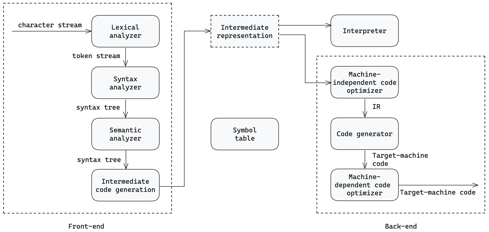

# A comparative analysis of programming languages for blockchain development with focus on gas efficiency

## Cover page

TODO: in English or Ukrainian?

## Abstract

TODO:
Document size A pages, B illustrations, C references.

BENCHMARK, BLOCKCHAIN, BYTECODE, COMPILATION, ETHEREUM VIRTUAL MACHINE, FE, FORGE, GAS EFFICIENCY, GAS OPTIMISATION, OPCODE, PROGRAMMING LANGUAGE, SMART CONTRACT, SOLIDITY, VYPER, WEB-3, YUL, YULP

The process of developing smart contracts with different programming languages, further source code compilation into bytecode, and its on-chain execution is an object of research in this paper. The subject of the research is the comparison of different programming languages for smart contract development with focus on gas efficiency of the resulting bytecode.

The main goal is to compare different programming languages for blockchain development, highlighting the gas efficiency of the resulting bytecode, alongside with other language features.

The research is based on the analysis of the Ethereum Virtual Machine (EVM), its code execution, programming languages for smart contract development, the features of corresponding compilers, and the gas efficiency of the resulting bytecode.

The results of this research paper describe features of different programming languages for blockchain development, their advantages and disadvantages, and a comparision of gas efficiency of the resulting bytecode.

The research findings can be used by developers to choose the most gas-efficient programming language for blockchain development both prior to the development or for optimisation purposes.

## Table of contents

TODO: update TOC accordingly

## Introduction

Current state of the research topic. The blockchain technology has gained significant popularity in recent years due to its decentralised nature, security, and transparency. One of the key components of blockchain technology is smart contracts, self-executing contracts with the terms of the agreement between buyer and seller being directly written into lines of code. Smart contracts are executed on the blockchain and can be used for various purposes, such as financial transactions, supply chain management, and digital identity verification.

Smart contracts are executed inside Ethereum Virtual Machine (EVM), a virtual machine that runs on every blockchain node when validating transactions. To prevent spam and unreasonably-heavy computational transactions, a concept of gas was introduced. Each operation in the EVM has a gas cost associated with it, which corresponds to the computational resources required to execute the operation. The gas cost is paid by the transaction sender in Ether, the native cryptocurrency of the Ethereum blockchain.

On the one hand, gas fees allow for a fair and efficient execution of smart contracts, preventing spam and denial-of-service attacks. On the other hand, gas fees can be a significant cost for both the smart contract developers and their users, especially when the contract contains complex and computationally-intensive logic. Consequently, it is crucial to optimise the gas efficiency of the smart contracts to reduce the gas fees and ease the burden of developing and using smart contracts.

Relevance of the research.
Each EVM operation is denoted by an opcode, which constitutes the bytecode of the smart contract. The bytecode is generated by compiling the source code of the smart contract written in a programming language supported by the EVM. The gas cost of the bytecode execution is the sum of the gas costs of the individual opcodes that are executed.

Alongside with the rise of the blockchain technology, different languages for smart contract development have emerged. However, if the same smart contract is developed in different languages, the resulting bytecode may have different gas costs due to the language features and compiler optimisations. Therefore, it is essential to compare different programming languages for blockchain development with focus on gas efficiency of the resulting bytecode.

Purpose and objectives of the research. The purpose of the research "A comparative analysis of programming languages for blockchain development with focus on gas efficiency" is to compare different programming languages for blockchain development, highlighting the gas efficiency of the resulting bytecode, alongside with other language features.

To achieve this goal, the following objectives were outlined:

1. Conduct a research on the blockchain technology
2. Describe how smart contracts and Ethereum Virtual Machine work
3. Define gas and its role in the EVM
4. Investigate the compilation process and resulting bytecode
5. Compile a list of programming languages for blockchain development
6. Define criterias for comparison of programming languages
7. Define and develop a smart contract for comparison
8. Compile and benchmark the resulting bytecode

Object, methods and means of research
An object of the research is the process of developing smart contracts with different programming languages, further source code compilation into bytecode, and its on-chain execution.

During the research, the most popular programming languages for blockchain development were analysed, and the criterias for comparison were defined. A smart contract was developed in different programming languages, compiled into bytecode, and benchmarked for gas consumption.
The result of the research is a comparison of the programming languages with focus on gas efficiency of the resulting bytecode.

Microsoft Visual Studio Code was used as an integrated development environment (IDE) for the development of the smart contract.

Possible areas of application
This paper describes the process of smart contract execution on the EVM-compatible blockchains, the concepts of gas, opcodes, bytecode, and the compilation process. The results of this research can be used by developers to better understand the relation between the bytecode and gas efficiency, and to choose the most gas-efficient programming language for blockchain development.

## Chapter 1. Blockchain and gas fees

The advent of blockchain technology has revolutionized the way transactions and digital interactions are conducted, introducing a decentralized and immutable ledger system that operates independently of traditional financial institutions.Central to this innovation is the concept of "gas fees," a critical component that governs the execution of operations on blockchain networks, particularly in platforms like Ethereum.Understanding gas fees is not only essential for developers working on blockchain-based applications but also for those involved in optimizing the efficiency of these platforms, particularly when it comes to the design and implementation of smart contracts.

At its core, gas fees serve as the economic incentive that drives the processing power required for transactions and smart contract execution on a blockchain.They function as a mechanism to compensate miners or validators for the computational resources they expend.In essence, gas fees ensure that the network remains secure, incentivizing participants to verify and add new transactions to the blockchain while preventing abuse of network resources by imposing a cost on each operation. This concept is crucial in blockchain environments, where decentralized consensus is achieved without a central authority.

The calculation of gas fees is intrinsically tied to the complexity of operations performed on the blockchain. For each operation within a transaction or a smart contract, a specific amount of gas is required. The total gas required is then multiplied by the gas price, which can fluctuate based on network demand.Therefore, the total transaction cost is a function of both the gas used and the prevailing gas price at the time of the transaction. This variability introduces an additional layer of complexity for developers and users alike, as they must anticipate potential costs associated with their operations.

Gas fees also play a pivotal role in the design and development of blockchain-based applications. For developers, the challenge lies in optimizing their smart contracts to be as gas-efficient as possible, minimizing the costs for end-users while ensuring the functionality and security of their applications.The programming language chosen for smart contract development has a significant impact on gas efficiency, as different languages offer varying levels of control over low-level operations and optimizations. This aspect becomes particularly critical in high-traffic environments where gas costs can escalate rapidly, affecting the viability of certain applications or even leading to network congestion.

Moreover, the concept of gas fees extends beyond merely covering computational costs; it also serves as a mechanism for network governance. By adjusting gas limits and fees, blockchain networks can regulate the throughput and scalability of the system. Higher gas fees during periods of congestion can deter excessive or unnecessary transactions, thereby maintaining the network's overall stability.Conversely, lowering gas fees can encourage more activity and experimentation on the network, fostering innovation and adoption.

### 1.1. Blockchain technology

Blockchain technology represents a transformative innovation in digital record-keeping, characterized by its decentralized, transparent, and immutable nature. Unlike traditional centralized systems where a single entity controls data, blockchain operates on a distributed ledger maintained across a network of nodes.This decentralization ensures that no single participant can alter the history of transactions, thereby providing a secure and tamper-resistant platform for various applications. The blockchain's structure, comprising blocks of data linked together in a chronological sequence, underpins its robustness against fraud and data manipulation. Each block contains a list of transactions and is cryptographically secured, making it virtually impossible to alter without the consensus of the network. This inherent security, combined with the transparency of public ledgers, has made blockchain a foundational technology in industries ranging from finance to supply chain management, and most notably, in the development of smart contracts and decentralized applications (DApps).

#### 1.1.1. General overview

Blockchain is a decentralized ledger system that records transactions across a network of computers (nodes). It consists of blocks containing transactions, timestamps, and cryptographic links to previous blocks. This decentralized design enhances security, transparency, and tamper resistance [1].

Ethereum expands blockchain beyond simple transactions, enabling smart contracts—self-executing code with terms written directly in it. These run on the Ethereum Virtual Machine (EVM), a decentralized computation engine. The Ethereum Yellow Paper by Dr. Gavin Wood outlines the protocol, including the EVM's structure and operation.

Ethereum's Turing-complete language allows developers to build sophisticated decentralized applications (DApps), distinguishing it from earlier blockchains limited to basic scripting and transactions.

Transactions and smart contract executions in Ethereum require "gas," a unit measuring computational work. Gas fees depend on consumption and user-set gas prices, deterring inefficiency while compensating miners or validators.

Ethereum transitioned from Proof of Work (PoW) to Proof of Stake (PoS) with Ethereum 2.0, improving scalability and energy efficiency. This shift, along with Ethereum's technical rigor detailed in the Yellow Paper, cements its role as a leader in blockchain innovation and decentralized applications [1].

#### 1.1.2. Global state

The "Global State" in Ethereum, detailed in the Ethereum Yellow Paper, represents the current status of the blockchain at any point, including account balances, contract code, and storage. It serves as the network's collective "memory" and is maintained across all nodes.

As transactions are executed, the Global State evolves through state transitions, dictated by the deterministic state transition function (𝛾) defined by the Ethereum protocol. This ensures consistent state changes across the distributed network.

Ethereum accounts, identified by unique addresses, include externally owned accounts (EOAs) controlled by private keys for Ether transactions, and contract accounts controlled by smart contract code. Each account stores a nonce, balance, contract code (if applicable), and storage.

The Global State is stored in a Merkle Patricia Trie, enabling efficient retrieval and verification. The state root, stored in the block header, provides a cryptographic summary of the state, allowing nodes to verify it without storing the entire blockchain, supporting Ethereum's decentralized nature [2].

Smart contracts also use their own Merkle Patricia Tries for storage, enabling secure and scalable management of data. This structure supports the growing number of contracts and decentralized applications (DApps).

Transactions modify the Global State by altering balances, invoking contracts, or changing contract storage. The Ethereum Virtual Machine (EVM) processes these transactions, computing state transitions with a stack-based architecture and gas to ensure resource efficiency.

Ethereum's consensus mechanism, historically Proof of Work (PoW) and now Proof of Stake (PoS) with Ethereum 2.0, maintains the integrity and security of the Global State. Each new block includes a state root representing the updated state after processing transactions, ensuring continuity and immutability. Validators or miners validate these blocks, preserving the blockchain's integrity.

#### 1.1.3. Transaction and execution

In Ethereum, transactions are the primary means by which state transitions occur within the blockchain. A transaction, as defined in Section 4.2 of the Ethereum Yellow Paper, is a signed data package that stores a message to be sent from an externally owned account (EOA) to another account on the network. Transactions are the mechanism through which value is transferred and smart contracts are executed, driving the functionality of decentralized applications (DApps) and the broader Ethereum ecosystem.

##### 1.1.3.1 Transaction Structure

A transaction in Ethereum contains the following fields, each of which plays a crucial role in the transaction's execution:

- Nonce: This is a counter that indicates the number of transactions sent from a particular account. It serves as a unique identifier for each transaction from the same account, preventing double-spending and ensuring that transactions are executed in the correct order.
- Gas Price: The gas price specifies the amount of Ether that the sender is willing to pay per unit of gas for the transaction to be processed. This value is set by the sender and can fluctuate depending on network demand. Higher gas prices incentivize miners or validators to prioritize the transaction.
- Gas Limit: The gas limit defines the maximum amount of gas the sender is willing to expend on the transaction. This value caps the total computational resources that can be used, protecting the sender from incurring excessively high costs if the transaction fails or requires more resources than expected.
- To: This field contains the address of the recipient account. If the transaction is intended to deploy a new contract, the "To" field is left empty.
- Value: The value field specifies the amount of Ether to be transferred from the sender’s account to the recipient’s account. If the transaction is calling a smart contract, this value might be used within the contract's logic.
- Data: The data field is optional and can contain arbitrary data, typically used for invoking specific functions within a smart contract. This field may also include the contract's initialization code when deploying a new contract.
- v, r, s: These fields represent the components of the transaction’s digital signature, ensuring that the transaction is authenticated and has not been tampered with. The v, r, and s values are derived from the sender's private key using the Elliptic Curve Digital Signature Algorithm (ECDSA).

Together, these fields define the parameters and constraints of a transaction, ensuring that it can be validated and executed in a manner consistent with the Ethereum protocol.

##### 1.1.3.2 Transaction Receipt

After a transaction executes, a transaction receipt summarizes its execution, as detailed in Section 4.4.1 of the Ethereum Yellow Paper. It includes:

- Post-Transaction State Root: The root of the global state trie after the transaction, serving as cryptographic proof of the updated state.
- Cumulative Gas Used: The total gas used in the block up to and including the transaction, showing block-wide gas consumption.
- Bloom Filter: A compact structure encoding logs for efficient searching and filtering by users and applications.
- Logs: Data records from transaction execution, often from smart contract events, stored in the receipt for external access.

The transaction receipt provides a historical record and a tool for analyzing and interacting with past transactions.

##### 1.1.3.3 Transaction Execution Process

The execution of a transaction in Ethereum is a multi-step process that ensures the integrity and consistency of the network, as outlined in Chapter 6 of the Ethereum Yellow Paper. The process can be broken down into three main stages: transaction validation, logic execution, and receipt creation.

1. Transaction Validation: Before a transaction can be executed, it must first be validated by the network. This involves several checks, including:

- Nonce Check: The nonce must match the expected value for the sender's account. If it does not, the transaction is considered invalid.
- Signature Verification: The v, r, and s values are used to verify the sender’s signature, ensuring that the transaction has been authorized by the account holder.
- Gas Check: The transaction must have a gas limit that is sufficient to cover the intrinsic cost of the transaction. This intrinsic cost includes a base fee plus additional costs for the size of the transaction data and any specific operations it may invoke.

2. Logic Execution: Once validated, the transaction is executed by the Ethereum Virtual Machine (EVM). This execution involves the following steps:

- Gas Consumption: As the transaction is processed, gas is consumed based on the computational complexity of the operations. If the transaction runs out of gas before completion, it is reverted, but the gas spent is not refunded.
- State Modification: The EVM processes the transaction, potentially modifying the global state. This could involve updating account balances, invoking smart contracts, or altering contract storage.
- Log Emission: If the transaction includes events or triggers within a smart contract, logs are emitted and recorded in the transaction receipt.

3. Receipt Creation: After the transaction is executed, a transaction receipt is generated. This receipt includes the post-transaction state root, cumulative gas used, bloom filter, and logs, as described earlier. The receipt is then stored on the blockchain, providing a permanent record of the transaction's outcome.

#### 1.1.4. Gas fees

Gas fees are a fundamental component of the Ethereum network, serving as the mechanism by which computational resources are measured and compensated. In Ethereum, every operation performed by the Ethereum Virtual Machine (EVM), whether it's executing a smart contract, sending a transaction, or performing data storage, requires a certain amount of computational work. Gas is the unit of measurement used to quantify this work, and gas fees are the cost that users must pay to execute these operations on the network.

##### 1.1.4.1. Components of Gas Fees

The gas fee for a transaction is determined by several factors, as detailed in Section 5 of the Ethereum Yellow Paper:

1. Gas Cost: Each operation in the EVM, from simple arithmetic to complex contract executions, has an associated gas cost. The gas cost is a fixed value assigned to each operation, reflecting the computational effort required. For example, simple operations like adding two numbers might cost only a few units of gas, while more complex operations like storing data in contract storage might cost significantly more.

2. Gas Limit: The gas limit is set by the sender of the transaction and represents the maximum amount of gas they are willing to spend. The gas limit must be high enough to cover the intrinsic gas cost of the transaction, which includes a base fee for the transaction itself, as well as additional fees for the data payload and specific operations. If the gas limit is set too low, the transaction will fail, but the gas used up to that point will still be consumed.

3. Gas Price: The gas price is the amount of Ether the sender is willing to pay per unit of gas. This value is set by the sender and is typically measured in gwei (1 gwei = 10^-9 Ether). The gas price can fluctuate based on network demand, with higher prices offering an incentive for miners or validators to prioritize the transaction. The total gas fee paid by the sender is the product of the gas used and the gas price.

##### 1.1.4.2. Gas Fees Calculation

The total gas fee for a transaction is calculated as follows:

```txt
Total Gas Fee = Gas Used × Gas Price
```

Where:

- Gas Used: This is the actual amount of gas consumed by the transaction during execution. If the transaction completes successfully, the gas used will be equal to or less than the gas limit set by the sender. If the transaction runs out of gas before completion, it is reverted, but the gas up to that point is still deducted from the sender’s account.

- Gas Price: This is the price per unit of gas, as determined by the sender.

For instance, if a transaction consumes 21,000 units of gas (a typical value for a simple Ether transfer) and the sender sets a gas price of 20 gwei, the total gas fee would be:

```txt
21,000 × 20 gwei = 420,000 gwei = 0.00042 Ether
```

##### 1.1.4.3. Intrinsic Gas Cost

The intrinsic gas cost is the base cost for executing a transaction, and it is composed of several elements:

1. Base Transaction Cost: This is a fixed cost for any transaction, which covers the basic overhead of processing the transaction on the blockchain. As per the Yellow Paper, the base cost for a standard transaction is 21,000 gas.

2. Data and Storage Costs: Transactions that include data (such as contract execution or deploying a contract) incur additional gas costs. The cost is proportional to the amount of data sent or stored, with operations that write to storage being particularly expensive, as they contribute to the growth of the blockchain state.

3. Operation-Specific Costs: Certain operations within a transaction, such as creating a new contract or invoking specific EVM opcodes, have additional gas costs associated with them. These costs are predefined in the Ethereum protocol to reflect the relative computational intensity of each operation.

Ethereum also provides mechanisms for optimizing gas usage and potentially receiving gas refunds. For example, if a transaction deletes a contract or clears storage, gas can be refunded to the sender, reducing the overall cost of the transaction. This incentivizes developers to write more efficient smart contracts, as unnecessary data and operations can significantly increase gas costs.

##### 1.1.4.4. Economic and Network Implications

Gas fees play a critical role in the economics of the Ethereum network. They incentivize miners or validators to include transactions in the blockchain and help prevent network abuse by imposing a cost on every operation. High gas fees during periods of network congestion can serve as a natural deterrent to excessive or unnecessary transactions, while also reflecting the scarcity of computational resources on the network.

In conclusion, gas fees are a sophisticated mechanism that balances the computational needs of the Ethereum network with the economic realities of decentralized transaction processing. They ensure that all participants in the network contribute to the cost of maintaining and securing the blockchain, while also encouraging the efficient use of resources through careful management of gas limits, prices, and intrinsic costs. The Ethereum Yellow Paper’s detailed specification of gas costs and fees underscores the importance of these mechanisms in maintaining the network’s integrity, scalability, and long-term sustainability.

#### 1.1.5. Blocks

Ethereum’s blockchain is a series of blocks, each capturing transactions and the network's state. Blocks consist of:

1. Block Header: Contains metadata like:

- Parent Hash: Links to the previous block for continuity and security.
- Uncle Hash: References "uncle" blocks to reward miners and improve security.
- State Root: Cryptographic proof of the global state post-transactions.
- Transactions Root: Efficiently verifies transactions.
- Receipts Root: Enables quick access to transaction outcomes.
- Logs Bloom: Summarizes logs for easy search.
- Difficulty: Adjusts PoW complexity for consistent block mining.
- Number: Indicates block position.
- Gas Limit/Used: Defines and tracks transaction gas usage.
- Timestamp: Records when the block was mined.
- Extra Data: Optional 32-byte custom field.
- Mix Hash/Nonce: Used in the PoW algorithm.

2. Block Body:

- Transaction List: Transactions transitioning the state.
- Uncles: Near-simultaneously mined blocks improving security.

Blocks are cryptographically linked via the parent hash, ensuring tamper resistance. Block addition follows Ethereum’s consensus mechanism: PoW (miners solving puzzles) or PoS (validators staking Ether). Once added, blocks are immutable, securing Ethereum’s transaction and state history, supporting decentralized apps and smart contracts.

#### 1.1.6. Consensus algorithms and block finalization

Consensus algorithms are the mechanisms that allow distributed networks like Ethereum to agree on the state of the blockchain, ensuring that all participants maintain a consistent and secure ledger without a central authority. In Ethereum, two primary consensus algorithms have been employed: Proof of Work (PoW) and Proof of Stake (PoS), each with its own method of securing the network and achieving consensus.

Proof of Stake (PoS) is the consensus algorithm introduced with Ethereum 2.0, designed to address the limitations of PoW. In PoS, validators are chosen to propose and attest to new blocks based on the amount of Ether they have staked as collateral. This staking process replaces the need for energy-intensive computations, significantly reducing the environmental impact of securing the network. Validators are incentivized to act honestly by the potential loss of their staked Ether if they attempt to undermine the network. PoS also enables more efficient scalability and faster finalization times, making it a more sustainable solution for Ethereum’s long-term growth.

Block finalization refers to the point at which a block is considered permanently included in the blockchain, meaning that it cannot be altered or removed without the consensus of the entire network. Traditionally, a block is considered final after six subsequent blocks, often referred to as the "6 confirmations" rule.

In PoS, finalization is more deterministic and is achieved through a process known as checkpointing. Validators periodically vote on the state of the blockchain at certain intervals (epochs). When two-thirds of the validators agree on a checkpoint, all preceding blocks up to that checkpoint are considered finalized. This mechanism not only enhances security by preventing reorgs but also speeds up the finalization process, providing faster guarantees that transactions included in these blocks are immutable.

#### 1.1.7. Clients

In the Ethereum network, clients, also known as nodes, are software implementations that enable participants to interact with the blockchain. Execution clients are responsible for executing smart contracts, validating transactions, maintaining the network’s state, and ensuring consensus across the distributed network. These clients provide the necessary infrastructure for developers, miners, validators, and users to access and engage with Ethereum.

Several execution clients exist, each with its own unique features and optimizations. The most prominent and widely used Ethereum clients include:

1. **Geth (Go-Ethereum)**: Developed by the Ethereum Foundation, Geth is the most popular and widely used client. Written in Go, it is known for its robust performance and extensive feature set, making it a preferred choice for both developers and operators of Ethereum nodes.

2. **Nethermind**: Written in C#, Nethermind is known for its high performance and compatibility with various platforms, including Windows. It is often chosen by developers looking for a client with strong support for debugging and analysis tools.

3. **Besu**: Developed by the Hyperledger Foundation, Besu is an Ethereum client written in Java. It is particularly popular among enterprises due to its support for both public and private Ethereum networks, as well as its strong focus on permissioned blockchain use cases.

4. **Erigon**: Formerly known as Turbo-Geth, Erigon is a performance-optimized client written in Go. It focuses on reducing resource usage and improving synchronization speed, making it ideal for operators looking for efficiency.

Each of these clients plays a crucial role in maintaining the decentralized and resilient nature of Ethereum. By offering diverse options tailored to different needs, they contribute to the robustness and scalability of the Ethereum network.

### 1.2. Accounts and Smart contracts

In Ethereum, accounts and smart contracts form the backbone of all interactions on the blockchain. Accounts, which can be either externally owned or contract-based, are the primary entities that hold Ether and initiate transactions. Externally owned accounts (EOAs) are controlled by private keys and are typically used by individuals or organizations to send and receive funds. In contrast, contract accounts are governed by code and operate autonomously based on predefined rules.

#### 1.2.1. Accounts

In Ethereum, every interaction on the blockchain is associated with an address, a 160-bit identifier that represents either an Externally Owned Account (EOA) or a Smart Contract (SC). The difference between these two types of accounts is fundamental to how Ethereum operates. An Externally Owned Account (EOA) is controlled by a private key and is typically associated with a user or entity. EOAs are the source of transactions on the Ethereum network, including sending Ether and interacting with smart contracts. A Smart Contract (SC), on the other hand, is a contract account that is controlled by code rather than a private key. Once deployed on the Ethereum blockchain, a smart contract operates autonomously according to its programmed logic, responding to incoming transactions based on its predefined rules.

Each Ethereum address, whether associated with an EOA or an SC, contains several key fields, as described in the Ethereum Yellow Paper:

1. Nonce: This field represents a counter that tracks the number of transactions sent from an EOA or the number of contract creations initiated by an SC. It ensures that transactions are processed in order and prevents replay attacks.

2. Balance: The balance field indicates the amount of Ether held by the account. For EOAs, this balance can be freely transferred, while for SCs, it can be used according to the contract’s logic.

3. Storage Root: This field is unique to smart contracts and represents the root of a Merkle Patricia Trie that encodes the contract’s storage. It is used to efficiently manage and access the data stored within the smart contract.

4. CodeHash: Also specific to smart contracts, the CodeHash field contains the hash of the contract’s code. This hash enables the network to efficiently verify the contract’s code during execution without storing the actual code in the address field.

#### 1.2.2. Contract creation

Contract creation in Ethereum is a transaction type that deploys a new smart contract. As detailed in Section 7 of the Ethereum Yellow Paper, this process ensures proper initialization and integration into the network.

Both Externally Owned Accounts (EOAs) and smart contracts can create contracts, enabling autonomous, multi-contract systems for enhanced flexibility.

During contract creation, the transaction’s "To" field is empty, and the data field contains initialization code to set up the contract’s state. The steps include:

- Transaction Initiation: An account sends a transaction with initialization code, gas, and validation checks (e.g., funds, nonce).
- Address Generation: The contract address is deterministically generated from the sender’s address and nonce.
- Initialization Code Execution: The EVM runs the code, consuming gas, and stores the resulting runtime bytecode in the contract’s CodeHash.
- Storage Setup: The initialization code sets up initial storage, managed via a Merkle Patricia Trie.
- Contract Finalization: The contract’s address, code, and storage are recorded on the blockchain, with unused gas refunded.

This process ensures consistent and secure deployment of contracts, whether initiated by EOAs or other smart contracts, preserving Ethereum's integrity.

#### 1.2.3. Message call

A message call in Ethereum allows an account (EOA or smart contract) to interact with another contract or send Ether. Unlike transactions, message calls are internal processes that may not create new blocks but can alter the EVM state.

Key steps in a message call, per Section 8 of the Ethereum Yellow Paper:

- Initiation: Triggered by an EOA via a transaction or a smart contract during execution, specifying the recipient, Ether amount, input data, and gas limit.
- Recipient: The recipient address may be an EOA or smart contract. For contracts, the call can trigger code execution.
- Gas Allocation: Gas allocated limits computation. If gas runs out, the call fails, and state changes are reverted.
- Code Execution: If the recipient is a contract, the EVM executes its code using the input data, enabling operations like storage updates, sending Ether, or further calls.
- Return Data: Results, confirmations, or error messages are returned to the caller after execution.
- Finalization: On success, state changes are committed, and unused gas is refunded. On failure, all changes (except gas used) are reverted.

Message calls enable dynamic interactions between contracts, supporting Ethereum’s decentralized applications.

### 1.3. Bytecode

In Ethereum, bytecode refers to the low-level machine code that is executed by the Ethereum Virtual Machine (EVM). This code is the result of compiling high-level programming languages like Solidity or Vyper into a format that the EVM can understand and execute. Bytecode plays a critical role in how smart contracts are deployed, executed, and interacted with on the blockchain. Understanding its structure, functionality, and the distinction between different types of bytecode is essential for developers and researchers working with Ethereum.

#### 1.3.1. Structure of Bytecode

Ethereum bytecode consists of a series of hexadecimal values, each representing a specific instruction for the EVM to execute. These instructions, known as opcodes, dictate the operations the EVM must perform, such as arithmetic operations, storage access, flow control, and interaction with external contracts. Each opcode is 1 byte (2 hexadecimal characters), followed by any necessary parameters or arguments.

For example, a simple operation like `ADD` (which adds two numbers) is represented by the opcode `0x01`. More complex operations such as `SSTORE` (store a value in contract storage) are represented by opcodes like `0x55`.

A sample segment of Ethereum bytecode might look like this:

```hex
6080604052348015600f57600080fd5b50604051602080610100833981018060405281019080805182019291906020018051820192919050505061004c8061004a6000396000f3fe6080604052600080fdfea26469706673582212206d0d22d2b5bc5b08cfb4101917a9e0f08045c7f6b6c33e47d33f7419eebfd7a864736f6c63430008000033
```

The bytecode is composed of individual opcodes that the EVM interprets and executes sequentially. To extract opcodes from bytecode, a common method is to split the bytecode into segments of 2 hex characters (1 byte) and map them to known EVM opcodes using a reference table.

For example, consider the following simple bytecode:

```hex
6001600101
```

Breaking this down:

- `60` (PUSH1) pushes the value 01 onto the stack.
- `60` (PUSH1) pushes the value 01 again onto the stack.
- `01` (ADD) adds the two values on the stack.

This bytecode adds two numbers, both 1, resulting in a value of 2 on the stack.

#### 1.3.2. Deployment and execution bytecode

There are two types of bytecode associated with smart contracts in Ethereum: deployment (initialization) bytecode and execution (deployed) bytecode. These bytecode types serve different purposes in the lifecycle of a smart contract.

**Deployment Bytecode** is the code responsible for initializing a smart contract. It is included in the transaction that deploys the contract to the blockchain. The deployment bytecode contains both the constructor logic of the contract and the code responsible for returning the contract’s execution bytecode. Once this bytecode is executed, the contract is stored on the blockchain, and only the execution bytecode remains active.

For example, when a smart contract is deployed, the deployment bytecode handles tasks like setting initial values in storage, executing constructor functions, and allocating contract-specific resources. After the deployment process is complete, the EVM discards the initialization code, leaving only the execution bytecode on the blockchain.

**Execution Bytecode** is what remains on the blockchain once a smart contract is deployed, and is invoked when users or other contracts interact with the contract. This bytecode defines the contract's logic and handles function calls, event emissions, and interactions with external accounts or contracts. Unlike the deployment bytecode, which is executed once during contract creation, the execution bytecode persists on the blockchain and is executed each time the contract is called.

### 1.4. Ethereum Virtual Machine

Ethereum Virtual Machine (EVM) is a crutial component of the Ethereum blockchain, acting as a quasi-Turing-complete virtual machine that executes transactions within the Ethereum ecosystem.
As clarified in Ethereum Yellow Paper, "quasi" stems from the fact that the total amount of computations performed is explicitly bounded by a separate parameter called gas.
The aforementioned Ethereum Yellow Paper also rigoriously defines the behavior of the EVM, which includes the compliance with the rules of the global (persistant) and local (not persistant) state changes alongside with calculation and deduction of the gas costs of the performed operations.

#### 1.4.1. EVM overview

The EVM operates as a simple stack-based architecture with a word size of 256 bits, chosen specifically to support the Keccak256 hash function and elliptic-curve calculations.
The memory model is a straightforward word-addressed byte array, while the stack has a maximum depth of 1024 items.
The machine also includes a separate storage model, which is conceptually similar to memory but differs in that it is a word-addressable word array. Unlike volatile memory, storage is non-volatile and persists as part of the system global state.
Initially, all locations in both storage and memory are well-initialized as zero.

The EVM does not adhere to the traditional von Neumann architecture: instead of storing program code in generally accessible memory or storage, the code is kept in a separate virtual ROM, accessible only through specialized instructions.

The machine can have exceptional execution halting for several reasons, including stack underflow, invalid instructions, and out-of-gas exceptions. The latter is a critical feature of the EVM, as it prevents infinite loops and other computationally intensive operations from consuming all available resources.
During exceptional halting, all performed state changes are reverted and this fact is reported to the execution agent, which deals with it separetely.

#### 1.4.2. Machine state

For the EVM to operate, it must maintain a machine state, which consists of the following components:

- Gas available (g) - the amount of gas remaining for the current transaction. Decreases as operations are executed and is used to pay for computation.
- Program counter (pc) - the number of the current instruction being executed. Increments by one after each instruction. Can be modified by JUMP and JUMPI instructions.
- Memory contents (m) - word-addressable byte array, with each byte array being 32 bytes long. Used for temporary storage during execution.
- Active number of words in memory (i) - the number of words currently used in memory, counting from 0. Increases as memory is accessed and decreases as memory is freed.
- Stack contents (s) - a stack of 256-bit words used for storing intermediate values during execution. Grows and shrinks as values are pushed and popped.
- Returndata buffer (o) - a buffer used to store data returned from a message call. Cleared after each call.

Apart from the machine state, the EVM also inherits execution environment (I), which includes:

- I_a, the address of the account which owns the code that is executing.
- I_o, the sender address of the transaction that originated this execution.
- I_p, the price of gas paid by the signer of the transaction that originated this execution (effective gas price).
- I_d, the byte array that is the input data to this execution (transaction data).
- I_s, the address of the account which caused the code to be executing (transaction sender).
- I_v, the value, in Wei, passed to this account as part of the same procedure as execution (transaction value).
- I_b, the byte array that is the machine code to be executed.
- I_H, the block header of the present block.
- I_e, the depth of the present message-call or contract-creation (i.e. the number of CALLs or CREATE(2)s being executed at present).
- I_w, the permission to make modifications to the state.

#### 1.4.3. Opcodes

In EVM, each operation has its own number, therefore the short name - "opcode" (operation code). The EVM has a total of 143 opcodes, each descibed by:

- Value - the number of the opcode;
- Mnemonic - the short descriptive name of the opcode;
- Items popped - the number of items popped from the stack;
- Items pushed - the number of items pushed to the stack;
- Intrinsic gas cost - the base gas cost of the opcode. The actual gas cost can be higher due to additional factors;
- Operation logic - a description of the operation performed by the opcode.

Detailed information about each opcode can be found in Appendix TODO:.

#### 1.4.4. Fees overview

In EVM, gas fees are charged in three specific scenarios, each being a prerequisite for executing an operation. The first and most common scenario involves the intrinsic gas cost associated with the computation required for the operation (opcode) itself.
The second scenario arises when gas is deducted as part of a payment for initiating a subordinate message call or creating a new contract, which applies to operations such as CREATE, CREATE2, CALL, and CALLCODE. Lastly, gas is also consumed when there is an increase in memory usage during execution.

During the execution of a contract, the total fee related to memory usage is based on the smallest multiple of 32 bytes that covers all memory indices accessed (whether for reading or writing).
These memory fees are assessed on a just-in-time basis. For example, accessing a memory area that extends at least 32 bytes beyond any previously accessed region will trigger an additional fee.

Storage fees operate under a slightly different model. To encourage efficient storage usage — since excessive storage increases the state database size for all nodes — the gas cost for an operation that clears a storage entry does not only waived, but also gets a refund.
In fact, this refund is effectively provided up front because the initial cost of using a storage location is significantly higher than that of ongoing usage. This design incentivizes developers to clear unused storage, helping manage the overall blockchain state size.

The gas cost of an operation is calculated as the sum of the intrinsic gas cost, possible gas cost of passing arguments to instruction, as well as memory access, either cold or warm.

More detailed information about gas costs for each opcode is presented in Appendix TODO:.

#### 1.4.5. Halting

As previously stated, the EVM can halt execution for various reasons, however two groups can be distinguished: exceptional halting and normal halting.

Ethereum Yellow Paper specifies that the execution is in an exceptional halting state if there is insufficient gas, if the instruction (opcode) is invalid, if there are insufficient stack items for the operation,
if the new stack size after performing an operation is larger than 1024, if a JUMP/JUMPI destination is invalid, or state modification is attempted during a static call.

JUMP/JUMPI destination is valid if it is occupied by the JUMPDEST opcode. Such positions must be on valid instruction boundaries, rather then in the middle of the PUSH operations, and must appear within the explicitly defined portion of the code.

The normal halting state is reached when the VM executes either opcode from the two groups: RETURN, REVERT or STOP, SELFDESTRUCT, or reaches the end of the code. In the latter case, the STOP opcode is executed.

#### 1.4.6. Execution

Execution model is defined recursively as a function X over the full system state, the machine state, accrued system substate and the execution environment.
The results of X are a changed full system state, changed machine state, and the output data, and are determined conditionally:

- if the system is in an exceptional halting state, a full system state is not changed, and output data is empty.
- if a system is in a normal halting state (e.g. the current instruction is REVERT), then a full system state is not changed, an amount of gas consumed by the instruction is deducted from the current machine state, and output data is the result of the current instruction.
- if an output of the current instruction is not empty, then the result is an application of the iterator function O (which defines the result of a single cycle of the state machine).
- otherwise, the result is an application of the execution model function X to the result of the iterator function O.

Iterator function O is defined as a function of the current full system state, machine state, accrued system substate, and execution environment, and outputs of the same meaning. The function is defined as following:

- The execution environment is not changed.
- The full system state and accrued substate are changed according to the effects of the current instruction.
- The changes to the machine state are the following:
  - a specific for a current instruction amount of items are popped from and pushed to the stack
  - gas left is decreased by the gas cost of the current instruction
  - program counter is modified according to the current instruction: either set to the JUMP/JUMPI destination, or incremented so that the next instruction is executed (PUSH1...PUSH32 require bigger increment to account for the data being pushed).

Informally, the execution model function X is cycled (Yellow Paper specifies recursion, but the implementation can use a simple loop), executes instructions one by one, which results in changes to the machine and global state,
until either the system is in an exceptional halting state, which discards all changes made, or the machine has reached a controlled halt, which preserves the changes made and returns the output data.

### 1.5. Fee sources conslusion

In Ethereum, gas fees are the fundamental mechanism that ensure fair compensation for computational resources consumed by smart contracts and transactions. As explained in the previous subchapter, users pay gas fees to cover the costs of various operations performed by the Ethereum Virtual Machine (EVM). These fees are required for executing opcodes, storing data, and interacting with the blockchain. To optimize the efficiency of smart contracts and minimize costs, it is essential to understand the key sources of gas consumption.

1. Computation: The EVM performs numerous operations during contract execution, each represented by an opcode. Some opcodes are computationally expensive, consuming significant gas, while others are relatively lightweight. Appendix G of the Ethereum Yellow Paper defines the gas cost for each opcode, with the following consuming the most gas:

- `EXP` (`0x0A`): Exponentiation is one of the most gas-intensive operations, with a base cost of 10 gas and an additional cost of 50 gas for every byte in the exponent.
- `SLOAD` (`0x54`): Loading data from contract storage is expensive, costing 100 gas per access.
- `SSTORE` (`0x55`): Storing data in contract storage is one of the most expensive operations, costing 20,000 gas to add new storage and 5,000 gas to modify existing storage.
- `CALL` (`0xF1`): External contract calls are costly due to the complexity involved. They have a base cost of 700 gas, with additional gas based on the contract's execution complexity.
- `CREATE` (`0xF0`): Deploying a new contract is expensive, requiring 32,000 gas plus the cost of executing the initialization bytecode.
- `LOGn` (`0xA0`–`0xA4`): Logging operations (event emissions) can consume between 375 gas and 8 gas per byte of data logged.
- `Storage`: Contract storage is a major source of gas fees. Operations that interact with storage, such as `SSTORE` and `SLOAD`, are expensive because they require changes to the blockchain’s persistent state. Storing large amounts of data or frequently accessing storage can significantly drive up the cost of executing smart contracts.

2. Memory and Stack Usage: While operations involving memory and the stack are less expensive than storage operations, they still contribute to gas consumption. Operations like MLOAD (3 gas) and MSTORE (3 gas) cost relatively little, but inefficient memory management can accumulate costs over many operations.

3. External Interactions: Interacting with external contracts or sending Ether through CALL or CREATE incurs substantial gas fees. Each call requires gas for both the base operation and the execution of the called contract, making contract-to-contract interactions one of the primary fee sources.

Smart contract developers must carefully manage gas costs to optimize their contract’s performance and affordability. Reducing interactions with storage, minimizing computationally expensive operations, and efficiently managing memory are all key strategies for lowering gas consumption. Furthermore, gas refunds can be earned by deleting storage variables using the SSTORE opcode, which refunds part of the gas used, incentivizing more efficient use of the blockchain's resources.

## Chapter 2. Programming languages and compilation

### 2.1. Programming languages

#### 2.1.1. Overview

Programming languages are formal systems designed for writing instructions that computers can interpret and execute. They act as a bridge between human logic and machine operations, enabling developers to communicate tasks to a computer in a structured and efficient manner. Each language has its own set of rules, syntax, and semantics that dictate how instructions are written and executed, allowing for the creation of software ranging from simple scripts to complex applications.

At their core, programming languages abstract the complexities of hardware, making it easier for developers to focus on solving problems rather than dealing with low-level machine operations. They provide tools for controlling the flow of execution, manipulating data, and interacting with external systems. Over time, various languages have emerged, each with distinct characteristics and specialized use cases, catering to different programming paradigms and problem domains.

While all programming languages share a common goal—enabling human interaction with computers—they differ significantly in terms of structure, performance, and usability. These differences can be analyzed through several key features, such as paradigms, typing systems, memory management models, and more. Understanding these features provides insight into how different programming languages function and what makes them suitable for particular types of tasks.

#### 2.1.2. Key Features of Programming Languages

Programming languages possess several key features that define their behavior, usability, and suitability for different tasks. These features include paradigms, typing discipline, syntax and semantics, memory management, compilation model, concurrent support, level of abstraction, and error handling.

Paradigms: Programming paradigms influence how problems are structured and solved in a language. Procedural languages organize logic into step-by-step instructions (e.g., C), while object-oriented languages focus on classes and objects (e.g., Java, Python). Functional programming emphasizes immutability and mathematical function evaluation (e.g., Haskell), and logic programming uses facts and rules for inference (e.g., Prolog). Many modern languages support multiple paradigms.

Typing Discipline: Typing determines how a language handles data types. Statically typed languages check types at compile-time (e.g., Java), while dynamically typed languages infer types at runtime (e.g., Python). Strongly typed languages enforce strict type rules, while weakly typed ones allow implicit type conversions. Some languages, like TypeScript, enhance type safety in traditionally weakly typed environments.

Syntax and Semantics: Syntax governs how code is written, while semantics define its behavior during execution. Languages like Python prioritize readability with clear and simple syntax, while others like Perl offer flexibility. Semantics vary across languages, with similar constructs often carrying different meanings (e.g., assignment in Python vs. Haskell).

Memory Management: Efficient memory management is critical for performance and reliability. Manual management (e.g., C) gives developers control but risks issues like memory leaks, while automatic garbage collection (e.g., Java) simplifies memory handling at the cost of potential overhead. Techniques like reference counting and ownership rules (e.g., Rust) further diversify memory management approaches.

Compilation Model: Languages differ in how they transform source code into executable form. Compiled languages (e.g., C++) generate optimized machine code for high performance. Interpreted languages (e.g., Python) execute code line-by-line for flexibility but slower execution. Hybrid models like JIT (e.g., Java) and AOT (e.g., Swift) balance these trade-offs.

Concurrent Support: Concurrency allows programs to perform tasks simultaneously. Multithreading (e.g., Java) enables parallel execution, while asynchronous programming (e.g., JavaScript) handles tasks like I/O efficiently. Lightweight alternatives like coroutines (e.g., Python) facilitate cooperative multitasking.

Level of Abstraction: High-level languages (e.g., Python) abstract hardware details, prioritizing ease of use, while low-level languages (e.g., C) provide fine control over resources. Mid-level languages (e.g., C++) blend these approaches, offering flexibility and performance.

Error Handling: Robust error handling ensures reliability. Exceptions (e.g., Python) allow structured responses to runtime issues, while error codes (e.g., C) require manual checks. Assertions are commonly used for debugging. Each approach has strengths depending on the application context.

### 2.2. Compilation process

#### 2.2.1. Compiler overview

A compiler is a program that reads a program written in one language (the source language) and converts it into an equivalent program in another language (the target language).
A critical function of the compiler is to identify and report any errors found in the source program during the translation process, so that the developer can resolve the issues and retry again.
When the target program is a machine-language executable, the user can call it to process inputs and generate outputs.

Another type of language processor is an interpreter. Rather than producing a target program through translation, an interpreter executes the operations specified in the source program directly on the user-provided inputs.
Generally, a compiler-generated machine-language target program is significantly faster at mapping inputs to outputs compared to an interpreter. However, an interpreter often provides better error diagnostics than a compiler because it executes the source program statement by statement.

Creating an executable target program might require more than just a compiler. The source program could be split into modules stored in separate files, and gathering these into a single program might be the job of a separate program called a preprocessor.
The preprocessor can also expand macros, which are shorthand notations, into source language statements.

This modified source program is then sent to a compiler. The compiler's output might be an assembly-language program, as assembly language is easier to generate and debug. The assembly-language program is then processed by an assembler, producing relocatable machine code.

Large programs are often compiled in segments, necessitating the linking of relocatable machine code with other relocatable object files and library files to form the executable code that runs on the machine.
The linker resolves external memory addresses where code in one file refers to a location in another file. Finally, the loader assembles all executable object files into memory for execution.

#### 2.2.2. Structure of a compiler

Basically, compilation process can be divided into two main parts: analysis and synthesis.

During the analysis phase, the source program is broken down into its fundamental components, and a grammatical structure is applied to these components. This structure is then used to create an intermediate representation of the source program.
If the analysis phase finds that the source program is either syntactically incorrect or semantically flawed, it must provide informative messages to help the user make corrections.
Additionally, the analysis phase gathers information about the source program and stores it in a data structure known as a symbol table. This symbol table, along with the intermediate representation, is then passed to the synthesis phase.

In the synthesis phase, the target program is constructed using the intermediate representation and the information from the symbol table. The analysis phase is often referred to as the front end of the compiler, while the synthesis phase is known as the back end.
Upon closer inspection of the compilation process, we see that it functions as a series of phases, each transforming the representation of the source program. A typical breakdown of these phases is shown in Fig. 2.1. In practice, several phases might be combined, and the intermediate representations between these grouped phases might not be explicitly constructed.
The symbol table, which contains information about the entire source program, is utilized by all phases of the compiler.

The analysis part is often called the front end, and the synthesis part is called the back end. An interpreter, however, does not fit into this model, as it does not produce a target program. Instead, it directly executes the operations specified in the source program on the user-provided inputs.



Figure 1 - Compilation process phases

##### 2.2.2.1. Symbol table

A key function of a compiler is to record the variable names used in the source program and gather information about various attributes of each name.
These attributes may include details about the allocated storage for a name, its type, its scope (where in the program its value can be used), and, in the case of procedure names, details such as the number and types of its arguments, the method of passing each argument (e.g., by value or by reference), and the return type.

The symbol table is a data structure that contains a record for each variable name, with fields for the name's attributes. This data structure should be designed to enable the compiler to quickly find the record for each name and efficiently store or retrieve data from that record.

##### 2.2.2.2. Lexical analysis

The first phase of a compiler is known as lexical analysis or scanning. During this phase, the lexical analyzer reads the stream of characters that make up the source program and groups these characters into meaningful sequences called lexemes. For each lexeme, the lexical analyzer generates a token in the form of

```txt
<token-name; attribute-value>
```

which it then passes to the next phase, syntax analysis. In this token, the first component, token-name, is an abstract symbol used in syntax analysis, while the second component, attribute-value, refers to an entry in the symbol table for this token. The information from the symbol table entry is essential for semantic analysis and code generation.

For example, a sequence of tokens after lexical analysis might look like this:

```txt
<id,1> <+=> <42> <*> <id,2>
```

In this representation, the tokens are `id` (identifier), `+=` (addition assignment operator), `42` (integer constant), `*` (multiplication operator), and `id` (identifier). The attribute values `1` and `2` refer to the symbol table entries for the identifiers.

##### 2.2.2.3. Syntax analysis

The second phase of a compiler is syntax analysis or parsing. During this phase, the parser takes the first components of the tokens generated by the lexical analyzer and uses them to create a tree-like intermediate representation that illustrates the grammatical structure of the token stream.
A common form of this representation is a syntax tree, where each interior node represents an operation, and the children of the node represent the arguments of that operation.

The following phases of the compiler utilize this grammatical structure to further analyze the source program and generate the target program.

##### 2.2.2.4. Semantic analysis

The semantic analyzer utilizes the syntax tree and the information in the symbol table to verify the source program's semantic consistency with the language definition. It also collects type information and stores it either in the syntax tree or the symbol table for later use during intermediate code generation.
A crucial aspect of semantic analysis is type checking, where the compiler ensures that each operator has compatible operands. For instance, many programming languages require an array index to be an integer; the compiler must report an error if a floating-point number is used as an array index.
The language specification may allow certain type conversions, known as coercions. For example, a binary arithmetic operator might be used with either a pair of integers or a pair of floating-point numbers. If the operator is applied to a floating-point number and an integer, the compiler can convert or coerce the integer to a floating-point number.

##### 2.2.2.5. Intermediate code generation

When translating a source program into target code, a compiler may create one or more intermediate representations, which can take various forms. Syntax trees are a common type of intermediate representation used during syntax and semantic analysis.

After completing the syntax and semantic analysis of the source program, many compilers generate a specific low-level or machine-like intermediate representation, which can be considered a program for an abstract machine. This intermediate representation should be easy to produce and straightforward to translate into the target machine.

One form of intermediate representation is known as three-address code, which comprises a sequence of assembly-like instructions with three operands per instruction. Each operand can function similarly to a register.

There are several noteworthy points about three-address instructions. First, each three-address assignment instruction has at most one operator on the right side, thereby determining the order of operations. Second, the compiler must generate a temporary name to store the value computed by a three-address instruction. Third, some three-address instructions have fewer than three operands.

Another form of intermediate representation is bytecode, which is then usually executed by an interpreter.
For example, Java language processor generates bytecode that is executed by the Java Virtual Machine (JVM). A benefit of using bytecode is that it allows the same compiled program to run on any machine that has an interpreter for the bytecode.

##### 2.2.2.6. Code optimization

The machine-independent code optimization phase aims to enhance the intermediate code to produce better target code. Typically, "better" means faster, but other goals, such as shorter code or code that uses less power, may also be important. For instance, a basic algorithm might generate intermediate code by using an instruction for each operator in the tree representation produced by the semantic analyzer.

Using a straightforward intermediate code generation algorithm followed by code optimization is an effective method for producing high-quality target code.

The extent of code optimization varies significantly among different compilers. In those that perform the most optimization, known as "optimizing compilers," a substantial amount of time is devoted to this phase. There are simple optimizations that can greatly improve the running time of the target program without significantly slowing down the compilation process.

##### 2.2.2.7. Code generation

The code generator receives an intermediate representation of the source program and translates it into the target language. If the target language is machine code, it involves selecting registers or memory locations for each variable used by the program.
The intermediate instructions are then converted into sequences of machine instructions that accomplish the same tasks. An essential part of code generation is the careful assignment of registers to store variables.

## Chapter 3. Blockchain programming languages comparison

Blockchain development involves selecting the right programming language to build efficient, secure, and scalable decentralized applications (DApps) and smart contracts. Given the unique demands of blockchain environments, different languages offer varying levels of performance, security, and resource efficiency, especially regarding gas consumption. This chapter will compare the most widely used programming languages in blockchain development, focusing on their features and gas efficacy.

Building on the programming language characteristics outlined in the previous chapter, each language will be analyzed based on its typing system, memory management, concurrency model, and error handling mechanisms. Special attention will be given to gas optimization, a critical factor in Ethereum, where computational efficiency directly impacts transaction costs. Through a detailed analysis of the strengths and limitations of each language, this chapter aims to provide insights into the trade-offs that developers must consider when choosing a language for blockchain programming.

### 3.1. Programming languages for blockchain development

In the Ethereum ecosystem, several programming languages have emerged to support the development of smart contracts and decentralized applications (DApps). These languages are specifically designed or adapted to meet the unique requirements of blockchain environments, such as immutability, security, and gas efficiency. In this section, we will explore the most widely used programming languages for Ethereum-compatible blockchains, providing descriptions and categorizing them based on key features such as typing discipline, memory management, error handling, and more.

While programming languages can typically be grouped based on their compilation models or concurrency support, we will omit these categorizations in this section. This is because, in the context of Ethereum, all smart contracts are ultimately compiled into Ethereum Virtual Machine (EVM) bytecode, regardless of the language used. Similarly, there is no concept of concurrency in Ethereum, as the platform processes transactions sequentially to maintain a consistent global state across the network.

The following analysis will focus on the technical features that differentiate these languages, helping to clarify the strengths and limitations of each for blockchain development. By understanding these distinctions, developers can make informed decisions about which language is best suited for their projects.

#### 3.1.1. Solidity

Paradigm. Solidity is a statically typed, contract-oriented language for writing smart contracts on Ethereum. It follows object-oriented and contract-oriented paradigms, where contracts resemble classes, encapsulating state and behavior [Code Sn. 1].

```solidity
contract SimpleStorage {
        uint256 storedData;
        function set(uint256 x) public { storedData = x; }
        function get() public view returns (uint256) {
    return storedData;
}
}
```

Code Snippet 1 – Solidity overview

Typing Discipline. Statically and strongly typed, Solidity requires explicit type declarations (e.g., uint, address). Type mismatches are flagged at compile time, enhancing reliability.
Memory Management. Solidity uses the EVM's automatic memory management. Developers specify storage (persistent) or memory (temporary) for variables, optimizing gas usage.
Syntax and Semantics. Inspired by JavaScript and C++, Solidity supports common control structures (if, for) and custom modifiers to enhance function behavior. Contracts operate autonomously in response to inputs.
Error Handling. Errors revert the state to avoid side effects. Tools like require(), assert(), and revert() handle input validation and invariant enforcement:

require(b > 0, "Cannot divide by zero");

Level of Abstraction. A high-level language abstracting EVM details while enabling inline assembly for low-level control. Developers optimize gas usage through careful coding.

#### 3.1.2. Vyper

Paradigm. Vyper, inspired by Python, emphasizes simplicity and security. It avoids features like function overloading and inheritance, focusing on readable, secure contracts [Code Sn. 2].

```solidity
stored_data: public(uint256)

@external
def set_data(x: uint256): self.stored_data = x
@view
@external
def get_data() -> uint256: return self.stored_data
```

Code Snippet 2 – Vyper overview

Typing Discipline. Statically and strongly typed, Vyper enforces explicit type declarations (e.g., uint256, address) and disallows implicit conversions, ensuring security.
Memory Management. Like Solidity, Vyper relies on the EVM’s automatic memory management, requiring explicit declarations of storage and memory.
Syntax and Semantics. Vyper adopts Python-like syntax with simplified control structures (if, for) and restricts complex operations like while loops to enhance security.
Error Handling. Assertions (assert) are used for conditions that must hold true. Failed assertions revert transactions, preserving blockchain state.
Level of Abstraction. A high-level language with strict rules, Vyper simplifies contract auditability but limits flexibility by excluding low-level constructs.

#### 3.1.3. Yul

Paradigm. Yul is a low-level, procedural language for direct EVM interaction. It focuses on performance optimization and fine-grained control:
function add(x, y) -> sum { sum := add(x, y) }
Typing Discipline. Dynamically and weakly typed, all variables are treated as 256-bit words. Yul avoids type enforcement for maximum flexibility.
Memory Management. Manual memory and storage management using opcodes like mstore, mload, and sstore:
let ptr := mload(0x40)
mstore(ptr, 42)
Syntax and Semantics. Assembly-like with basic structures (if, for). Yul enables low-level optimizations while maintaining readable syntax.
Error Handling. Minimal; transactions are reverted using the revert opcode. Developers handle errors explicitly.
Level of Abstraction. Minimal abstraction, providing direct EVM control for gas-efficient and optimized contracts.

#### 3.1.4. Yul+

Paradigm. An extension of Yul, Yulp introduces typed functions, improved error handling, and structured control flows for greater flexibility:
function multiply(a: uint256, b: uint256) -> result { result := mul(a, b) }
Typing Discipline. Retains dynamic typing but introduces parameter and return type definitions for functions, enhancing safety.
Memory Management. Manual, with more structured memory layouts for handling complex data while reducing gas costs.
Syntax and Semantics. Similar to Yul, with enhancements like structured functions and improved readability.
Error Handling. Supports explicit checks and reverts for robust error management, making contracts more maintainable.
Level of Abstraction. Low-level, balancing flexibility and readability with better developer control over gas optimization.

#### 3.1.5. Fe

Paradigm. Fe is a statically typed, contract-oriented language inspired by Python. It emphasizes simplicity, readability, and security [Code Sn. 3].

```fe
contract SimpleStorage:
    pub stored_data: u256

    pub def set_data(value: u256): self.stored_data = value
    pub def get_data() -> u256: return self.stored_data
```

Code Snippet 3 – Fe overview

Typing Discipline. Statically and strongly typed, requiring explicit type declarations. Fe prevents implicit conversions, reducing runtime errors.
Memory Management. EVM-managed with developer-specified storage or memory for efficiency.
Syntax and Semantics. Python-like syntax for control structures (if, for). Stricter than Python, ensuring secure contract logic.
Error Handling. Uses assertions to enforce conditions, reverting transactions on failure to maintain blockchain integrity.
Level of Abstraction. A high-level language with focus on usability and security, abstracting low-level EVM details for simplicity.

### 3.2. Criterias for comparison

#### 3.2.1. Type Checking

Type checking determines when a language checks and enforces data types, either at compile time or runtime. This affects how developers detect and fix type-related errors. Statically typed languages ensure that type mismatches are caught early, leading to more robust code and fewer runtime issues. In contrast, dynamically typed languages offer more flexibility but can increase debugging time as type errors may surface only during execution.

**Values**:

- **Statically Typed**: Types are checked at compile time.
- **Dynamically Typed**: Types are checked at runtime.

#### 3.2.2. Type Strength

Type strength describes how strictly the language enforces its type rules, impacting how developers handle conversions between types. Strongly typed languages reduce type-related errors but may require more explicit conversions, whereas weakly typed languages allow implicit type conversions, making them easier to work with but potentially leading to unintended behavior.

**Values**:

- **Strongly Typed**: Strict enforcement of type rules with minimal implicit type conversion.
- **Weakly Typed**: Allows implicit type conversion, potentially leading to more flexible code but at the cost of type safety.

#### 3.2.3. Memory Management

Memory management governs how a language allocates and deallocates memory, affecting performance and gas costs. Developers benefit from automatic memory management (garbage collection) in terms of reduced workload, but manual memory management allows for fine-tuning gas efficiency. Knowing where data is stored (heap, stack) and using relevant keywords can make the development process more efficient.

**Values**:

- **Automatic (Garbage Collection)**: Memory is automatically managed by the environment.
- **Manual**: Developers manually allocate and free memory.
- **Memory Locations**: Stack, Heap, Storage.

#### 3.2.4. Keywords

The keywords used in a language impact how easily developers can express logic and manage state. A well-designed set of keywords simplifies contract development, making the code more readable and maintainable. The variety of keywords for control flow, data types, and memory management provide necessary tools for efficient smart contract development.

**Values**:

- **Data Type Keywords**: Keywords like `uint256`, `bool`, etc., to define types.
- **Functions and Variable Modifiers**: Keywords like `public`, `private`, `constant`.
- **Exception Handling Keywords**: `require`, `assert`, `revert` to handle runtime issues.

#### 3.2.5. Level of Abstraction

A language's level of abstraction defines how close the language is to the underlying blockchain system. Higher-level abstractions make it easier for developers to write smart contracts quickly, but lower-level abstractions provide finer control over contract execution and gas costs, giving experienced developers more flexibility.

**Values**:

- **High-Level**: Abstracts most low-level details, making development easier.
- **Low-Level**: Provides more direct control over system-level operations but at the cost of complexity.

#### 3.2.6. Error Handling

How a language manages errors affects its reliability and robustness. Structured error handling simplifies identifying and responding to unexpected conditions, making contracts more predictable and reducing unintended behaviors. Developers can create more resilient applications by utilizing built-in mechanisms for detecting and reverting errors.

**Values**:

- **Built-In Error Handling**: Languages use mechanisms like `require`, `assert`, `revert` to handle errors efficiently.

#### 3.2.7. Open/Closed Source

Whether a language is open-source or closed-source affects its community support and extensibility. Open-source languages often benefit from a larger contributor base, leading to faster bug fixes, more features, and a more vibrant developer ecosystem. Closed-source languages, however, might offer more control and stability, but at the cost of flexibility.

**Values**:

- **Open Source**: Code is available for community contributions and improvements.
- **Closed Source**: Proprietary with limited access to the underlying code.

#### 3.2.8. Adoption and Community Support

The level of community support, as reflected by GitHub stars, issues, commits, and activity, can significantly impact the development experience. A larger community means more resources, tutorials, libraries, and tools are available, which can make learning and working with the language easier.

**Values**:

- **GitHub Stars, Issues, Commits**: A high number of stars and commits reflects strong community adoption and support.
- **Active Community**: Frequent commits and issue resolutions show a language's development is actively maintained.

#### 3.2.9. Latest Version and Release Date

The latest version and frequency of releases indicate how actively a language is maintained and improved. Languages with frequent updates are more likely to incorporate new features and security patches, ensuring a better development experience over time.

**Values**:

- **Version Number**: The current stable version.
- **Release Frequency**: How often new versions are published.

#### 3.2.10. Number of Plugins Available for IDEs (e.g., VS Code)

The number of available IDE plugins affects the ease of development. More plugins mean better tooling, such as syntax highlighting, linting, and debugging tools, all of which enhance developer productivity.

**Values**:

- **VS Code Plugins**: The number of available plugins for tasks like code completion, debugging, and formatting.

#### 3.2.11. Compiler Features

The features provided by the compiler, such as error checking, detailed warnings, and cross-platform compatibility, determine how effectively developers can write and optimize code. Comprehensive compilers reduce errors early and provide valuable feedback to the developer during the coding process.

**Values**:

- **Error Checking**: How effectively the compiler catches errors.
- **Warnings**: The level of detail provided by the compiler in warning messages.
- **Cross-Platform Support**: Whether the compiler can generate bytecode for different blockchain environments.

#### 3.2.12. Compiler Optimizations

Compiler optimizations reduce gas consumption and improve performance, directly impacting the cost of smart contract execution. Languages with advanced optimization mechanisms help developers write more efficient contracts without requiring manual optimization.

**Values**:

- **Optimization Levels**: Compiler flags for optimizing code during compilation.
- **Gas Optimization**: Specific optimizations aimed at reducing gas consumption.

### 3.3. Gas comparison

This section defines the criteria for comparing the gas efficiency of programming languages used in Ethereum smart contract development. Gas consumption directly impacts the cost of deploying and interacting with smart contracts, making optimization crucial for developers. The gas comparison will evaluate how efficiently languages handle various operations, including storage, execution, and error handling. To facilitate this comparison, we will introduce a benchmark smart contract designed to measure gas consumption across different languages and programming patterns. This standardized contract will serve as the basis for assessing the relative gas costs and efficiency of each language in Ethereum environments.

#### 3.3.1. Defining Gas Benchmark Smart Contract

To facilitate an objective gas efficiency comparison, the same smart contract is be written, compiled, deployed, and benchmarked in each of the selected programming languages. The contract chosen for this purpose is the ERC20 token, a standardized contract widely used for creating fungible tokens on the Ethereum network.

https://eips.ethereum.org/EIPS/eip-20

The ERC20 standard defines a set of common functions and events that allow token holders to transfer assets, check balances, and approve other users to spend tokens on their behalf. ERC20 tokens are extremely popular in the blockchain ecosystem, with thousands of implementations used for various decentralized applications, including decentralized finance (DeFi), initial coin offerings (ICOs), and more.

Given its simplicity and broad adoption, the ERC20 token contract serves as an ideal benchmark for assessing gas consumption across different languages. Its standardized functions, such as `transfer()`, `approve()`, and `transferFrom()`, offer a consistent basis for measuring the gas costs associated with executing common blockchain operations. By applying the same contract across various languages, the comparison remains focused on language performance and optimization rather than contract complexity.

It is worth noting that the logic and parameters of the constructor function are not described by the standard, which has led to several logical variations of the ERC20 token contract:

- Mintable supply - deploying without minting any tokens, only owner of the contract can mint tokens later.
- Preminting supply - deploying with minting all tokens to the deployer / specified address.
- Preminting amount and mintable - deploying with minting only a specified amount of tokens to the deployer / specified address. Owner can mint more tokens later.
- Customizable token - an ability to specify the name, symbol, and decimals of the token.
- Burneable token - an ability to "burn" token by moving them out of circulation by sending them to an unaccessible address.

The latter is the most common practice due to its flexibility and ability to customize the token contract according to specific requirements.
The preminting supply is also common, especially in ICOs and token sales, where all tokens are minted at the contract deployment, i.e. "fire and forget" approach.

Another common extension of the standard is a so called "Capped" token, which limits the total supply of tokens that can be minted. This is often used in ICOs to ensure that the total supply is fixed and cannot be increased beyond a certain limit.
This is done by adding a `cap` variable, a congnominal getter function and a check in the `mint` function to ensure that the total supply does not exceed the cap.

Therefore, it would be logical to use these common practises in the benchmark ERC20 token contract to ensure that the comparison is relevant and reflects real-world scenarios.

Finalizing, the benchmark contract implements ERC20 standard with the following features:

- Customizable token name, symbol, and decimals.
- Preminting supply of tokens to the deployer.
- Capped supply of tokens.
- Burnable tokens.

#### 3.3.2. Gas comparison criteria

To compare the gas efficiency of programming languages for blockchain, several criteria are evaluated, focusing on the gas costs of core ERC20 token operations and the efficiency of generated bytecode.
Bytecode size influences deployment costs, as larger contracts require more gas to deploy. Languages that produce smaller, more optimized bytecode can significantly reduce deployment fees.
Deployment gas cost reflects the efficiency of a language in generating and initializing contract bytecode. Measuring the gas used during the deployment of an ERC20 token contract highlights how well a language minimizes the overhead of contract creation.
Gas usage for mutative functions—such as approve, transfer, transferFrom, and burn—indicates how efficiently a language handles state modifications and storage updates. For example, approve measures gas efficiency in managing permissions, while transfer reflects how well the language handles token transfers, a core operation in most applications. More complex functions like transferFrom, which involve authorization checks and token transfers, provide insights into handling multi-step operations. Similarly, burn assesses the language's efficiency in token destruction and state updates.
View functions, which read data without altering the contract state, are another key metric. These functions are free to call externally but consume gas when invoked internally. Functions like name, symbol, and decimals provide token metadata, while totalSupply tracks circulating tokens. Operations such as balanceOf and allowance are critical for checking token balances and permissions, reflecting the efficiency of non-mutative operations.
By assessing these criteria, a comprehensive understanding of the strengths and weaknesses of each programming language in terms of execution cost, bytecode optimization, and operational efficiency can be achieved. This evaluation helps identify which languages are better suited for gas-sensitive applications and highlights opportunities for optimization in smart contract development.

#### 3.3.3. Developing the Smart Contract

**Solidity**. In developing the ERC20 token contract using Solidity, the primary focus is to implement the ERC20 standard without relying on assembly-level optimizations, such as the `assembly` keyword, which would shift the responsibility of optimization to a lower-level language like Yul. Instead, the contract is following Solidity’s high-level syntax and use its built-in gas optimization mechanisms.

https://eips.ethereum.org/EIPS/eip-20

For this comparison, the contract is built using the OpenZeppelin ERC20 implementation, a well-established and extensively tested library. OpenZeppelin’s ERC20 contracts are widely used across the Ethereum ecosystem for their robustness, security, and gas efficiency. The OpenZeppelin contracts have been rigorously audited and optimized for real-world deployments, making them a suitable choice for a gas comparison benchmark. By leveraging OpenZeppelin, the contract remains aligned with best practices in Ethereum development while offering competitive gas consumption.

In Solidity, the ERC20 token contract is written to adhere strictly to the ERC20 standard, using high-level constructs to ensure clarity and maintainability.

This code displays the most advanced features of Solidity, namely:

- Inheritance
- Function and variable visibility types
- Virtualization
- Custom revert errors

```solidity
abstract contract ERC20 is Context, IERC20, IERC20Metadata, IERC20Errors {
  mapping(address account => uint256) private _balances;

  mapping(address account => mapping(address spender => uint256)) private _allowances;

  uint256 private _totalSupply;

  string private _name;
  string private _symbol;

  function balanceOf(address account) public view virtual returns (uint256) {
    return _balances[account];
  }

  function _transfer(address from, address to, uint256 value) internal {
    if (from == address(0)) {
        revert ERC20InvalidSender(address(0));
    }
    if (to == address(0)) {
        revert ERC20InvalidReceiver(address(0));
    }
    _update(from, to, value);
  }
```

https://github.com/OpenZeppelin/openzeppelin-contracts/blob/c01a0fa27fb2d1546958be5d2cbbdd3fb565e4fa/contracts/token/ERC20/ERC20.sol
https://github.com/OpenZeppelin/openzeppelin-contracts/blob/c01a0fa27fb2d1546958be5d2cbbdd3fb565e4fa/contracts/token/ERC20/extensions/ERC20Capped.sol

**Vyper**. In Vyper, the ERC20 token contract is based on the example provided by the Vyper language developers, with slight modifications to add the cap and premint supply features, ensuring that it follows the language’s best practices for gas efficiency and security. This approach highlights how Vyper, with its minimalist design, handles the ERC20 standard and its impact on gas consumption in comparison to Solidity.
Vyper emphasizes simplicity and security, aiming to reduce potential attack surfaces through a restrictive feature set compared to Solidity. The ERC20 implementation in Vyper follows the standard token interface but avoids the use of complex features such as function overloading or inheritance, which are available in Solidity but omitted in Vyper for safety and simplicity reasons.

The Vyper contract is not represented by an object, but rather the whole file contains top-level definitions of functions and state variables.

```vyper
from ethereum.ercs import IERC20
from ethereum.ercs import IERC20Detailed

implements: IERC20
implements: IERC20Detailed

name: public(String[32])
symbol: public(String[32])
decimals: public(uint8)

@external
def transfer(_to : address, _value : uint256) -> bool:
  ...
```

https://github.com/vyperlang/vyper/blob/9a208a6950900fa3184ef381e84d4d675c68cc97/examples/tokens/ERC20.vy

**Yul**. Yul is an intermediate language that can be compiled to bytecode for different backends. It can be used in stand-alone mode and for “inline assembly” inside Solidity. The compiler uses Yul as an intermediate language in the IR-based code generator (“new codegen” or “IR-based codegen”). Yul is a good target for high-level optimisation stages that can benefit all target platforms equally.

The ERC20 contract code is Yul is highly inspired by the Solidity documentation example in Yul section, however modified to incorporate the cap and premint supply features. The contract is written in a low-level, assembly-like syntax, focusing on gas efficiency and direct interaction with the Ethereum Virtual Machine (EVM). The Yul implementation of the ERC20 token contract demonstrates how developers can optimize for gas consumption by leveraging low-level operations and direct memory management.

The whole contract code is an "object" with 2 parts: "code" and "object "runtime"". The "code" part is the initialization code that is executed once when the contract is deployed. The "object "runtime"" part is the code that is executed when the contract is called.

It is worth noting that in Yul implementation of the ERC20 token contract, the function selector method from Solidity [TODO: solidity docs link] is used to determine the code to execute. This is done to ensure that the contract is compatible with modern blockchain interaction libraries, which all use the Solidity function selectors as an implicit standard.

More precisely, the first runtime part code is a switch statement that checks the function selector and calls the corresponding function.

```yul
// Dispatcher
switch selector()
case 0x70a08231 /* "balanceOf(address)" */ {
    returnUint(balanceOf(decodeAsAddress(0)))
}
case 0x18160ddd /* "totalSupply()" */ {
    returnUint(totalSupply())
}
case 0xa9059cbb /* "transfer(address,uint256)" */ {
    transfer(decodeAsAddress(0), decodeAsUint(1))
    returnTrue()
}
case 0x23b872dd /* "transferFrom(address,address,uint256)" */ {
    transferFrom(decodeAsAddress(0), decodeAsAddress(1), decodeAsUint(2))
    returnTrue()
}
case 0x095ea7b3 /* "approve(address,uint256)" */ {
    approve(decodeAsAddress(0), decodeAsUint(1))
    returnTrue()
}
case 0xdd62ed3e /* "allowance(address,address)" */ {
    returnUint(allowance(decodeAsAddress(0), decodeAsAddress(1)))
}
case 0x40c10f19 /* "mint(address,uint256)" */ {
    mint(decodeAsAddress(0), decodeAsUint(1))
    returnTrue()
}
default {
    revert(0, 0)
}
```

For more readability, the Yul code is divided into functions with the same name as in ERC20 standard.

It is also worth noting that event hashes are also precalculated from the ERC and stored as constants in the contract.

https://github.com/pynchmeister/yul-greatest-hits/blob/main/contracts/ERC20/ERC20.yul

**Yulp**. Yul+ is an extension of Yul that builds on its low-level capabilities, introducing enhanced features for more complex contracts while maintaining gas efficiency. Yul+ preserves the modularity and flexibility of Yul but adds constructs for more readable and maintainable code.

Similarly to Yul, the whole contract code is an "object" with same 2 parts. The first runtime part code is a switch statement as well, however "case" statements are more readable. This is because function as well as event selectors are calculated with a built-in function "sig":

```yulp
case sig"transfer(address owner, uint256 amount) returns (bool success)" {...}
case sig"approve(address destination, uint256 amount) returns (bool success)" {...}
topic"event Transfer(address indexed source, address indexed destination, uint amount)"
```

https://github.com/pynchmeister/yul-greatest-hits/blob/main/contracts/ERC20/ERC20.yulp

**Fe**. Fe is a high-level language designed for the Ethereum ecosystem, focusing on gas efficiency and ease of use for developers familiar with Python-like syntax. It offers a simpler, more approachable alternative to Solidity and Vyper while maintaining efficient low-level operations.

The ERC20 token contract in Fe differentiates itself from Solidity, Vyper, and Yul in several key ways. Unlike Solidity and Vyper, which offer more general-purpose programming paradigms, Fe structures its code in a minimalistic and Pythonic style, focusing on conciseness. Fe's built-in type system, such as u256 and String<100>, provides stricter constraints, which ensures better memory handling and optimization for Ethereum.

Additionally, Fe does not use inline assembly or low-level function dispatching like Yul. Instead, it directly supports structured data types, such as Map, which facilitates more readable state management without resorting to lower-level abstractions. Events are defined using structured data, offering indexed fields like Solidity, but Fe syntax allows for more explicit type control.

Unlike Yul and Yul+, Fe stands out with its clear separation of pub and internal functions, enhancing modularity while remaining more gas-efficient and optimized than Solidity's high-level structure, with lower cognitive overhead compared to Vyper’s more verbose approach.

```fe
pub fn transferFrom(mut self, mut ctx: Context, sender: address, recipient: address, value: u256) -> bool {
    assert self._allowances[sender][ctx.msg_sender()] >= value
    self._transfer(ctx, sender, recipient, value)
    self._approve(ctx, owner: sender, spender: ctx.msg_sender(), value: self._allowances[sender][ctx.msg_sender()] - value)
    return true
}
```

https://github.com/ethereum/fe/blob/master/crates/test-files/fixtures/demos/erc20_token.fe

#### 3.3.4. Compiling the Smart Contract

Before the contracts can be benchmarked for gas efficiency, they must be compiled into bytecode for deployment on the Ethereum network. Each language has its own compiler and optimization settings that affect the resulting bytecode’s gas efficiency. The compilation process is crucial for assessing how well each language optimizes code and manages gas consumption. Note, that the newest version of each compiler is used to account for the latest optimizations and improvements.

Each bytecode is stored in a "bin" field of a json file with a name, corresponding to a language and optimizations used.

To ease the compilation, a Makefile was created, that can compile all languages with a simple command.

##### 3.3.4.1 Compiling Solidity

The Solidity contract is compiled using solc, the Solidity compiler, several times to generate different outputs for comparison.

The compiler can be installed using several methods, including npm, Docker, apt-get, brew, or built from source. https://docs.soliditylang.org/en/v0.8.27/installing-solidity.html

An acute reader may realize that during a prolonged and frequent development, the same project can use several compiler versions to incorporate for more new feature, optimizations and bug fixes. However, it may be inconvenient to reinstall the compiler each time. In this case, it may be useful to use a "solc-select" CLI tool, that allows to install and switch between different versions of the Solidity compiler. https://github.com/crytic/solc-select

To compile the ERC20 token contract in Solidity without optimizations and save it to the `out/solidity/ERC20_no_opt.bin` file, the following command is used:

```bash
solc --combined-json bin src/solidity/ERC20.sol | jq -r '.contracts["src/solidity/ERC20.sol:ERC20"]' > out/solidity/ERC20_no_opt.json
```

Solc provides the following optimizer options:

```bash
--via-ir             Turn on compilation mode via the IR.
--optimize           Enable optimizer.
--optimize-runs n (=200)
                      The number of runs specifies roughly how often each
                      opcode of the deployed code will be executed across the
                      lifetime of the contract. Lower values will optimize
                      more for initial deployment cost, higher values will
                      optimize more for high-frequency usage.
--optimize-yul       Enable Yul optimizer (independently of the EVM assembly
                      optimizer). The general --optimize option automatically
                      enables this unless --no-optimize-yul is specified.
--no-optimize-yul    Disable Yul optimizer (independently of the EVM assembly
                      optimizer).
--yul-optimizations steps
                      Forces Yul optimizer to use the specified sequence of
                      optimization steps instead of the built-in one.
```

TODO: link to solidity docs

The intermediate representation (IR) is a representation of the contract that is used by the Solidity compiler to optimize the code. The IR is a lower-level Yul representation of the contract that allows the compiler to perform more advanced optimizations than the high-level Solidity code. By enabling the IR mode, developers can achieve better gas efficiency and performance in their contracts.

To compile in the IR mode, the `--via-ir` flag is used:

```bash
solc --via-ir --optimize --optimize-runs 200 --combined-json bin src/solidity/ERC20.sol | jq -r '.contracts["src/solidity/ERC20.sol:ERC20"]' > out/solidity/ERC20_ir.json
```

The `--optimize` flag enables the optimizer, which performs various optimizations on the contract code to reduce gas consumption and improve performance. The `--optimize-runs` flag specifies the number of runs each function is expected to be used, affecting the level of optimization applied. Lower values optimize for initial deployment cost, while higher values optimize for high-frequency usage.

To compile the contract with the optimizer enabled and set to 100000 runs, the following command is used:

```bash
solc --optimize --optimize-runs 100000 --combined-json bin src/solidity/ERC20.sol | jq -r '.contracts["src/solidity/ERC20.sol:ERC20"]' > out/solidity/ERC20_opt.json
```

##### 3.3.4.2 Compiling Vyper

The Vyper contract is compiled using the vyper compiler and different optimization modes are used: "none", "codesize" and "gas". Each of them is used to evaluate the impact on gas efficiency.

The compiler can be installed using several methods, including pip, Docker or nix. https://docs.vyperlang.org/en/stable/installing-vyper.html

To compile the ERC20 token contract in Vyper without optimizations and save it to the `compiled/vyper/ERC20_no_opt.bytecode` file, the following command is used:

```bash
vyper src/vyper/ERC20.vy --no-optimize | cut -c 3- | jq -R --slurp '{bin: (.| sub("\n$"; ""))}' > out/vyper/ERC20_no_opt.json
```

The Vyper CLI tool accepts the following optimization modes: "none", "codesize", or "gas" (default).

In a gas optimization mode, the compiler will try to generate bytecode which minimizes gas (up to a point), including:

- using a sparse selector table which optimizes for gas over codesize
- inlining some constants, and
- trying to unroll some loops, especially for data copies.

To compile the contract with gas optimization enabled, the following command is used:

```bash
vyper src/vyper/ERC20.vy | cut -c 3- | jq -R --slurp '{bin: (.| sub("\n$"; ""))}' > out/vyper/ERC20_opt_gas.json
```

In codesize optimized mode, the compiler will try hard to minimize codesize by:

- using a dense selector table
- out-lining code, and
- using more loops for data copies.

To compile the contract with codesize optimization enabled, the following command is used:

```bash
vyper src/vyper/ERC20.vy --optimize codesize | cut -c 3- | jq -R --slurp '{bin: (.| sub("\n$"; ""))}' > out/vyper/ERC20_opt_codesize.json
```

##### 3.3.4.3 Compiling Yul

The Yul contract is compiled using the solc compiler as it has a built-in Yul compiler. There is no standalone Yul compiler as of time of writing.

The contract is compiled with and without optimizations to evaluate the impact on gas efficiency.

To compile the ERC20 token contract in Yul without optimizations and save it to the `compiled/yul/ERC20.yul` file, the following command is used:

```bash
solc --strict-assembly --bin src/yul/ERC20.yul | grep -A 1 "Binary representation:" | tail -n 1 | jq -R --slurp '{bin: (.| sub("\n$"; ""))}' > out/yul/ERC20_no_opt.json
```

We had to resert to using `grep` and `tail` to extract the bytecode from the compiler output, as the output of the compilation is a string, that includes the purposeless "Binary representation:" and "=========" parts.

To compile the contract with optimizations enabled, the following command is used:

```bash
solc --strict-assembly --optimize --bin src/yul/ERC20.yul | grep -A 1 "Binary representation:" | tail -n 1 | jq -R --slurp '{bin: (.| sub("\n$"; ""))}' > out/yul/ERC20_opt.json
```

The default optimization runs is 200, however, it can be changed with the `--optimize-runs` flag. Nevertheless, compiling with higher number of runs produces the same bytecode in our case, therefore this compilation option is not compared.

##### 3.3.4.4 Compiling Yulp

The Yulp compiler can be installed as an npm package, and there is no CLI tool for it as of time of writing.

The compiler can be run as a JavaScript function, which takes the Yulp code as input and returns the Yul code.
Therefore, to get the bytecode, the resulting Yul code must be compiled with the solc compiler:

```bash
SRC_PATH="/ERC20.yulp" OUT_PATH="/../../out/yulp/ir_ERC20.yul" node src/yulp/compile.js && solc --strict-assembly --bin out/yulp/ir_ERC20.yul | grep -A 1 "Binary representation:" | tail -n 1 | jq -R --slurp '{bin: (.| sub("\n$"; ""))}' > out/yulp/ERC20.json
```

It should also be mentioned that the Yulp compiler development is discontinued, as its repository has been archived since Febuary 2022.

##### 3.3.4.5 Compiling Fe

The Fe compiler can be installed using brew, downloaded directly from the GitHub releases page, or built from source. The compiler is compatible with MacOS and Linux, also it is possible to run it on Windows using WSL.

Fe compiler also includes optimizer options:

```bash
--optimize <OPTIMIZE>
```

where `<OPTIMIZE>` can be set to true of false.

It is worth noting that there is no ability to output the resulting bytecode to stdout, and the output is forcefully saved to `<output_dir>/<contract_name>/<contract_name>.bin`, making it impossible to change the outer directory of the binary file.

To compile the ERC20 token contract in Fe without optimizations, the following command is used:

```bash
fe build --optimize false -e bytecode src/fe/ERC20.fe -o out/fe
```

However, this produces an error:

```bash
Error: Internal exception in StandardCompiler::compile: /solidity/libyul/backends/evm/EVMObjectCompiler.cpp(126): Throw in function run
Dynamic exception type: boost::wrapexcept<solidity::yul::StackTooDeepError>
std::exception::what: Variable $value is 4 slot(s) too deep inside the stack. Stack too deep. Try compiling with `--via-ir` (cli) or the equivalent `viaIR: true` (standard JSON) while enabling the optimizer. Otherwise, try removing local variables.
[solidity::util::tag_comment*] = Variable $value is 4 slot(s) too deep inside the stack. Stack too deep. Try compiling with `--via-ir` (cli) or the equivalent `viaIR: true` (standard JSON) while enabling the optimizer. Otherwise, try removing local variables.

thread 'main' panicked at crates/driver/src/lib.rs:356:13:
Yul compilation failed with the above errors
note: run with `RUST_BACKTRACE=1` environment variable to display a backtrace

You've hit an internal compiler error. This is a bug in the Fe compiler.
Fe is still under heavy development, and isn't yet ready for production use.

If you would, please report this bug at the following URL:
https://github.com/ethereum/fe/issues/new
```

which suggests that an internal error has occurred, and the compiler is not yet ready for production use.

However, compiling with optimizations enabled produces the bytecode:

```bash
fe build -o out/fe -e bytecode src/fe/ERC20.fe && jq -R --slurp '{bin: .}' out/fe/ERC20/ERC20.bin  > out/fe/ERC20.json
```

#### 3.3.5. Benchmarking the resulting bytecode

All bytecodes generated by each compilers should be benchmarked using the same script, that deploys the contract to a local Ethereum chain and measures the gas consumption of key operations. Firstly, it was planned to use forge gas-report tool (https://book.getfoundry.sh/forge/gas-reports), however, it turned out that it does not work with raw bytecode, but does only with the contracts written in Solidity.
For this reason, an issue on Foundry GitHub repository was created and communicated upon (https://github.com/foundry-rs/foundry/issues/6129). Nevertheless, after developer team has added some workarounds, the key issue still remains.

Therefore, another approach was used to benchmark the bytecode. Instead of using forge gas-report tool, a gas snapshot cheatcodes were used (https://book.getfoundry.sh/forge/gas-section-snapshots), which basically resemble what the gas-report tool does under the hood.
The test interacts with the contract to execute the burn(), approve(), transfer() and transferFrom() mutative functions, and name(), symbol(), decimals(), totalSupply(), balanceOf(), allowance() view functions, recording the gas used for each operation. Also, the deployment gas cost is recorded.
Gas snapshots cheatcode create a `snapshot` folder with a json file of a test contract's name, that contains the snapshots with names specified in tests. Each field of the snapshot object corresponds to a snapshot name used in the test, and the value is the gas used for the operation.

To ensure accurate and reliable gas measurements, the contracts receive the same paratemers and tested in the same environment.

It is also worth mentioning that the tests are run with the `--isolate` flag, which enables the isolation of calls.
In isolation mode all top-level calls are executed as a separate transaction in a separate EVM context, enabling more precise gas accounting and transaction state changes

Gas benchmarks are run the the following command:

```bash
BYTECODE_PATH=../out/<path_to_bytecode> forge test --isolate ./test/ERC20Benchmark.t.sol
```

To ease the benchmarking, a Makefile was created, that can run benchmarks for all languages with a simple command.

### 3.4. Comparison results

#### 3.4.1. Gas report and snapshot

For the sake of research, it was decided to compare the gas consumption measurements accuracy of the gas-report tool and the gas snapshots cheatcodes, the first one being the tool that is supposed to be used for the research, and the second one being a workaround.

The gas-report tool results are more detailed and provide a mininum, average, median and maximum gas consumption for each operation, as well as the total gas consumption for the contract deployment. The gas snapshots cheatcodes provide a single gas measurement for each operation, without additional statistics.

Note, that for clearer comparison, the ERC20 Solidity contract used with the gas-report tool must be compiled with the same number of optimisations as the one used with the gas snapshots cheatcodes.

The results of running a gas-report tool are the following:

<!--
// TODO: use picture
╭---------------------------------------+-----------------+-------+--------+-------+---------╮
| src/solidity/ERC20.sol:ERC20 Contract |                 |       |        |       |         |
+============================================================================================+
| Deployment Cost                       | Deployment Size |       |        |       |         |
|---------------------------------------+-----------------+-------+--------+-------+---------|
| 749211                                | 4299            |       |        |       |         |
|---------------------------------------+-----------------+-------+--------+-------+---------|
|                                       |                 |       |        |       |         |
|---------------------------------------+-----------------+-------+--------+-------+---------|
| Function Name                         | Min             | Avg   | Median | Max   | # Calls |
|---------------------------------------+-----------------+-------+--------+-------+---------|
| allowance                             | 753             | 753   | 753    | 753   | 515     |
|---------------------------------------+-----------------+-------+--------+-------+---------|
| approve                               | 26130           | 46108 | 46258  | 46630 | 1029    |
|---------------------------------------+-----------------+-------+--------+-------+---------|
| balanceOf                             | 580             | 1381  | 580    | 2580  | 2575    |
|---------------------------------------+-----------------+-------+--------+-------+---------|
| burn                                  | 33743           | 33798 | 33779  | 33851 | 257     |
|---------------------------------------+-----------------+-------+--------+-------+---------|
| decimals                              | 249             | 249   | 249    | 249   | 257     |
|---------------------------------------+-----------------+-------+--------+-------+---------|
| name                                  | 927             | 1223  | 1325   | 3106  | 257     |
|---------------------------------------+-----------------+-------+--------+-------+---------|
| symbol                                | 925             | 1216  | 1104   | 3104  | 257     |
|---------------------------------------+-----------------+-------+--------+-------+---------|
| totalSupply                           | 303             | 1305  | 2303   | 2303  | 1029    |
|---------------------------------------+-----------------+-------+--------+-------+---------|
| transfer                              | 24173           | 37804 | 26761  | 51582 | 514     |
|---------------------------------------+-----------------+-------+--------+-------+---------|
| transferFrom                          | 24479           | 35562 | 24971  | 57557 | 772     |
╰---------------------------------------+-----------------+-------+--------+-------+---------╯
-->

The following table shows the gas consumption measurements for the ERC20 token contract in Solidity using the gas-report tool (average results) and gas snapshots cheatcodes.

| Function     | Gas report (avg) | Gas report (max)     | Gas snapshots |
| ------------ | ---------------- | -------------------- | ------------- |
| deployment   | 749211           | 749211 (same as avg) | 781711        |
| --           | --               | --                   | --            |
| approve      | 46108            | 46630                | 46102         |
| transfer     | 37804            | 51582                | 51318         |
| transferFrom | 35562            | 57557                | 52493         |
| burn         | 33798            | 33851                | 33803         |
| --           | --               | --                   | --            |
| allowance    | 753              | 753                  | 753           |
| balanceOf    | 1381             | 2580                 | 2580          |
| decimals     | 249              | 249                  | 249           |
| name         | 1223             | 3106                 | 3106          |
| symbol       | 1216             | 3104                 | 3104          |
| totalSupply  | 1305             | 2303                 | 2303          |

As can be seen, the gas consumption measurements for the ERC20 token contract in Solidity using the gas-report tool and gas snapshots cheatcodes are nearly consistent across most operations.
It can be noted that gas snapshots results are closer to the maximum gas report values, than the average. The possible reason is that gas report tool measures several calls to the same function (the `balanceOf` was measured 2575 times), whereas gas snapshots measure only one call.
Even considering the differences, the gas snapshots results are incredibly close to the maximum gas report values, which indicates that the gas snapshots cheatcodes provide reliable gas consumption measurements for the ERC20 token contract in Solidity.
Therefore, the gas snapshots cheatcodes provide a reliable alternative for measuring gas consumption when the gas-report tool is not available or does not support raw bytecode.

#### 3.4.2. Cross-language comparison

This section presents a comparative analysis of popular programming languages for EVM-based blockchain development: Solidity, Vyper, Fe, Yul, and Yul+. These languages are evaluated against a set of criteria derived from sections 3.2 and 3.3.2. The table below summarizes key features, advantages, and limitations of each language.

The goal of this comparison is to provide developers with a clear understanding of the strengths and weaknesses of each language, enabling informed decisions for smart contract development.

| **Criteria**                        | **Solidity**                                      | **Vyper**                                       | **Fe**                                      | **Yul**                                           | **Yulp**                                      |
| ----------------------------------- | ------------------------------------------------- | ----------------------------------------------- | ------------------------------------------- | ------------------------------------------------- | --------------------------------------------- |
| **Type Checking**                   | Statically Typed                                  | Statically Typed                                | Statically Typed                            | None (assembly-like)                              | None (assembly-like)                          |
| **Type Strength**                   | Strongly Typed                                    | Strongly Typed                                  | Strongly Typed                              | None                                              | None                                          |
| **Memory Management**               | Automatic (GC)                                    | Automatic (GC)                                  | Automatic (GC)                              | Manual                                            | Manual                                        |
| **Keywords**                        | Rich set                                          | Minimal                                         | Developing                                  | Minimal                                           | Minimal                                       |
| **Level of Abstraction**            | High-Level                                        | High-Level                                      | High-Level                                  | Low-Level                                         | Low-Level                                     |
| **Error Handling**                  | Built-In                                          | Built-In                                        | Built-In                                    | Minimal                                           | Minimal                                       |
| **Open/Closed Source**              | Open Source, https://github.com/ethereum/solidity | Open Source, https://github.com/vyperlang/vyper | Open Source, https://github.com/ethereum/fe | Open Source, https://github.com/ethereum/solidity | Open Source, https://github.com/FuelLabs/yulp |
| **Adoption and Community Support**  | Large, Active                                     | Medium, Active                                  | Small, Emerging                             | Small                                             | Small                                         |
| **Latest Version and Release Date** | 0.8.28, Oct 9 2024                                | 0.4.0, Jun 20 2024                              | 0.26.0, Oct 3 2023                          | 0.8.28, Oct 9 2024                                | 0.2.3, Oct 10 2020                            |
| **Number of Plugins for IDEs**      | Many                                              | Growing                                         | Few                                         | Minimal                                           | Absent                                        |
| **Compiler Features**               | Advanced                                          | Strict                                          | Evolving                                    | Limited                                           | Very Limited                                  |
| **Compiler Optimizations**          | Moderate                                          | High                                            | High                                        | High                                              | High                                          |

##### 3.4.2.1. Keywords comparison

Here’s a compiled table comparing the keywords of Solidity, Vyper, Fe, Yul, and Yul+ across different categories:

| **Category**              | **Solidity**                                                                                                                   | **Vyper**                                                                                    | **Fe**                                                                        | **Yul**                                                                | **Yul+**                                  |
| ------------------------- | ------------------------------------------------------------------------------------------------------------------------------ | -------------------------------------------------------------------------------------------- | ----------------------------------------------------------------------------- | ---------------------------------------------------------------------- | ----------------------------------------- |
| **Data Type Keywords**    | `uint`, `int`, `bool`, `address`, `bytes`, `string`, `mapping`, `struct`, `enum`, `true`, `false`                              | `int128`, `uint256`, `bool`, `address`, `bytes`, `string`, `struct`, `mapping`, `array`      | `u256`, `i256`, `bool`, `address`, `bytes`, `string`, `map`, `struct`, `enum` | -                                                                      | `const`, `mstruct`, `enum`, `mslice`      |
| **Sub-denomination**      | `wei`, `gwei`, `ether`, `seconds`, `minutes`, `hours`, `days`, `weeks`, `years`                                                | `wei`, `gwei`, `ether`                                                                       | -                                                                             | -                                                                      | -                                         |
| **Function & Modifiers**  | `function`, `constructor`, `fallback`, `receive`, `public`, `private`, `internal`, `external`, `view`, `pure`, `payable`, etc. | `external`, `internal`, `view`, `pure`, `payable`, `nonreentrant`, `constructor`, `fallback` | `fn`, `pub`, `nonpayable`, `payable`                                          | `function`                                                             | Inherits from Yul with no added modifiers |
| **Control Flow**          | `if`, `else`, `for`, `while`, `do`, `break`, `continue`                                                                        | `if`, `elif`, `else`, `for`, `while`, `break`, `continue`, `pass`                            | `if`, `else`, `elif`, `for`, `while`, `break`, `continue`, `match`, `return`  | `if`, `for`, `switch`, `case`, `default`, `break`, `continue`, `leave` | Inherits Yul                              |
| **Error Handling**        | `require`, `assert`, `revert`, `try`, `catch`, `error`                                                                         | `assert`, `raise`                                                                            | `assert`, `revert`                                                            | `revert`                                                               | Adds `error"...`                          |
| **Built-in Functions**    | `abi`, `keccak256`, `ecrecover`, `type`, `block`, `msg`, `tx`, `gasleft`, `self`                                               | `msg`, `block`, `tx`, `log`, `event`                                                         | -                                                                             | `keccak256`, `sha3`, `sha256`, `ripemd160`, `identity`, etc.           | Adds `sig"..."`                           |
| **Contract Structure**    | `contract`, `interface`, `library`, `abstract`, `event`, `emit`, `is`, `assembly`, `unchecked`                                 | `contract`, `implements`, `interface`, `event`, `log`, `self`                                | `contract`, `event`, `use`                                                    | `object`, `code`                                                       | Inherits Yul                              |
| **Memory Management**     | `storage`, `memory`, `calldata`, `immutable`, `transient`                                                                      | `storage`, `memory`, `calldata`, `immutable`, `constant`                                     | `let`, `mut`, `const`                                                         | `mstore`, `mload`, `sstore`, `sload`, `calldataload`, `msize`, etc.    | Adds `mstore(x1, ... , xn)`               |
| **File-level Directives** | `pragma`, `import`                                                                                                             | `import`, `from`, `as`                                                                       | -                                                                             | -                                                                      | Adds `import`, `is`                       |

##### 3.4.2.2. Gas consumption comparison

The gas consumption measurements for the ERC20 token contract in Solidity, Vyper, Fe, Yul, and Yulp are presented in the table below. The gas consumption is measured for key operations, including contract deployment, function calls, and view functions. The gas measurements are recorded using the gas snapshots cheatcodes, which provide reliable gas consumption measurements for raw bytecode.

| **Operation**     | **Optimization level**       | **Solidity** | **Vyper**  | **Fe**     | **Yul**    | **Yulp**   |
| ----------------- | ---------------------------- | ------------ | ---------- | ---------- | ---------- | ---------- |
| **Bytecode size** | **No optimizations**         | 6969 bytes   | 1967 bytes | 4516 bytes | 2076 bytes | 4099 bytes |
|                   | **Specific (ir/deployment)** | 3033 bytes   | 1460 bytes | -          | -          | -          |
|                   | **Runtime**                  | 4011 bytes   | 1524 bytes | -          | 1672 bytes | -          |
| ----------------- | ---------------------------- | ------------ | ---------- | ---------- | ---------- | ---------- |
| **Deployment**    | **No optimizations**         | 945_835      | 491_486    | 704_448    | 448_980    | 540_259    |
|                   | **Specific (ir/deployment)** | 511_132      | 407_943    | -          | -          | -          |
|                   | **Runtime**                  | 667_598      | 421_159    | -          | 386_247    | -          |
| ----------------- | ---------------------------- | ------------ | ---------- | ---------- | ---------- | ---------- |
| **approve**       | **No optimizations**         | 25_298       | 24_313     | 25_011     | 24_755     | 25_146     |
|                   | **Specific (ir/deployment)** | 24_339       | 24_312     | -          | -          | -          |
|                   | **Runtime**                  | 24_686       | 24_218     | -          | 24_350     | -          |
| ----------------- | ---------------------------- | ------------ | ---------- | ---------- | ---------- | ---------- |
| **transfer**      | **No optimizations**         | 28_645       | 27_394     | 28_691     | 27_843     | 30_625     |
|                   | **Specific (ir/deployment)** | 27_656       | 27_411     | -          | -          | -          |
|                   | **Runtime**                  | 27_902       | 27_294     | -          | 27_428     | -          |
| ----------------- | ---------------------------- | ------------ | ---------- | ---------- | ---------- | ---------- |
| **transferFrom**  | **No optimizations**         | 29_689       | 28_156     | 32_597     | 28_807     | 29_404     |
|                   | **Specific (ir/deployment)** | 28_220       | 28_101     | -          | -          | -          |
|                   | **Runtime**                  | 28_709       | 27_984     | -          | 27_883     | -          |
| ----------------- | ---------------------------- | ------------ | ---------- | ---------- | ---------- | ---------- |
| **burn**          | **No optimizations**         | 10_903       | 10_321     | 11_047     | 10_539     | 35_526     |
|                   | **Specific (ir/deployment)** | 10_263       | 10_266     | -          | -          | -          |
|                   | **Runtime**                  | 10_539       | 10_149     | -          | 10_209     | -          |
| ----------------- | ---------------------------- | ------------ | ---------- | ---------- | ---------- | ---------- |
| **name**          | **No optimizations**         | 3_330        | 4_612      | 11_575     | 2_925      | 4_801      |
|                   | **Specific (ir/deployment)** | 2_707        | 4_580      | -          | -          | -          |
|                   | **Runtime**                  | 3_106        | 4_452      | -          | 2_574      | -          |
| ----------------- | ---------------------------- | ------------ | ---------- | ---------- | ---------- | ---------- |
| **symbol**        | **No optimizations**         | 3_395        | 4_640      | 11_580     | 2_947      | 4_824      |
|                   | **Specific (ir/deployment)** | 2_894        | 4_581      | -          | -          | -          |
|                   | **Runtime**                  | 3_104        | 4_453      | -          | 2_601      | -          |
| ----------------- | ---------------------------- | ------------ | ---------- | ---------- | ---------- | ---------- |
| **decimals**      | **No optimizations**         | 427          | 2_418      | 306        | 2_355      | 2_476      |
|                   | **Specific (ir/deployment)** | 259          | 2_349      | -          | -          | -          |
|                   | **Runtime**                  | 249          | 2_221      | -          | 2_235      | -          |
| ----------------- | ---------------------------- | ------------ | ---------- | ---------- | ---------- | ---------- |
| **totalSupply**   | **No optimizations**         | 2_477        | 2_496      | 2_307      | 2_398      | 2_495      |
|                   | **Specific (ir/deployment)** | 2_315        | 2_349      | -          | -          | -          |
|                   | **Runtime**                  | 2_303        | 2_244      | -          | 2_278      | -          |
| ----------------- | ---------------------------- | ------------ | ---------- | ---------- | ---------- | ---------- |
| **balanceOf**     | **No optimizations**         | 2_873        | 2_564      | 2_595      | 2_567      | 2_688      |
|                   | **Specific (ir/deployment)** | 2_574        | 2_450      | -          | -          | -          |
|                   | **Runtime**                  | 2_580        | 2_333      | -          | 2_395      | -          |
| ----------------- | ---------------------------- | ------------ | ---------- | ---------- | ---------- | ---------- |
| **allowance**     | **No optimizations**         | 1_246        | 719        | 748        | 887        | 994        |
|                   | **Specific (ir/deployment)** | 783          | 559        | -          | -          | -          |
|                   | **Runtime**                  | 753          | 442        | -          | 617        | -          |
| ----------------- | ---------------------------- | ------------ | ---------- | ---------- | ---------- | ---------- |

## Conclusions

### Language Comparison

The comparative analysis highlights significant differences in the design philosophy, usability, and tooling ecosystem of Solidity, Vyper, Fe, Yul, and Yul+, showcasing how each language caters to different developer needs and skill levels.
Solidity, as the most mature and widely adopted language, offers a multi-paradigm approach with extensive community support and a robust tooling ecosystem. This makes it the go-to choice for developers building smart contracts, particularly those
seeking versatility and strong integrations with existing Ethereum developer tools. However, its moderate gas optimization capabilities and a relatively complex syntax may pose challenges for developers prioritizing simplicity or efficiency.

Vyper, with its strict procedural paradigm and simplicity-focused syntax, is designed to prioritize security and readability. Its minimalistic approach makes it appealing for projects where contract clarity and auditability are critical,
such as decentralized finance (DeFi) protocols. However, its smaller community and less mature tooling ecosystem compared to Solidity can be limiting, especially for developers seeking advanced integrations or comprehensive documentation.

Fe is an emerging language that aims to balance simplicity with modern features. While it offers comparable typing discipline and automatic memory management, its smaller community and developing ecosystem currently make it less practical for widespread adoption.
As Fe matures, it may become a competitive choice for developers seeking an alternative to Solidity or Vyper.

Yul and Yul+ provide low-level programming options for those needing fine-grained control over Ethereum Virtual Machine (EVM) bytecode.
These languages are best suited for experienced developers focused on maximizing gas efficiency and controlling the compiled output. However, their minimal syntax and lack of high-level abstractions make them less accessible to beginners. The limited community and documentation further emphasize their niche appeal for optimization-focused projects.

### Gas Consumption Comparison

#### Deployment Efficiency

- The most bytecode-efficient language for deployment is **Yul**, with the lowest optimized gas consumption.
- For languages lacking optimized values (Fe and Yul+), the minimum present value is used as a fallback.
- Vyper-to-Vyper comparison correctly results in a **0% increase**.

Increase Relative to Most Efficient (Yul)

- Solidity: 72.8%
- Vyper: 8.0%
- Fe: (fallback value) 13.0%
- Yul+: (fallback value) 13.0%

Decrease from "No Optimizations" to Optimized

- Solidity: 29.4%
- Vyper: 14.3%
- Fe: (fallback used) 15.2%
- Yul: 13.9%
- Yul+: (fallback used) 13.1%

#### Mutable Functions Efficiency

- **Vyper** is the most gas-efficient for mutable functions: `approve`, `transfer`, `transferFrom`, `burn`.
- Fe and Yul+ fallback to the minimum present values for calculations.

Increase Relative to Most Efficient (Vyper)

- Solidity: 4.7%
- Vyper: 0.0%
- Fe: (fallback value) 10.2%
- Yul+: (fallback value) 12.3%

Decrease from "No Optimizations" to Optimized

- Solidity: 1.5%
- Vyper: 0.4%
- Fe: (fallback used) 8.7%
- Yul: 0.4%
- Yul+: (fallback used) 9.2%

#### Read Functions Efficiency

- **Vyper** remains the most efficient for read operations such as `name`, `symbol`, and `allowance`.
- Fe and Yul+ use fallback values for missing optimizations.

Increase Relative to Most Efficient (Vyper)

- Solidity: 8.7%
- Vyper: 0.0%
- Fe: (fallback value) 12.0%
- Yul+: (fallback value) 15.5%

Decrease from "No Optimizations" to Optimized

- Solidity: 4.5%
- Vyper: 9.6%
- Fe: (fallback used) 6.7%
- Yul: 7.6%
- Yul+: (fallback used) 8.9%

## References
